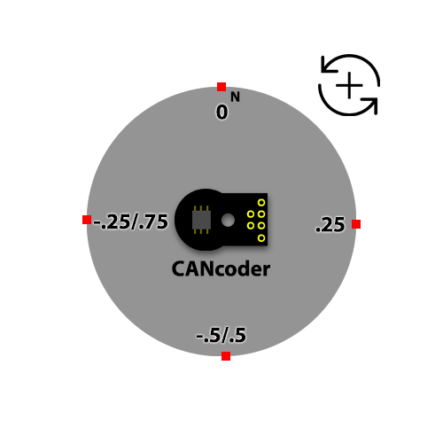

CANcoder Configs
================

This article highlights the CANcoder specific configs and how they are intended to be used.

.. note:: Unlike Phoenix 5, CANcoder will always initialize to the absolute position measurement.

Magnet Configs
--------------

These are configs related to the CANcoder magnet placement and interpretation.

Magnet Offset
^^^^^^^^^^^^^

An offset can be applied to the CANcoder position measurements that is relative, in rotations, to the magnet position. For example, the below picture indicates that the current absolute rotation is ``.75`` rotations. If you rotate the magnet CCW (from the perspective of the back of the CANcoder) by ``.25`` rotations, then the reported absolute position is ``1`` rotations. When an offset of ``.25`` is applied, the CANcoder will report the current position as ``1`` rotations. Magnet Offset must be in a range of ``-1`` to ``1``.

.. note:: For mechanisms with fixed range of motion, the offset should be set so that the discontinuity of the absolute measurement (ie, the rollover from ``1`` to ``0``) does not occur within the mechanism's range of motion.

Magnet Range
^^^^^^^^^^^^

The range for a rotation can be modified. This can be useful if the CANcoder is not directly placed on the output shaft. For example, if the gear ratio between the CANcoder and the output shaft is 8:1, then the output shaft rotates 8 times for 1 CANcoder magnet rotation. If a Magnet Range config of ``8`` is applied, then this will be reported as ``1`` rotation instead of ``8`` rotations.
