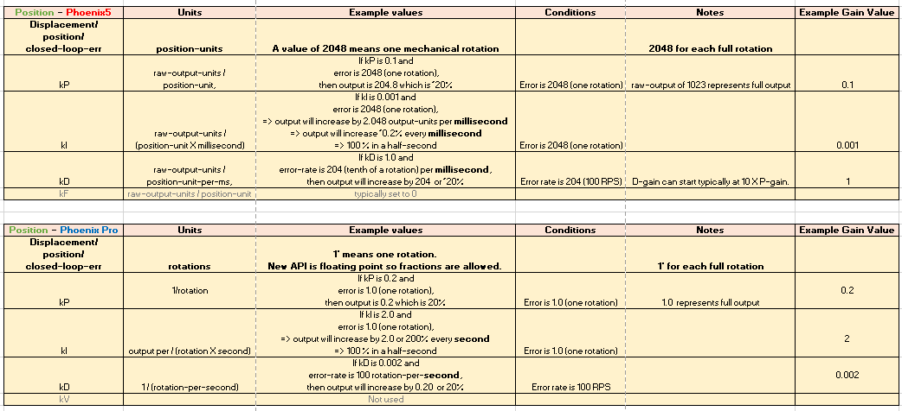
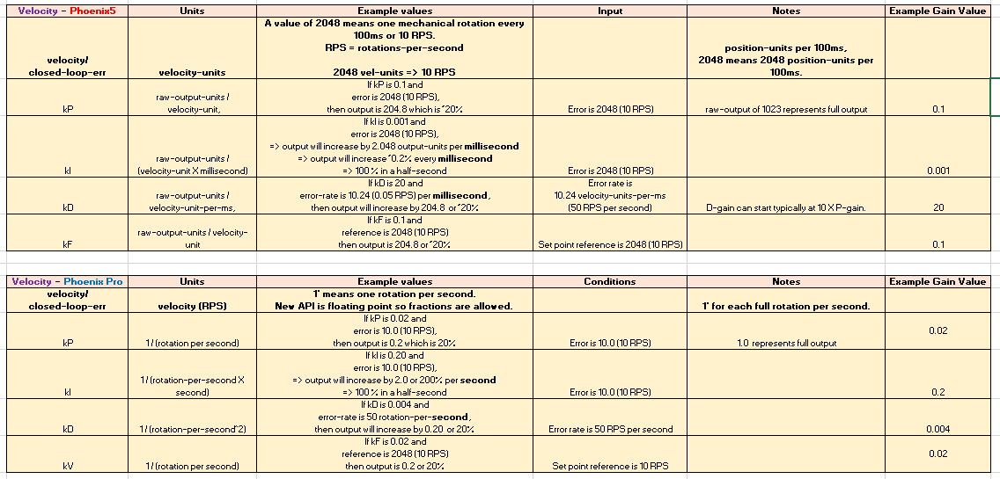

Migration Guide
===============

This document serves as a "cheat sheet" of commonly accessed functions in Phoenix 5 and its equivalent in Phoenix Pro.

Status Signals
--------------

Phoenix v5

.. tab-set::

   .. tab-item:: Java
      :sync: Java

      .. code-block:: java

         // get latest TalonFX selected sensor position
         // units are encoder ticks
         int sensorPos = m_talonFX.getSelectedSensorPosition();

         // latency is unknown
         // cannot synchronously wait for new data

   .. tab-item:: C++
      :sync: C++

      .. code-block:: cpp

         // get latest TalonFX selected sensor position
         // units are encoder ticks
         int sensorPos = m_talonFX.GetSelectedSensorPosition();

         // latency is unknown
         // cannot synchronously wait for new data

Phoenix Pro

.. tab-set::

   .. tab-item:: Java
      :sync: Java

      .. code-block:: java

         // acquire a refreshed TalonFX rotor position signal
         var rotorPosSignal = m_talonFX.getRotorPosition();

         // because we are calling getRotorPosition() every loop,
         // we do not need to call refresh()
         //rotorPosSignal.refresh();

         // retrieve position value that we just refreshed
         // units are rotations
         var rotorPos = rotorPosSignal.getValue();

         // get latency of the signal
         var rotorPosLatency = rotorPosSignal.getTimestamp().getLatency();

         // synchronously wait 20 ms for new data
         rotorPosSignal.waitForUpdate(0.020);

   .. tab-item:: C++
      :sync: C++

      .. code-block:: cpp

         // acquire a refreshed TalonFX rotor position signal
         auto& rotorPosSignal = m_talonFX.GetRotorPosition();

         // because we are calling GetRotorPosition() every loop,
         // we do not need to call Refresh()
         //rotorPosSignal.Refresh();

         // retrieve position value that we just refreshed
         // units are rotations, uses the units library
         auto rotorPos = rotorPosSignal.GetValue();

         // get latency of the signal
         auto rotorPosLatency = rotorPosSignal.GetTimestamp().GetLatency();

         // synchronously wait 20 ms for new data
         rotorPosSignal.WaitForUpdate(20_ms);

Control Requests
----------------

Phoenix v5

.. tab-set::

   .. tab-item:: Java
      :sync: Java

      .. code-block:: java

         // robot init, set voltage compensation to 12 V
         m_motor.configVoltageComSaturation(12);
         m_motor.enableVoltageCompensation(true);

         // main robot code, command 12 V output
         m_motor.set(ControlMode.PercentOutput, 1.0);

   .. tab-item:: C++
      :sync: C++

      .. code-block:: cpp

         // robot init, set voltage compensation to 12 V
         m_motor.ConfigVoltageComSaturation(12);
         m_motor.EnableVoltageCompensation(true);

         // main robot code, command 12 V output
         m_motor.Set(ControlMode::PercentOutput, 1.0);

Phoenix Pro

.. tab-set::

   .. tab-item:: Java
      :sync: Java

      .. code-block:: java

         // class member variable
         VoltageOut m_request = new VoltageOut(0);

         // main robot code, command 12 V output
         m_motor.setControl(m_request.withOutput(12.0));

   .. tab-item:: C++
      :sync: C++

      .. code-block:: cpp

         // class member variable
         controls::VoltageOut m_request{0_V};

         // main robot code, command 12 V output
         m_motor.SetControl(m_request.WithOutput(12_V));

Applying Configs
----------------

Phoenix v5

.. tab-set::

   .. tab-item:: Java
      :sync: Java

      .. code-block:: Java

         // set slot 0 gains
         // 50 ms timeout on each config call
         m_motor.config_kF(0, 0.05, 50);
         m_motor.config_kP(0, 0.046, 50);
         m_motor.config_kI(0, 0.0002, 50);
         m_motor.config_kD(0, 0.42, 50);

   .. tab-item:: C++
      :sync: C++

      .. code-block:: cpp

         // set slot 0 gains
         // 50 ms timeout on each config call
         m_motor.Config_kF(0, 0.05, 50);
         m_motor.Config_kP(0, 0.046, 50);
         m_motor.Config_kI(0, 0.0002, 50);
         m_motor.Config_kD(0, 0.42, 50);

Phoenix Pro

.. tab-set::

   .. tab-item:: Java
      :sync: Java

      .. code-block:: java

         // set slot 0 gains
         var slot0Configs = new Slot0Configs();
         slot0Configs.kV = 0.12;
         slot0Configs.kP = 0.11;
         slot0Configs.kI = 0.5;
         slot0Configs.kD = 0.001;

         // apply gains, 50 ms total timeout
         m_talonFX.getConfigurator().apply(slot0Configs, 0.050);

   .. tab-item:: C++
      :sync: C++

      .. code-block:: cpp

         // set slot 0 gains
         configs::Slot0Configs slot0Configs{};
         slot0Configs.kV = 0.12;
         slot0Configs.kP = 0.11;
         slot0Configs.kI = 0.5;
         slot0Configs.kD = 0.001;

         // apply gains, 50 ms total timeout
         m_talonFX.GetConfigurator().Apply(slot0Configs, 50_ms);

Factory Defaulting Configs
^^^^^^^^^^^^^^^^^^^^^^^^^^

Phoenix v5

.. tab-set::

   .. tab-item:: Java
      :sync: Java

      .. code-block:: Java

         // user must remember to factory default if they configure devices in code
         m_motor.configFactoryDefault();

   .. tab-item:: C++
      :sync: C++

      .. code-block:: cpp

         // user must remember to factory default if they configure devices in code
         m_motor.ConfigFactoryDefault();

Phoenix Pro

.. tab-set::

   .. tab-item:: Java
      :sync: Java

      .. code-block:: Java

         // any unmodified configs in a configuration object are *automatically* factory-defaulted;
         // user can perform a full factory default by passing a new configuration object
         m_motor.getConfigurator().apply(new TalonFXConfiguration());

   .. tab-item:: C++
      :sync: C++

      .. code-block:: cpp

         // any unmodified configs in a configuration object are *automatically* factory-defaulted;
         // user can perform a full factory default by passing a new configuration object
         m_motor.GetConfigurator().Apply(TalonFXConfiguration{});

Closed Loop Gains
-----------------

These tables are for translating Phoenix v5 gains to Phoenix Pro DutyCycle gains.

.. note:: There are other :ref:`control output types <docs/api-reference/api-usage/device-specific/talonfx/talonfx-control-intro:control output types>` in Phoenix Pro that will change the magnitude of the gains.

Position (DutyCycle)
^^^^^^^^^^^^^^^^^^^^

Velocity (DutyCycle)
^^^^^^^^^^^^^^^^^^^^

