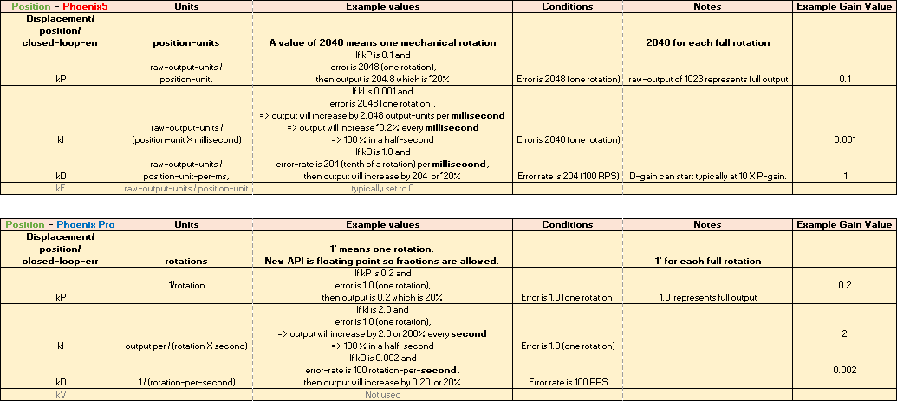
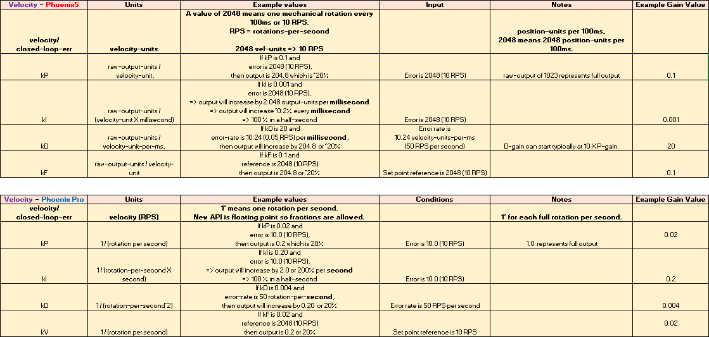

Closed-Loop Control
===================

Phoenix Pro enhances the experience of using onboard closed-loop control through the use of standardized units and a variety of control output types.

Closed Loop Gains
-----------------

These tables are for translating Phoenix 5 gains to Phoenix Pro DutyCycle gains.

.. note:: There are other :ref:`control output types <docs/api-reference/api-usage/device-specific/talonfx/talonfx-control-intro:control output types>` in Phoenix Pro that will change the magnitude of the gains.

Position (DutyCycle)
^^^^^^^^^^^^^^^^^^^^

Velocity (DutyCycle)
^^^^^^^^^^^^^^^^^^^^

Using Closed-Loop Control
-------------------------

**Phoenix 5**

.. tab-set::

   .. tab-item:: Java
      :sync: Java

      .. code-block:: Java

         // robot init, set slot 0 gains
         m_motor.config_kF(0, 0.05, 50);
         m_motor.config_kP(0, 0.046, 50);
         m_motor.config_kI(0, 0.0002, 50);
         m_motor.config_kD(0, 4.2, 50);

         // enable voltage compensation
         m_motor.configVoltageComSaturation(12);
         m_motor.enableVoltageCompensation(true);

         // periodic, run velocity control with slot 0 configs,
         // target velocity of 50 rps (10240 ticks/100ms)
         m_motor.selectProfileSlot(0, 0);
         m_motor.set(ControlMode.Velocity, 10240);

   .. tab-item:: C++
      :sync: C++

      .. code-block:: cpp

         // robot init, set slot 0 gains
         m_motor.Config_kF(0, 0.05, 50);
         m_motor.Config_kP(0, 0.046, 50);
         m_motor.Config_kI(0, 0.0002, 50);
         m_motor.Config_kD(0, 4.2, 50);

         // enable voltage compensation
         m_motor.ConfigVoltageComSaturation(12);
         m_motor.EnableVoltageCompensation(true);

         // periodic, run velocity control with slot 0 configs,
         // target velocity of 50 rps (10240 ticks/100ms)
         m_motor.SelectProfileSlot(0, 0);
         m_motor.Set(ControlMode::Velocity, 10240);

**Phoenix Pro**

.. tab-set::

   .. tab-item:: Java
      :sync: Java

      .. code-block:: java

         // class member variable
         VelocityVoltage m_velocity = new VelocityVoltage(0);

         // robot init, set slot 0 gains
         var slot0Configs = new Slot0Configs();
         slot0Configs.kV = 0.12;
         slot0Configs.kP = 0.11;
         slot0Configs.kI = 0.5;
         slot0Configs.kD = 0.01;
         m_talonFX.getConfigurator().apply(slot0Configs, 0.050);

         // periodic, run velocity control with slot 0 configs,
         // target velocity of 50 rps
         m_velocity.Slot = 0;
         m_motor.setControl(m_velocity.withVelocity(50));

   .. tab-item:: C++
      :sync: C++

      .. code-block:: cpp

         // class member variable
         controls::VelocityVoltage m_velocity{0_tps};

         // robot init, set slot 0 gains
         configs::Slot0Configs slot0Configs{};
         slot0Configs.kV = 0.12;
         slot0Configs.kP = 0.11;
         slot0Configs.kI = 0.5;
         slot0Configs.kD = 0.01;
         m_talonFX.GetConfigurator().Apply(slot0Configs, 50_ms);

         // periodic, run velocity control with slot 0 configs,
         // target velocity of 50 rps
         m_velocity.Slot = 0;
         m_motor.SetControl(m_velocity.WithVelocity(50_tps));

Motion Magic
^^^^^^^^^^^^

**Phoenix 5**

.. tab-set::

   .. tab-item:: Java
      :sync: Java

      .. code-block:: Java

         // robot init, set slot 0 gains
         m_motor.config_kF(0, 0.05, 50);
         // PID runs on position
         m_motor.config_kP(0, 0.2, 50);
         m_motor.config_kI(0, 0, 50);
         m_motor.config_kD(0, 4.2, 50);

         // set Motion Magic settings
         m_motor.configMotionCruiseVelocity(16384); // 80 rps = 16384 ticks/100ms cruise velocity
         m_motor.configMotionAcceleration(32768); // 160 rps/s = 32768 ticks/100ms/s acceleration
         m_motor.configMotionSCurveStrength(3); // s-curve smoothing strength of 3

         // enable voltage compensation
         m_motor.configVoltageComSaturation(12);
         m_motor.enableVoltageCompensation(true);

         // periodic, run Motion Magic with slot 0 configs
         m_motor.selectProfileSlot(0, 0);
         // target position of 200 rotations (409600 ticks)
         // add 0.02 (2%) arbitrary feedforward to overcome friction
         m_motor.set(ControlMode.MotionMagic, 409600, DemandType.ArbitraryFeedforward, 0.02);

   .. tab-item:: C++
      :sync: C++

      .. code-block:: cpp

         // robot init, set slot 0 gains
         m_motor.Config_kF(0, 0.05, 50);
         // PID runs on position
         m_motor.Config_kP(0, 0.2, 50);
         m_motor.Config_kI(0, 0, 50);
         m_motor.Config_kD(0, 4.2, 50);

         // set Motion Magic settings
         m_motor.ConfigMotionCruiseVelocity(16384); // 80 rps = 16384 ticks/100ms cruise velocity
         m_motor.ConfigMotionAcceleration(32768); // 160 rps/s = 32768 ticks/100ms/s acceleration
         m_motor.ConfigMotionSCurveStrength(3); // s-curve smoothing strength of 3

         // enable voltage compensation
         m_motor.ConfigVoltageComSaturation(12);
         m_motor.EnableVoltageCompensation(true);

         // periodic, run Motion Magic with slot 0 configs
         m_motor.SelectProfileSlot(0, 0);
         // target position of 200 rotations (409600 ticks)
         // add 0.02 (2%) arbitrary feedforward to overcome friction
         m_motor.Set(ControlMode::MotionMagic, 409600, DemandType::ArbitraryFeedforward, 0.02);

**Phoenix Pro**

.. note:: The Motion Magic S-Curve Strength has been replaced with jerk control in Phoenix Pro.

.. tab-set::

   .. tab-item:: Java
      :sync: Java

      .. code-block:: java

         // class member variable
         MotionMagicVoltage m_motmag = new MotionMagicVoltage(0);

         // robot init
         var talonFXConfigs = new TalonFXConfiguration();

         // set slot 0 gains
         var slot0Configs = talonFXConfigs.Slot0Configs;
         slot0Configs.kS = 0.24; // add 0.24 V to overcome friction
         slot0Configs.kV = 0.12; // apply 12 V for a target velocity of 100 rps
         // PID runs on position
         slot0Configs.kP = 4.8;
         slot0Configs.kI = 0;
         slot0Configs.kD = 0.1;

         // set Motion Magic settings
         var motionMagicConfigs = talonFXConfigs.MotionMagicConfigs;
         motionMagicConfigs.MotionMagicCruiseVelocity = 80; // 80 rps cruise velocity
         motionMagicConfigs.MotionMagicAcceleration = 160; // 160 rps/s acceleration (0.5 seconds)
         motionMagicConfigs.MotionMagicJerk = 1600; // 1600 rps/s^2 jerk (0.1 seconds)

         m_talonFX.getConfigurator().apply(talonFXConfigs, 0.050);

         // periodic, run Motion Magic with slot 0 configs,
         // target position of 200 rotations
         m_motmag.Slot = 0;
         m_motor.setControl(m_motmag.withPosition(200));

   .. tab-item:: C++
      :sync: C++

      .. code-block:: cpp

         // class member variable
         controls::MotionMagicVoltage m_motmag{0_tr};

         // robot init
         configs::TalonFXConfiguration talonFXConfigs{};

         // set slot 0 gains
         auto& slot0Configs = talonFXConfigs.Slot0Configs;
         slot0Configs.kS = 0.24; // add 0.24 V to overcome friction
         slot0Configs.kV = 0.12; // apply 12 V for a target velocity of 100 rps
         // PID runs on position
         slot0Configs.kP = 4.8;
         slot0Configs.kI = 0;
         slot0Configs.kD = 0.1;

         // set Motion Magic settings
         auto& motionMagicConfigs = talonFXConfigs.MotionMagicConfigs;
         motionMagicConfigs.MotionMagicCruiseVelocity = 80; // 80 rps cruise velocity
         motionMagicConfigs.MotionMagicAcceleration = 160; // 160 rps/s acceleration (0.5 seconds)
         motionMagicConfigs.MotionMagicJerk = 1600; // 1600 rps/s^2 jerk (0.1 seconds)

         m_talonFX.GetConfigurator().Apply(talonFXConfigs, 50_ms);

         // periodic, run Motion Magic with slot 0 configs,
         // target position of 200 rotations
         m_motmag.Slot = 0;
         m_motor.SetControl(m_motmag.WithPosition(200_tr));

Motion Profiling
^^^^^^^^^^^^^^^^

The Motion Profile Executor is not supported in the current release of Phoenix Pro. Users can use :ref:`Motion Magic <docs/api-reference/api-usage/device-specific/talonfx/closed-loop-requests:motion magic>` or run a motion profile on the robot controller.
