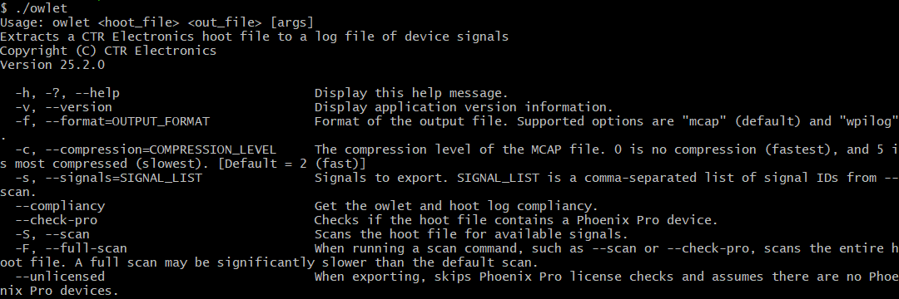

Signal Logging
==============

.. note:: Information on how to retrieve and convert ``hoot`` files to compatible formats can be found in :doc:`/docs/tuner/tools/log-extractor`.

Phoenix 6 comes with a real-time, high-fidelity signal logger. This can be useful for any form of post analysis, including diagnosing issues after a match or using `WPILib SysId <https://docs.wpilib.org/en/stable/docs/software/pathplanning/system-identification/introduction.html>`__.

The Phoenix 6 signal logger provides the following advantages over alternatives:

- **All status signals** are captured **automatically** with their **timestamps from CAN**.
- Status signals are captured **as they arrive** at their configured update frequency.
- Logging is **not affected** by the timing of the main robot loop or Java GC, significantly improving the sensitivity and accuracy of system identification.
- **Custom user signals** can be logged alongside the automatically captured status signals on the **same timebase**.
- The **highly efficient** ``hoot`` file format minimizes the **size** of the log files and the **CPU usage** of the logger.

The signal logging API is available through static functions in the ``SignalLogger`` (`Java <https://api.ctr-electronics.com/phoenix6/stable/java/com/ctre/phoenix6/SignalLogger.html>`__, `C++ <https://api.ctr-electronics.com/phoenix6/stable/cpp/classctre_1_1phoenix6_1_1_signal_logger.html>`__, `Python <https://api.ctr-electronics.com/phoenix6/stable/python/autoapi/phoenix6/signal_logger/index.html#phoenix6.signal_logger.SignalLogger>`__) class. Signal logging is **enabled by default** on a roboRIO 1 with a USB flash drive or a roboRIO 2, where logging is started by any of the following (whichever occurs first):

- The robot is enabled.
- It has been at least 5 seconds since program startup (allowing for calls to ``setPath``), and the Driver Station is connected to the robot.

Users can disable this behavior with ``SignalLogger.enableAutoLogging(false)`` (`Java <https://api.ctr-electronics.com/phoenix6/stable/java/com/ctre/phoenix6/SignalLogger.html#enableAutoLogging(boolean)>`__, `C++ <https://api.ctr-electronics.com/phoenix6/stable/cpp/classctre_1_1phoenix6_1_1_signal_logger.html#ae9261bb623fbc9cb4040fedeedc5c91e>`__, `Python <https://api.ctr-electronics.com/phoenix6/stable/python/autoapi/phoenix6/signal_logger/index.html#phoenix6.signal_logger.SignalLogger.enable_auto_logging>`__).

.. tip:: Device status signals can also be viewed live in the :doc:`Tuner X Plotting page </docs/tuner/plotting>`.

Setting Log Path
----------------

The logging directory can optionally be changed using ``SignalLogger.setPath()`` (`Java <https://api.ctr-electronics.com/phoenix6/stable/java/com/ctre/phoenix6/SignalLogger.html#setPath(java.lang.String)>`__, `C++ <https://api.ctr-electronics.com/phoenix6/stable/cpp/classctre_1_1phoenix6_1_1_signal_logger.html#a5178de40e2d9e4d49d646f8d5f54d0f7>`__, `Python <https://api.ctr-electronics.com/phoenix6/stable/python/autoapi/phoenix6/signal_logger/index.html#phoenix6.signal_logger.SignalLogger.set_path>`__). If the specified directory does not exist, ``SignalLogger.setPath()`` will return an error code. Setting the path while logging will restart the log.

The below example sets the logging path to a ``ctre-logs`` folder on the first USB drive found.

.. tab-set::

   .. tab-item:: Java
      :sync: java

      .. code-block:: java

         SignalLogger.setPath("/media/sda1/ctre-logs/");

   .. tab-item:: C++
      :sync: cpp

      .. code-block:: cpp

         SignalLogger::SetPath("/media/sda1/ctre-logs/");

   .. tab-item:: Python
      :sync: python

      .. code-block:: python

         SignalLogger.set_path("/media/sda1/ctre-logs/")

.. note:: Each CAN bus gets its own dedicated log file. All logs will be placed in a subfolder named after the date and time of the start of the program.

Start/Stop Logging
------------------

The signal logger can be started and stopped using the ``start()`` and ``stop()`` functions (`Java <https://api.ctr-electronics.com/phoenix6/stable/java/com/ctre/phoenix6/SignalLogger.html#start()>`__, `C++ <https://api.ctr-electronics.com/phoenix6/stable/cpp/classctre_1_1phoenix6_1_1_signal_logger.html#aed8772a03e7d8ec65d5a950d86495f7e>`__, `Python <https://api.ctr-electronics.com/phoenix6/stable/python/autoapi/phoenix6/signal_logger/index.html#phoenix6.signal_logger.SignalLogger.start>`__).

.. tab-set::

   .. tab-item:: Java
      :sync: java

      .. code-block:: java

         SignalLogger.start();
         SignalLogger.stop();

   .. tab-item:: C++
      :sync: cpp

      .. code-block:: cpp

         SignalLogger::Start();
         SignalLogger::Stop();

   .. tab-item:: Python
      :sync: python

      .. code-block:: python

         SignalLogger.start()
         SignalLogger.stop()

Writing Custom Signals
----------------------

Users can write custom signals to the currently opened logs by utilizing the ``write*()`` functions. An example application of this is logging your swerve odometry data.

The integer and floating-point ``write*()`` functions can optionally be supplied a units string to log alongside the data. Additionally, all ``write*()`` functions support an optional latency parameter that is subtracted from the current time to get the latency-adjusted timestamp of the signal. This can be useful for logging high-latency data, such as vision measurements.

.. tip:: In a WPILib robot project, custom data types can be logged using Struct and Protobuf. Additionally, Java robot projects can take advantage of :doc:`Epilogue integration </docs/api-reference/wpilib-integration/epilogue-integration>`.

.. tab-set::

   .. tab-item:: Java
      :sync: java

      .. code-block:: java

         // Log the odometry pose
         SignalLogger.writeStruct("odometry", Pose2d.struct, pose);
         // Log the odometry period with units of "seconds"
         SignalLogger.writeDouble("odom period", state.OdometryPeriod, "seconds");
         // Log the camera pose with calculated latency
         SignalLogger.writeStruct(
            "camera pose", Pose2d.struct, camPose,
            Timer.getTimestamp() - camRes.getTimestampSeconds()
         );

   .. tab-item:: C++
      :sync: cpp

      .. code-block:: cpp

         // Log the odometry pose
         SignalLogger::WriteStruct<frc::Pose2d>("odometry", pose);
         // Log the odometry period with units of "seconds"
         SignalLogger::WriteDouble("odom period", state.OdometryPeriod, "seconds");
         // Log the camera pose with calculated latency
         SignalLogger::WriteStruct<frc::Pose2d>(
            "camera pose", camPose,
            frc::Timer::GetTimestamp() - camRes.GetTimestamp()
         );

   .. tab-item:: Python
      :sync: python

      .. code-block:: python

         # Log the odometry pose
         SignalLogger.write_struct("odometry", Pose2d, pose)
         # Log the odometry period with units of "seconds"
         SignalLogger.write_double("odom period", state.odometry_period, "seconds")
         # Log the camera pose with calculated latency
         SignalLogger.write_struct(
            "camera pose", Pose2d, cam_pose,
            Timer.getTimestamp() - cam_res.getTimestamp()
         )

Free Signals
------------

Any log that contains a :doc:`pro-licensed </docs/licensing/licensing>` device will export all signals. Otherwise, the following status signals and all custom signals can be exported for free.

.. dropdown:: Click here to view free signals

   **Common Signals**

   - VersionMajor
   - VersionMinor
   - VersionBugfix
   - VersionBuild
   - IsProLicensed
   - SupplyVoltage
   - Fault_UnlicensedFeatureInUse
   - Fault_BootDuringEnable
   - Fault_Hardware
   - Fault_Undervoltage

   .. tab-set::

      .. tab-item:: Talon FX

         - SupplyCurrent
         - StatorCurrent
         - MotorVoltage
         - Position
         - Velocity
         - DeviceEnable
         - RobotEnable
         - ConnectedMotor
         - Fault_DeviceTemp
         - Fault_ProcTemp
         - Fault_RemoteSensorDataInvalid
         - Fault_StaticBrakeDisabled
         - Fault_BridgeBrownout

      .. tab-item:: Talon FXS

         - SupplyCurrent
         - StatorCurrent
         - MotorVoltage
         - Position
         - Velocity
         - DeviceEnable
         - RobotEnable
         - ConnectedMotor
         - Fault_DeviceTemp
         - Fault_ProcTemp
         - Fault_RemoteSensorDataInvalid
         - Fault_StaticBrakeDisabled
         - Fault_BridgeBrownout
         - Fault_HallSensorMissing
         - Fault_DriveDisabledHallSensor
         - Fault_MotorTempSensorMissing
         - Fault_MotorTempSensorTooHot
         - Fault_MotorArrangementNotSelected

      .. tab-item:: CANcoder

         - Position
         - Velocity

      .. tab-item:: Pigeon 2.0

         - Yaw
         - AngularVelocityZWorld

      .. tab-item:: CANrange

         - DistanceMeters
         - ProximityDetected
         - SignalStrength

      .. tab-item:: CANdi™

         - Pin1State
         - Pin2State
         - S1Closed
         - S2Closed
         - QuadPosition
         - QuadVelocity
         - Pwm1_Position
         - Pwm1_Velocity
         - Pwm2_Position
         - Pwm2_Velocity
         - Overcurrent
         - Fault_5V

      .. tab-item:: CANdle®

         - OutputCurrent
         - DeviceTemp
         - MaxSimultaneousAnimationCount
         - Fault_Overvoltage
         - Fault_5VTooHigh
         - Fault_5VTooLow
         - Fault_Thermal
         - Fault_SoftwareFuse
         - Fault_ShortCircuit

Low Storage Space Behavior
--------------------------

If the target drive (i.e. flash drive or roboRIO internal storage) reaches 50 MB free space, old logs will be deleted, and a warning will be printed.

If the target drive reaches 5 MB of free space, logging will be stopped, and an error will be printed. Logging cannot be resumed until more disk space is made available.

An example error that may occur if the free space limit is reached is shown below.

.. code-block:: text

   [phoenix] Signal Logger: Available disk space (3 MB) below 5 MB, stopping log

Converting Signal Logs
----------------------

Signal logs can be converted to other common file formats such as WPILOG or MCAP using the :doc:`Tuner X Log Extractor </docs/tuner/tools/log-extractor>`.

Additionally, the ``owlet`` CLI tool can be used from a terminal, including on platforms not supported by Tuner X. ``owlet`` can be downloaded from the `CLI Tools download page <https://docs.ctr-electronics.com/cli-tools>`__.

To view a list of available commands, run ``owlet`` either with no parameters or with ``--help``.

As an example, to convert a ``hoot`` file to WPILOG, run:

.. code-block:: bash

   ./owlet -f wpilog "input.hoot" "output.wpilog"
