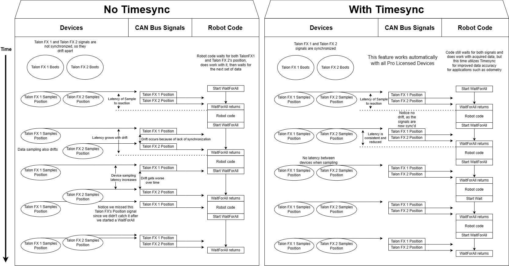

Status Signals
==============

Signals represent live data reported by a device; these can be yaw, position, etc.
To make use of the live data, users need to know the value, timestamp, latency, units, and error condition of the data.
Additionally, users may need to synchronize with fresh data to minimize latency.

``StatusSignal``
---------------------

The ``StatusSignal`` (`Java <https://api.ctr-electronics.com/phoenix6/release/java/com/ctre/phoenix6/StatusSignal.html>`__, `C++ <https://api.ctr-electronics.com/phoenix6/release/cpp/classctre_1_1phoenix6_1_1_status_signal.html>`__) is a signal object that provides APIs to address all of the requirements listed above.

The device object provides getters for all available signals. Each getter returns a ``StatusSignal`` that is typed appropriately for the signal.

.. note:: The device getters return a cached ``StatusSignal``. As a result, frequently calling the getter does not influence RAM performance.

.. tab-set::

   .. tab-item:: Java
      :sync: Java

      .. code-block:: java

         var supplyVoltageSignal = m_device.getSupplyVoltage();

   .. tab-item:: C++
      :sync: C++

      .. code-block:: cpp

         auto& supplyVoltageSignal = m_device.GetSupplyVoltage();

The value of the signal can be retrieved from the ``StatusSignal`` by calling ``getValue()``.

.. tab-set::

   .. tab-item:: Java
      :sync: Java

      .. code-block:: java

         var supplyVoltage = supplyVoltageSignal.getValue();

   .. tab-item:: C++
      :sync: C++

      .. code-block:: cpp

         auto supplyVoltage = supplyVoltageSignal.GetValue();

.. note:: Phoenix 6 utilizes the `C++ units library <https://docs.wpilib.org/en/stable/docs/software/basic-programming/cpp-units.html>`__ when applicable.

The ``StatusCode`` (`Java <https://api.ctr-electronics.com/phoenix6/release/java/com/ctre/phoenix6/StatusCode.html>`__, `C++ <https://api.ctr-electronics.com/phoenix6/release/cpp/_status_codes_8h.html#a1edbab973bc8d4d5097a6bcc17c88c19>`__) of the signal can be retrieved by calling ``getError()``.
This can be used to determine if the device is not present on the CAN bus.

.. note:: If a status signal is not available on the CAN bus, an error will be reported to the Driver Station.

Refreshing the Signal Value
^^^^^^^^^^^^^^^^^^^^^^^^^^^

The device ``StatusSignal`` getters implicitly refresh the cached signal values. However, if the user application caches the ``StatusSignal`` object, the ``refresh()`` method must be called to fetch fresh data.

.. tip:: The ``refresh()`` method can be method-chained. As a result, you can call ``refresh()`` and ``getValue()`` on one line.

.. tab-set::

   .. tab-item:: Java
      :sync: Java

      .. code-block:: java

         supplyVoltageSignal.refresh();

   .. tab-item:: C++
      :sync: C++

      .. code-block:: cpp

         supplyVoltageSignal.Refresh();

Waiting for Signal Updates
^^^^^^^^^^^^^^^^^^^^^^^^^^

Instead of using the latest value, the user can instead opt to synchronously wait for a signal update. ``StatusSignal`` provides a ``waitForUpdate(timeoutSec)`` method that will block the current robot loop until the signal is retrieved or the timeout has been exceeded. This replaces the need to call ``refresh()`` on cached ``StatusSignal`` objects.

.. tip:: If you want to zero your sensors, you can use this API to ensure the set operation has completed before continuing program flow.

.. tip:: The ``waitForUpdate()`` method can be method-chained. As a result, you can call ``waitForUpdate()`` and ``getValue()`` on one line.

.. tab-set::

   .. tab-item:: Java
      :sync: Java

      .. code-block:: java

         // wait up to 1 robot loop iteration (20ms) for fresh data
         supplyVoltageSignal.waitForUpdate(0.020);

   .. tab-item:: C++
      :sync: C++

      .. code-block:: cpp

         // wait up to 1 robot loop iteration (20ms) for fresh data
         supplyVoltageSignal.WaitForUpdate(20_ms);

Changing Update Frequency
^^^^^^^^^^^^^^^^^^^^^^^^^

All signals can have their update frequency configured via the ``setUpdateFrequency()`` method.

.. warning:: Increasing signal frequency will also increase CAN bus utilization, which can cause indeterminate behavior at high utilization rates (>90%). This is less of a concern when using CANivore, which uses the higher-bandwidth `CAN FD <https://store.ctr-electronics.com/can-fd/>`__ bus.

.. tab-set::

   .. tab-item:: Java
      :sync: Java

      .. code-block:: java

         // slow down supply voltage reporting to 10 Hz
         supplyVoltageSignal.setUpdateFrequency(10);

   .. tab-item:: C++
      :sync: C++

      .. code-block:: cpp

         // slow down supply voltage reporting to 10 Hz
         supplyVoltageSignal.SetUpdateFrequency(10_Hz);

.. important:: Currently in Phoenix 6, when different status signal frequencies are specified for signals that share a status frame, the last specified frequency is applied to the status frame. As a result, users should apply the slowest status frame frequencies first and the fastest frequencies last.

Timestamps
^^^^^^^^^^

The timestamps of a ``StatusSignal`` can be retrieved by calling ``getAllTimestamps()``, which returns a collection of ``Timestamp`` (`Java <https://api.ctr-electronics.com/phoenix6/release/java/com/ctre/phoenix6/Timestamp.html>`__, `C++ <https://api.ctr-electronics.com/phoenix6/release/cpp/classctre_1_1phoenix6_1_1_timestamp.html>`__) objects. The ``Timestamp`` objects can be used to perform latency compensation math.

CANivore Timesync
-----------------

.. important:: CANivore Timesync requires the devices or the CANivore to be :doc:`Pro licensed </docs/licensing/licensing>`.

When using `CANivore <https://store.ctr-electronics.com/canivore/>`__, the attached CAN devices will automatically synchronize their time bases. This allows devices to sample and publish their signals in a synchronized manner.

Users can synchronously wait for these signals to update using ``BaseStatusSignal.waitForAll()`` (`Java <https://api.ctr-electronics.com/phoenix6/release/java/com/ctre/phoenix6/BaseStatusSignal.html#waitForAll(double,com.ctre.phoenixpro.BaseStatusSignal...)>`__, `C++ <https://api.ctr-electronics.com/phoenix6/release/cpp/classctre_1_1phoenix6_1_1_base_status_signal.html#abcc070556164f88c966e17bf61741699>`__).

.. tip:: ``waitForAll()`` can be used with a timeout of zero to perform a non-blocking refresh on all signals passed in.

Because the devices are synchronized, time-critical signals are sampled and published on the same schedule. This combined with the ``waitForAll()`` routine means applications can considerably reduce the latency of the timesync signals. This is particularly useful for multi-device mechanisms, such as swerve odometry.

.. note:: When using a non-zero timeout, the signals passed into ``waitForAll()`` should have the same update frequency for synchronous data acquisition. This can be done by calling ``setUpdateFrequency()`` or by referring to the API documentation.

The following signals are time-synchronized:

- TalonFX

  - All Signals

- CANcoder

  - All Signals

- Pigeon 2.0

  - Yaw, Pitch, & Roll
  - Quaternion
  - Gravity Vector
  - Accum Gyro
  - Angular Rate
  - Accelerometer
  - Temperature

.. tab-set::

   .. tab-item:: Java
      :sync: Java

      .. code-block:: java

         var talonFXPositionSignal = m_talonFX.getPosition();
         var cancoderPositionSignal = m_cancoder.getPosition();
         var pigeon2YawSignal = m_pigeon2.getYaw();

         BaseStatusSignal.waitForAll(0.020, talonFXPositionSignal, cancoderPositionSignal, pigeon2YawSignal);

   .. tab-item:: C++
      :sync: C++

      .. code-block:: cpp

         auto& talonFXPositionSignal = m_talonFX.GetPosition();
         auto& cancoderPositionSignal = m_cancoder.GetPosition();
         auto& pigeon2YawSignal = m_pigeon2.GetYaw();

         BaseStatusSignal::WaitForAll(20_ms, {&talonFXPositionSignal, &cancoderPositionSignal, &pigeon2YawSignal});

Latency Compensation
--------------------

Users can perform latency compensation using ``BaseStatusSignal.getLatencyCompensatedValue()`` (`Java <https://api.ctr-electronics.com/phoenix6/release/java/com/ctre/phoenix6/BaseStatusSignal.html#getLatencyCompensatedValue(com.ctre.phoenixpro.StatusSignal,com.ctre.phoenixpro.StatusSignal)>`__, `C++ <https://api.ctr-electronics.com/phoenix6/release/cpp/classctre_1_1phoenix6_1_1_base_status_signal.html#a96a39be023f05d7c72de85fc30e5dcaa>`__).

.. important:: ``getLatencyCompensatedValue()`` does not automatically refresh the signals. As a result, the user must ensure the ``signal`` and ``signalSlope`` parameters are refreshed before retrieving a compensated value.

.. tab-set::

   .. tab-item:: Java
      :sync: Java

      .. code-block:: java

         double compensatedTurns = BaseStatusSignal.getLatencyCompensatedValue(m_motor.getPosition(), m_motor.getVelocity());

   .. tab-item:: C++
      :sync: C++

      .. code-block:: cpp

         auto compensatedTurns = BaseStatusSignal::GetLatencyCompensatedValue(m_motor.GetPosition(), m_motor.GetVelocity());

``SignalMeasurement``
---------------------

All ``StatusSignal`` objects have a ``getDataCopy()`` method that returns a new ``SignalMeasurement`` (`Java <https://api.ctr-electronics.com/phoenix6/release/java/com/ctre/phoenix6/StatusSignal.SignalMeasurement.html>`__, `C++ <https://api.ctr-electronics.com/phoenix6/release/cpp/structctre_1_1phoenix6_1_1_signal_measurement.html>`__) object. ``SignalMeasurement`` is a `Passive Data Structure <https://en.wikipedia.org/wiki/Passive_data_structure>`__ that provides all the information about a signal at the time of the ``getDataCopy()`` call, which can be useful for data logging.

.. warning:: ``getDataCopy()`` returns a **new** ``SignalMeasurement`` object every call. **Java** users should **avoid** using this API in RAM-constrained applications.
