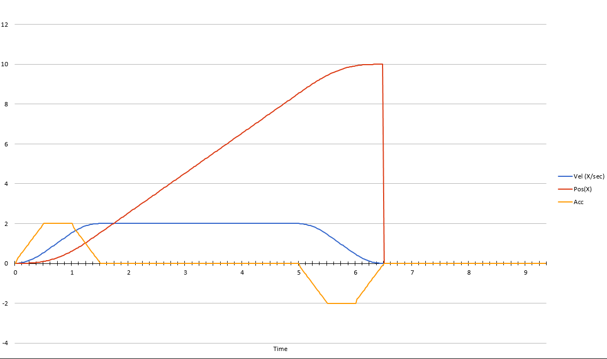
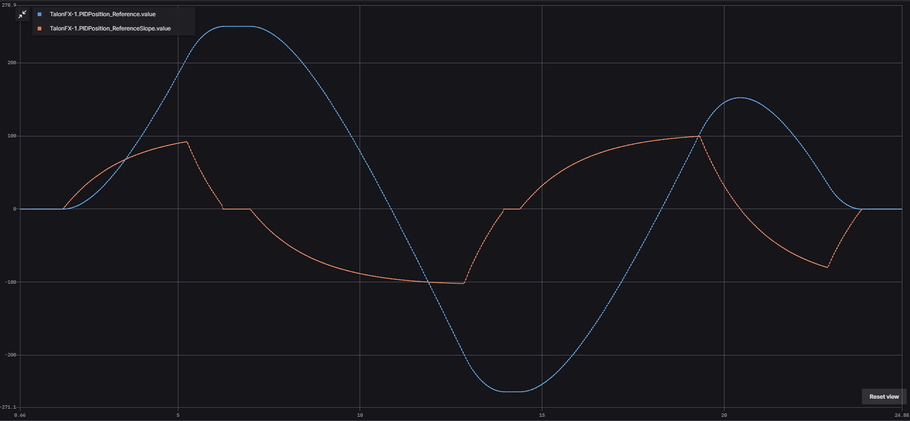
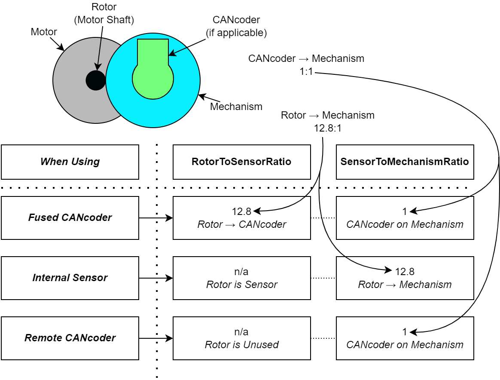

Closed-Loop Control
===================

Closed-loop control typically refers to control of a motor that relies on sensor data to adjust based on error. Systems/mechanisms that rely on maintaining a certain position or velocity achieve this state using closed-loop control. This is achieved by `feedback <https://docs.wpilib.org/en/stable/docs/software/advanced-controls/introduction/introduction-to-pid.html>`__ (PID) and `feedforward <https://docs.wpilib.org/en/stable/docs/software/advanced-controls/introduction/introduction-to-feedforward.html>`__ control. Closed-loop control can be performed on the robot controller or on the individual motor controllers. The benefit of onboard closed-loop control is that there is no sensor latency and 1 kHz update frequency. This can result in a more responsive output compared to running the closed-loop on the robot controller.

Since closed-loop control changes based on the dynamics of the system (velocity, mass, CoG, etc.), closed-loop relies on PID and feedforward parameters. These parameters are configured either via :doc:`/docs/tuner/configs` or in :doc:`code </docs/api-reference/api-usage/configuration>`. The parameters can be determined using System Identification (such as with `WPILib SysID <https://docs.wpilib.org/en/stable/docs/software/pathplanning/system-identification/introduction.html>`__) or through `manual tuning <https://docs.wpilib.org/en/stable/docs/software/advanced-controls/introduction/tutorial-intro.html>`__.

Manual tuning typically follows this process:

1. Set :math:`K_p`, :math:`K_i` and :math:`K_d` to zero.
2. Increase :math:`K_p` until the output starts to oscillate around the setpoint.
3. Increase :math:`K_d` as much as possible without introducing jittering to the response.

All closed-loop control requests follow the naming pattern ``{ClosedLoopMode}{ControlOutputType}``. For example, the ``VelocityVoltage`` control request performs a velocity closed-loop using voltage output.

Gain Slots
----------

It may be useful to switch between presets of gains in a motor controller, so the TalonFX supports multiple gain slots. All closed-loop control requests have a member variable ``Slot`` that can be assigned an integer ID to select the set of gains used by the closed-loop. The gain slots can be :doc:`configured in code </docs/api-reference/api-usage/configuration>` using ``Slot*Configs`` (`Java <https://api.ctr-electronics.com/phoenix6/release/java/com/ctre/phoenix6/configs/Slot0Configs.html>`__, `C++ <https://api.ctr-electronics.com/phoenix6/release/cpp/classctre_1_1phoenix6_1_1configs_1_1_slot0_configs.html>`__, `Python <https://api.ctr-electronics.com/phoenix6/release/python/autoapi/phoenix6/configs/config_groups/index.html#phoenix6.configs.config_groups.Slot0Configs>`__) objects.

Velocity Control
----------------

A Velocity closed loop can be used to maintain a target velocity (in rotations per second). This can be useful for controlling flywheels, where a velocity needs to be maintained for accurate shooting.

Velocity closed loop is currently supported for all base :ref:`control output types <docs/api-reference/device-specific/talonfx/talonfx-control-intro:control output types>`. The units of the output is determined by the control output type.

In a Velocity closed loop, the gains should be configured as follows:

- :math:`K_s` - output to overcome static friction (output)
- :math:`K_v` - output per unit of requested velocity (output/rps)
- :math:`K_a` - when using the Acceleration term, output per unit of requested acceleration (output/(rps/s))
- :math:`K_p` - output per unit of error in velocity (output/rps)
- :math:`K_i` - output per unit of integrated error in velocity (output/rotation)
- :math:`K_d` - output per unit of error derivative in velocity (output/(rps/s))

.. tab-set::

   .. tab-item:: Java
      :sync: Java

      .. code-block:: java

         // in init function, set slot 0 gains
         var slot0Configs = new Slot0Configs();
         slot0Configs.kS = 0.05; // Add 0.05 V output to overcome static friction
         slot0Configs.kV = 0.12; // A velocity target of 1 rps results in 0.12 V output
         slot0Configs.kA = 0.01; // An acceleration of 1 rps/s requires 0.01 V output
         slot0Configs.kP = 0.11; // An error of 1 rps results in 0.11 V output
         slot0Configs.kI = 0.5; // An error of 1 rps increases output by 0.5 V each second
         slot0Configs.kD = 0.01; // An acceleration of 1 rps/s results in 0.01 V output

         m_talonFX.getConfigurator().apply(slot0Configs);

   .. tab-item:: C++
      :sync: C++

      .. code-block:: cpp

         // in init function, set slot 0 gains
         configs::Slot0Configs slot0Configs{};
         slot0Configs.kS = 0.05; // Add 0.05 V output to overcome static friction
         slot0Configs.kV = 0.12; // A velocity target of 1 rps results in 0.12 V output
         slot0Configs.kA = 0.01; // An acceleration of 1 rps/s requires 0.01 V output
         slot0Configs.kP = 0.11; // An error of 1 rps results in 0.11 V output
         slot0Configs.kI = 0.5; // An error of 1 rps increases output by 0.5 V each second
         slot0Configs.kD = 0.01; // An acceleration of 1 rps/s results in 0.01 V output

         m_talonFX.GetConfigurator().Apply(slot0Configs);

   .. tab-item:: Python
      :sync: python

      .. code-block:: python

         slot0_configs = configs.Slot0Configs()
         slot0_configs.k_s = 0.05 # Add 0.05V output to overcome static friction
         slot0_configs.k_v = 0.12 # A velocity target of 1 rps results in 0.12 V output
         slot0_configs.k_a = 0.01 # An acceleration of 1 rps/s requires 0.01 V output
         slot0_configs.k_p = 0.11 # An error of 1 rps results in 0.11 V output
         slot0_configs.k_i = 0.5 # An error of 1 rps increases output by 0.5 V each second
         slot0_configs.k_d = 0.01 # An acceleration of 1 rps/s results in 0.01 V output

         self.talonfx.configurator.apply(slot0_configs)

Once the gains are configured, the Velocity closed loop control request can be sent to the TalonFX. The control request object has an optional feedforward term that can be used to add an arbitrary value to the output, which can be useful to account for the effects of gravity. The control request also has an optional acceleration parameter for use with motion profiles generated by the robot controller.

.. tab-set::

   .. tab-item:: Java
      :sync: Java

      .. code-block:: Java

         // create a velocity closed-loop request, voltage output, slot 0 configs
         var request = new VelocityVoltage(0).withSlot(0);

         // set velocity to 8 rps, add 0.5 V to overcome gravity
         m_talonFX.setControl(request.withVelocity(8).withFeedForward(0.5));

   .. tab-item:: C++
      :sync: C++

      .. code-block:: cpp

         // create a velocity closed-loop request, voltage output, slot 0 configs
         auto request = controls::VelocityVoltage{0_tps}.WithSlot(0);

         // set velocity to 8 rps, add 0.5 V to overcome gravity
         m_talonFX.SetControl(request.WithVelocity(8_tps).WithFeedForward(0.5_V));

   .. tab-item:: Python
      :sync: python

      .. code-block:: python

         # create a velocity closed-loop request, voltage output, slot 0 configs
         request = controls.VelocityVoltage(0).with_slot(0)

         # set velocity to 8 rps, add 0.5 V to overcome gravity
         self.talonfx.set_control(request.with_velocity(8).with_feed_forward(0.5))

Converting from Meters
^^^^^^^^^^^^^^^^^^^^^^

In some applications, it may be useful to translate between meters and rotations. This can be done using the following equation:

.. math::

   rotations = \frac{meters}{\pi \cdot wheelDiameter} \cdot gearRatio

where ``meters`` is the target in meters, ``wheelDiameter`` is the diameter of the wheel in meters, and ``gearRatio`` is the gear ratio between the output shaft and the wheel.

This equation also works with converting velocity from m/s to rps.

Position Control
----------------

A Position closed loop can be used to target a specified motor position (in rotations).

Position closed loop is currently supported for all base :ref:`control output types <docs/api-reference/device-specific/talonfx/talonfx-control-intro:control output types>`. The units of the output is determined by the control output type.

In a Position closed loop, the gains should be configured as follows:

- :math:`K_s` - when using the Velocity term, output to overcome static friction (output)
- :math:`K_v` - when using the Velocity term, output per unit of requested velocity (output/rps)
- :math:`K_a` - unused, as there is no target acceleration
- :math:`K_p` - output per unit of error in position (output/rotation)
- :math:`K_i` - output per unit of integrated error in position (output/(rotation*s))
- :math:`K_d` - output per unit of error derivative in position (output/rps)

.. tab-set::

   .. tab-item:: Java
      :sync: Java

      .. code-block:: java

         // in init function, set slot 0 gains
         var slot0Configs = new Slot0Configs();
         slot0Configs.kP = 24; // An error of 0.5 rotations results in 12 V output
         slot0Configs.kI = 0; // no output for integrated error
         slot0Configs.kD = 0.1; // A velocity of 1 rps results in 0.1 V output

         m_talonFX.getConfigurator().apply(slot0Configs);

   .. tab-item:: C++
      :sync: C++

      .. code-block:: cpp

         // in init function, set slot 0 gains
         configs::Slot0Configs slot0Configs{};
         slot0Configs.kP = 24; // An error of 0.5 rotations results in 12 V output
         slot0Configs.kI = 0; // no output for integrated error
         slot0Configs.kD = 0.1; // A velocity of 1 rps results in 0.1 V output

         m_talonFX.GetConfigurator().Apply(slot0Configs);

   .. tab-item:: Python
      :sync: python

      .. code-block:: python

         # in init function, set slot 0 gains
         slot0_configs = configs.Slot0Configs()
         slot0_configs.k_p = 24 # An error of 0.5 rotations results in 12 V output
         slot0_configs.k_i = 0 # no output for integrated error
         slot0_configs.k_d = 0.1 # A velocity of 1 rps results in 0.1 V output

         self.talonfx.configurator.apply(slot0_configs)

Once the gains are configured, the Position closed loop control request can be sent to the TalonFX. The control request object has an optional feedforward term that can be used to add an arbitrary value to the output, which can be useful to account for the effects of gravity or friction. The control request also has an optional velocity parameter for use with motion profiles generated by the robot controller.

.. tab-set::

   .. tab-item:: Java
      :sync: Java

      .. code-block:: java

         // create a position closed-loop request, voltage output, slot 0 configs
         var request = new PositionVoltage(0).withSlot(0);

         // set position to 10 rotations
         m_talonFX.setControl(request.withPosition(10));

   .. tab-item:: C++
      :sync: C++

      .. code-block:: cpp

         // create a position closed-loop request, voltage output, slot 0 configs
         auto request = controls::PositionVoltage{0_tr}.WithSlot(0);

         // set position to 10 rotations
         m_talonFX.SetControl(request.WithPosition(10_tr));

   .. tab-item:: Python
      :sync: python

      .. code-block:: python

         # create a position closed-loop request, voltage output, slot 0 configs
         request = controls.PositionVoltage(0).with_slot(0)

         # set position to 10 rotations
         self.talonfx.set_control(request.with_position(10))

Motion Magic®
-------------

Motion Magic® is a control mode that provides the benefit of Motion Profiling without needing to generate motion profile trajectory points. When using Motion Magic®, the motor will move to a target position using a motion profile, while honoring the user specified acceleration, maximum velocity (cruise velocity), and optional jerk.

The benefits of this control mode over "simple" PID position closed-looping are:

- Control of the mechanism throughout the entire motion (as opposed to racing to the end target position)
- Control of the mechanism's inertia to ensure smooth transitions between set points
- Improved repeatability despite changes in battery load
- Improved repeatability despite changes in motor load

After gain/settings are determined, the robot controller only needs to periodically set the target position.

There is no general requirement to "wait for the profile to finish". However, the robot application can poll the sensor position and determine when the motion is finished if need be.

Motion Magic® functions by generating a trapezoidal/S-Curve velocity profile that does not exceed the specified cruise velocity, acceleration, or jerk. This is done automatically by the motor controller.

.. note:: If the remaining sensor distance to travel is small, the velocity may not reach cruise velocity as this would overshoot the target position. This is often referred to as a "triangle profile".

.. image:: images/trapezoidal-profile.png
   :alt: Trapezoidal graph that showcases target cruise velocity and current velocity

If the Motion Magic® jerk is set to a nonzero value, the generated velocity profile is no longer trapezoidal, but instead is a continuous S-Curve (corner points are smoothed).

An S-Curve profile has the following advantaged over a trapezoidal profile:

- Reducing oscillation of the mechanism.
- Maneuver is more deliberate and reproducible.

.. note:: The jerk control feature, by its nature, will increase the amount of time a movement requires. This can be compensated for by increasing the configured acceleration value.

The following parameters must be set when controlling using Motion Magic®

- Cruise Velocity - peak/cruising velocity of the motion
- Acceleration - controls acceleration and deceleration rates during the beginning and end of motion
- Jerk - controls jerk, which is the derivative of acceleration

Using Motion Magic® in API
^^^^^^^^^^^^^^^^^^^^^^^^^^

Motion Magic® is currently supported for all base :ref:`control output types <docs/api-reference/device-specific/talonfx/talonfx-control-intro:control output types>`. The units of the output is determined by the control output type.

The Motion Magic® jerk, acceleration, and cruise velocity can be :doc:`configured in code </docs/api-reference/api-usage/configuration>` using a ``MotionMagicConfigs`` (`Java <https://api.ctr-electronics.com/phoenix6/release/java/com/ctre/phoenix6/configs/MotionMagicConfigs.html>`__, `C++ <https://api.ctr-electronics.com/phoenix6/release/cpp/classctre_1_1phoenix6_1_1configs_1_1_motion_magic_configs.html>`__, `Python <https://api.ctr-electronics.com/phoenix6/release/python/autoapi/phoenix6/configs/config_groups/index.html#phoenix6.configs.config_groups.MotionMagicConfigs>`__) object.

In Motion Magic®, the gains should be configured as follows:

- :math:`K_s` - output to overcome static friction (output)
- :math:`K_v` - output per unit of target velocity (output/rps)
- :math:`K_a` - output per unit of target acceleration (output/(rps/s))
- :math:`K_p` - output per unit of error in position (output/rotation)
- :math:`K_i` - output per unit of integrated error in position (output/(rotation*s))
- :math:`K_d` - output per unit of error in velocity (output/rps)

.. tab-set::

   .. tab-item:: Java
      :sync: Java

      .. code-block:: java

         // in init function
         var talonFXConfigs = new TalonFXConfiguration();

         // set slot 0 gains
         var slot0Configs = talonFXConfigs.Slot0;
         slot0Configs.kS = 0.25; // Add 0.25 V output to overcome static friction
         slot0Configs.kV = 0.12; // A velocity target of 1 rps results in 0.12 V output
         slot0Configs.kA = 0.01; // An acceleration of 1 rps/s requires 0.01 V output
         slot0Configs.kP = 4.8; // A position error of 2.5 rotations results in 12 V output
         slot0Configs.kI = 0; // no output for integrated error
         slot0Configs.kD = 0.1; // A velocity error of 1 rps results in 0.1 V output

         // set Motion Magic settings
         var motionMagicConfigs = talonFXConfigs.MotionMagic;
         motionMagicConfigs.MotionMagicCruiseVelocity = 80; // Target cruise velocity of 80 rps
         motionMagicConfigs.MotionMagicAcceleration = 160; // Target acceleration of 160 rps/s (0.5 seconds)
         motionMagicConfigs.MotionMagicJerk = 1600; // Target jerk of 1600 rps/s/s (0.1 seconds)

         m_talonFX.getConfigurator().apply(talonFXConfigs);

   .. tab-item:: C++
      :sync: C++

      .. code-block:: cpp

         // in init function
         configs::TalonFXConfiguration talonFXConfigs{};

         // set slot 0 gains
         auto& slot0Configs = talonFXConfigs.Slot0;
         slot0Configs.kS = 0.25; // Add 0.25 V output to overcome static friction
         slot0Configs.kV = 0.12; // A velocity target of 1 rps results in 0.12 V output
         slot0Configs.kA = 0.01; // An acceleration of 1 rps/s requires 0.01 V output
         slot0Configs.kP = 4.8; // A position error of 2.5 rotations results in 12 V output
         slot0Configs.kI = 0; // no output for integrated error
         slot0Configs.kD = 0.1; // A velocity error of 1 rps results in 0.1 V output

         // set Motion Magic settings
         auto& motionMagicConfigs = talonFXConfigs.MotionMagic;
         motionMagicConfigs.MotionMagicCruiseVelocity = 80; // Target cruise velocity of 80 rps
         motionMagicConfigs.MotionMagicAcceleration = 160; // Target acceleration of 160 rps/s (0.5 seconds)
         motionMagicConfigs.MotionMagicJerk = 1600; // Target jerk of 1600 rps/s/s (0.1 seconds)

         m_talonFX.GetConfigurator().Apply(talonFXConfigs);

   .. tab-item:: Python
      :sync: python

      .. code-block:: python

         # in init function
         talonfx_configs = configs.TalonFXConfiguration()

         # set slot 0 gains
         slot0_configs = talonfx_configs.slot0
         slot0_configs.k_s = 0.25 # Add 0.25 V output to overcome static friction
         slot0_configs.k_v = 0.12 # A velocity target of 1 rps results in 0.12 V output
         slot0_configs.k_a = 0.01 # An acceleration of 1 rps/s requires 0.01 V output
         slot0_configs.k_p = 4.8 # A position error of 2.5 rotations results in 12 V output
         slot0_configs.k_i = 0 # no output for integrated error
         slot0_configs.k_d = 0.1 # A velocity error of 1 rps results in 0.1 V output

         # set Motion Magic settings
         motion_magic_configs = talonfx_configs.motion_magic
         motion_magic_configs.motion_magic_cruise_velocity = 80 # Target cruise velocity of 80 rps
         motion_magic_configs.motion_magic_acceleration = 160 # Target acceleration of 160 rps/s (0.5 seconds)
         motion_magic_configs.motion_magic_jerk = 1600 # Target jerk of 1600 rps/s/s (0.1 seconds)

         self.talonfx.configurator.apply(talonfx_configs)

.. tip:: Motion Magic® supports modifying cruise velocity, acceleration, and jerk on the fly (requires firmware version 24.0.6.0 or newer).

Once the gains are configured, the Motion Magic® request can be sent to the TalonFX. The control request object has an optional feedforward term that can be used to add an arbitrary value to the output, which can be useful to account for the effects of gravity.

.. tab-set::

   .. tab-item:: Java
      :sync: Java

      .. code-block:: java

         // create a Motion Magic request, voltage output, slot 0 configs
         var request = new MotionMagicVoltage(0).withSlot(0);

         // set position to 10 rotations
         m_talonFX.setControl(request.withPosition(10));

   .. tab-item:: C++
      :sync: C++

      .. code-block:: cpp

         // create a Motion Magic request, voltage output, slot 0 configs
         auto request = controls::MotionMagicVoltage{0_tr}.WithSlot(0);

         // set position to 10 rotations
         m_talonFX.SetControl(request.WithPosition(10_tr));

   .. tab-item:: Python
      :sync: python

      .. code-block:: python

         # create a Motion Magic request, voltage output, slot 0 configs
         self.request = controls.MotionMagicVoltage(0).with_slot(0)

         # set position to 10 rotations
         self.talonfx.set_control(self.request.with_position(10))

Motion Magic® Expo
------------------

Whereas traditional Motion Magic® uses a trapezoidal profile or an S-Curve, Motion Magic® Expo uses an exponential profile. This allows the profile to best match the system dynamics, reducing both overshoot and time to target compared to a trapezoidal profile.

Motion Magic® Expo uses the kV and kA characteristics of the system, as well as an optional cruise velocity. The Motion Magic® Expo kV and kA configs are separate from the slot gain configs, as they may use different units and have different behaviors.

The Motion Magic® Expo kV represents the voltage required to maintain a given velocity and is in units of Volts/rps. Dividing the supply voltage by kV results in the maximum velocity of the profile. As a result, when supply voltage is fixed, a **higher kV** results in a **lower profile velocity**. Unlike with slot gains, it is safer to start from a higher kV than what is ideal.

The Motion Magic® Expo kA represents the voltage required to apply a given acceleration and is in units of Volts/(rps/s). Dividing the supply voltage by kA results in the maximum acceleration of the profile from 0. As a result, when supply voltage is fixed, a **higher kA** results in a **lower profile acceleration**. Unlike with slot gains, it is safer to start from a higher kA than what is ideal.

If the Motion Magic® cruise velocity is set to a non-zero value, the profile will only accelerate up to the cruise velocity. Otherwise, the profile will accelerate towards the maximum possible velocity based on the profile kV.

The following parameters must be set when controlling using Motion Magic® Expo:

- Expo kV - voltage required to maintain a given velocity, in V/rps
- Expo kA - voltage required to apply a given acceleration, in V/(rps/s)
- Cruise Velocity (optional) - peak velocity of the profile; set to 0 to target the system's max velocity

Using Motion Magic® Expo in API
^^^^^^^^^^^^^^^^^^^^^^^^^^^^^^^

Motion Magic® Expo is currently supported for all base :ref:`control output types <docs/api-reference/device-specific/talonfx/talonfx-control-intro:control output types>`. The units of the output is determined by the control output type.

The Motion Magic® Expo kV, kA, and cruise velocity can be :doc:`configured in code </docs/api-reference/api-usage/configuration>` using a ``MotionMagicConfigs`` (`Java <https://api.ctr-electronics.com/phoenix6/release/java/com/ctre/phoenix6/configs/MotionMagicConfigs.html>`__, `C++ <https://api.ctr-electronics.com/phoenix6/release/cpp/classctre_1_1phoenix6_1_1configs_1_1_motion_magic_configs.html>`__, `Python <https://api.ctr-electronics.com/phoenix6/release/python/autoapi/phoenix6/configs/config_groups/index.html#phoenix6.configs.config_groups.MotionMagicConfigs>`__) object.

In Motion Magic® Expo, the gains should be configured as follows:

- :math:`K_s` - output to overcome static friction (output)
- :math:`K_v` - output per unit of target velocity (output/rps)
- :math:`K_a` - output per unit of target acceleration (output/(rps/s))
- :math:`K_p` - output per unit of error in position (output/rotation)
- :math:`K_i` - output per unit of integrated error in position (output/(rotation*s))
- :math:`K_d` - output per unit of error in velocity (output/rps)

.. tab-set::

   .. tab-item:: Java
      :sync: Java

      .. code-block:: java

         // in init function
         var talonFXConfigs = new TalonFXConfiguration();

         // set slot 0 gains
         var slot0Configs = talonFXConfigs.Slot0;
         slot0Configs.kS = 0.25; // Add 0.25 V output to overcome static friction
         slot0Configs.kV = 0.12; // A velocity target of 1 rps results in 0.12 V output
         slot0Configs.kA = 0.01; // An acceleration of 1 rps/s requires 0.01 V output
         slot0Configs.kP = 4.8; // A position error of 2.5 rotations results in 12 V output
         slot0Configs.kI = 0; // no output for integrated error
         slot0Configs.kD = 0.1; // A velocity error of 1 rps results in 0.1 V output

         // set Motion Magic Expo settings
         var motionMagicConfigs = talonFXConfigs.MotionMagic;
         motionMagicConfigs.MotionMagicCruiseVelocity = 0; // Unlimited cruise velocity
         motionMagicConfigs.MotionMagicExpo_kV = 0.12; // kV is around 0.12 V/rps
         motionMagicConfigs.MotionMagicExpo_kA = 0.1; // Use a slower kA of 0.1 V/rps

         m_talonFX.getConfigurator().apply(talonFXConfigs);

   .. tab-item:: C++
      :sync: C++

      .. code-block:: cpp

         // in init function
         configs::TalonFXConfiguration talonFXConfigs{};

         // set slot 0 gains
         auto& slot0Configs = talonFXConfigs.Slot0;
         slot0Configs.kS = 0.25; // Add 0.25 V output to overcome static friction
         slot0Configs.kV = 0.12; // A velocity target of 1 rps results in 0.12 V output
         slot0Configs.kA = 0.01; // An acceleration of 1 rps/s requires 0.01 V output
         slot0Configs.kP = 4.8; // A position error of 2.5 rotations results in 12 V output
         slot0Configs.kI = 0; // no output for integrated error
         slot0Configs.kD = 0.1; // A velocity error of 1 rps results in 0.1 V output

         // set Motion Magic Expo settings
         auto& motionMagicConfigs = talonFXConfigs.MotionMagic;
         motionMagicConfigs.MotionMagicCruiseVelocity = 0; // Unlimited cruise velocity
         motionMagicConfigs.MotionMagicExpo_kV = 0.12; // kV is around 0.12 V/rps
         motionMagicConfigs.MotionMagicExpo_kA = 0.1; // Use a slower kA of 0.1 V/rps

         m_talonFX.GetConfigurator().Apply(talonFXConfigs);

   .. tab-item:: Python
      :sync: python

      .. code-block:: python

         # in init function
         talonfx_configs = configs.TalonFXConfiguration()

         # set slot 0 gains
         slot0_configs = talonfx_configs.slot0
         slot0_configs.k_s = 0.25 # Add 0.25 V output to overcome static friction
         slot0_configs.k_v = 0.12 # A velocity target of 1 rps results in 0.12 V output
         slot0_configs.k_a = 0.01 # An acceleration of 1 rps/s requires 0.01 V output
         slot0_configs.k_p = 4.8 # A position error of 2.5 rotations results in 12 V output
         slot0_configs.k_i = 0 # no output for integrated error
         slot0_configs.k_d = 0.1 # A velocity error of 1 rps results in 0.1 V output

         # set Motion Magic settings
         motion_magic_configs = talonfx_configs.motion_magic
         motion_magic_configs.motion_magic_cruise_velocity = 0 # Unlimited cruise velocity
         motion_magic_configs.motion_magic_expo_k_v = 0.12 # kV is around 0.12 V/rps
         motion_magic_configs.motion_magic_expo_k_a = 0.1 # Use a slower kA of 0.1 V/rps

         self.talonfx.configurator.apply(talonfx_configs)

.. tip:: Motion Magic® Expo supports modifying cruise velocity, kV, and kA on the fly.

Once the gains are configured, the Motion Magic® Expo request can be sent to the TalonFX. The control request object has an optional feedforward term that can be used to add an arbitrary value to the output, which can be useful to account for the effects of gravity.

.. tab-set::

   .. tab-item:: Java
      :sync: Java

      .. code-block:: java

         // create a Motion Magic Expo request, voltage output, slot 0 configs
         var request = new MotionMagicExpoVoltage(0).withSlot(0);

         // set position to 10 rotations
         m_talonFX.setControl(request.withPosition(10));

   .. tab-item:: C++
      :sync: C++

      .. code-block:: cpp

         // create a Motion Magic Expo request, voltage output, slot 0 configs
         auto request = controls::MotionMagicExpoVoltage{0_tr}.WithSlot(0);

         // set position to 10 rotations
         m_talonFX.SetControl(request.WithPosition(10_tr));

   .. tab-item:: Python
      :sync: python

      .. code-block:: python

         # create a Motion Magic Expo request, voltage output, slot 0 configs
         self.request = controls.MotionMagicExpoVoltage(0).with_slot(0)

         # set position to 10 rotations
         self.talonfx.set_control(self.request.with_position(10))

Continuous Mechanism Wrap
-------------------------

A continuous mechanism is a mechanism with unlimited travel in any direction, and whose rotational position can be represented with multiple unique position values. Some examples of continuous mechanisms are swerve drive steer mechanisms or turrets (without cable management).

``ContinuousWrap`` (`Java <https://api.ctr-electronics.com/phoenix6/release/java/com/ctre/phoenix6/configs/ClosedLoopGeneralConfigs.html#ContinuousWrap>`__, `C++ <https://api.ctr-electronics.com/phoenix6/release/cpp/classctre_1_1phoenix6_1_1configs_1_1_closed_loop_general_configs.html#a10ee9d992c59de7cb649c2001f2c4c8f>`__, `Python <https://api.ctr-electronics.com/phoenix6/release/python/autoapi/phoenix6/configs/config_groups/index.html#phoenix6.configs.config_groups.ClosedLoopGeneralConfigs.continuous_wrap>`__) is a mode of closed loop operation that enables the Talon to take the "shortest path" to a target position for a continuous mechanism. It does this by assuming that the mechanism is continuous within 1 rotation.

For example, if a Talon is currently at 2.1 rotations, it knows this is equivalent to every position that is exactly 1.0 rotations away from each other (3.1, 1.1, 0.1, -0.9, etc.). If that Talon is then commanded to a position of 0.8 rotations, instead of driving backwards 1.3 rotations or forwards 0.7 rotations, it will drive backwards 0.3 rotations to a target of 1.8 rotations.

.. note:: The ``ContinuousWrap`` config only affects the closed loop operation. Other signals such as Position are unaffected by this config.

In order to use this feature, the ``FeedbackConfigs`` (`Java <https://api.ctr-electronics.com/phoenix6/release/java/com/ctre/phoenix6/configs/FeedbackConfigs.html>`__, `C++ <https://api.ctr-electronics.com/phoenix6/release/cpp/classctre_1_1phoenix6_1_1configs_1_1_feedback_configs.html>`__, `Python <https://api.ctr-electronics.com/phoenix6/release/python/autoapi/phoenix6/configs/config_groups/index.html#phoenix6.configs.config_groups.FeedbackConfigs>`__) ratio configs must be configured so that the mechanism is properly described. An example is provided below, where there is a continuous mechanism with a 12.8:1 speed reduction between the rotor and mechanism.

