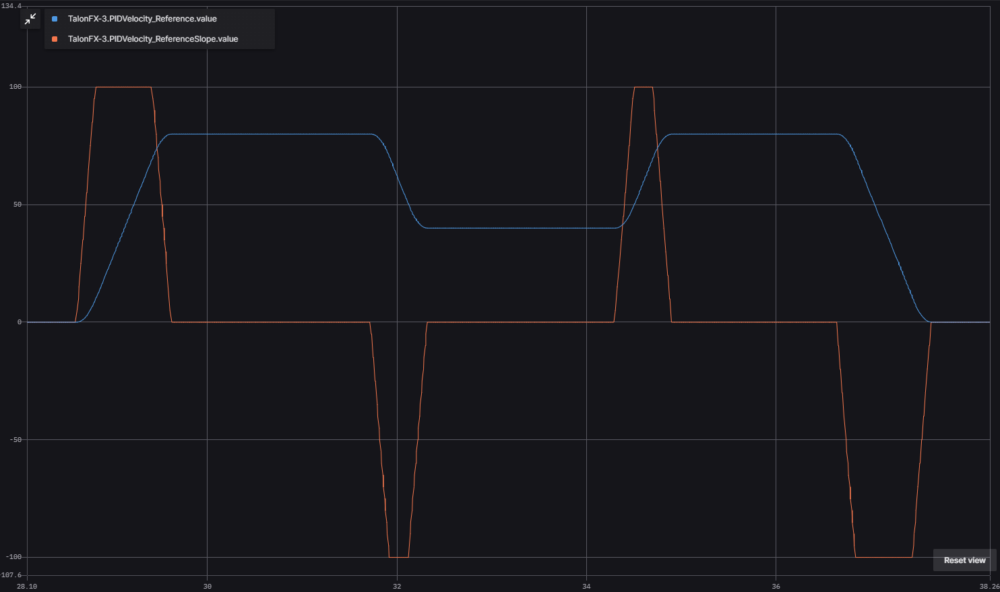

Motion Magic® Controls
======================

In addition to basic PID control, the Talon FX also supports onboard motion profiling using Motion Magic® controls.

Motion Magic®
-------------

Motion Magic® is a control mode that provides the benefit of Motion Profiling without needing to generate motion profile trajectory points. When using Motion Magic®, the motor will move to a target position using a motion profile, while honoring the user specified acceleration, maximum velocity (cruise velocity), and optional jerk.

The benefits of this control mode over "simple" PID position closed-looping are:

- Control of the mechanism throughout the entire motion (as opposed to racing to the end target position)
- Control of the mechanism's inertia to ensure smooth transitions between set points
- Improved repeatability despite changes in battery load
- Improved repeatability despite changes in motor load

After gain/settings are determined, the robot controller only needs to periodically set the target position.

There is no general requirement to "wait for the profile to finish". However, the robot application can poll the sensor position and determine when the motion is finished if need be.

Motion Magic® functions by generating a trapezoidal/S-Curve velocity profile that does not exceed the specified cruise velocity, acceleration, or jerk. This is done automatically by the motor controller.

.. note:: If the remaining sensor distance to travel is small, the velocity may not reach cruise velocity as this would overshoot the target position. This is often referred to as a "triangle profile".

.. image:: images/trapezoidal-profile.png
   :alt: Trapezoidal graph that showcases target cruise velocity and current velocity

If the Motion Magic® jerk is set to a nonzero value, the generated velocity profile is no longer trapezoidal, but instead is a continuous S-Curve (corner points are smoothed).

An S-Curve profile has the following advantaged over a trapezoidal profile:

- Reducing oscillation of the mechanism.
- Maneuver is more deliberate and reproducible.

.. note:: The jerk control feature, by its nature, will increase the amount of time a movement requires. This can be compensated for by increasing the configured acceleration value.

.. image:: images/s-curve-graph.png
   :alt: Graph showing velocity and position using s-curve profile

The following parameters must be set when controlling using Motion Magic®

- Cruise Velocity - peak/cruising velocity of the motion
- Acceleration - controls acceleration and deceleration rates during the beginning and end of motion
- Jerk (optional) - controls jerk, which is the derivative of acceleration

Using Motion Magic® in API
^^^^^^^^^^^^^^^^^^^^^^^^^^

Motion Magic® is currently supported for all base :ref:`control output types <docs/api-reference/device-specific/talonfx/talonfx-control-intro:control output types>`. The units of the output is determined by the control output type.

The Motion Magic® jerk, acceleration, and cruise velocity can be :doc:`configured in code </docs/api-reference/api-usage/configuration>` using a ``MotionMagicConfigs`` (`Java <https://api.ctr-electronics.com/phoenix6/release/java/com/ctre/phoenix6/configs/MotionMagicConfigs.html>`__, `C++ <https://api.ctr-electronics.com/phoenix6/release/cpp/classctre_1_1phoenix6_1_1configs_1_1_motion_magic_configs.html>`__, `Python <https://api.ctr-electronics.com/phoenix6/release/python/autoapi/phoenix6/configs/config_groups/index.html#phoenix6.configs.config_groups.MotionMagicConfigs>`__) object.

In Motion Magic®, the gains should be configured as follows:

- :math:`K_s` - output to overcome static friction (output)
- :math:`K_v` - output per unit of target velocity (output/rps)
- :math:`K_a` - output per unit of target acceleration (output/(rps/s))
- :math:`K_p` - output per unit of error in position (output/rotation)
- :math:`K_i` - output per unit of integrated error in position (output/(rotation*s))
- :math:`K_d` - output per unit of error in velocity (output/rps)

.. tab-set::

   .. tab-item:: Java
      :sync: Java

      .. code-block:: java

         // in init function
         var talonFXConfigs = new TalonFXConfiguration();

         // set slot 0 gains
         var slot0Configs = talonFXConfigs.Slot0;
         slot0Configs.kS = 0.25; // Add 0.25 V output to overcome static friction
         slot0Configs.kV = 0.12; // A velocity target of 1 rps results in 0.12 V output
         slot0Configs.kA = 0.01; // An acceleration of 1 rps/s requires 0.01 V output
         slot0Configs.kP = 4.8; // A position error of 2.5 rotations results in 12 V output
         slot0Configs.kI = 0; // no output for integrated error
         slot0Configs.kD = 0.1; // A velocity error of 1 rps results in 0.1 V output

         // set Motion Magic settings
         var motionMagicConfigs = talonFXConfigs.MotionMagic;
         motionMagicConfigs.MotionMagicCruiseVelocity = 80; // Target cruise velocity of 80 rps
         motionMagicConfigs.MotionMagicAcceleration = 160; // Target acceleration of 160 rps/s (0.5 seconds)
         motionMagicConfigs.MotionMagicJerk = 1600; // Target jerk of 1600 rps/s/s (0.1 seconds)

         m_talonFX.getConfigurator().apply(talonFXConfigs);

   .. tab-item:: C++
      :sync: C++

      .. code-block:: cpp

         // in init function
         configs::TalonFXConfiguration talonFXConfigs{};

         // set slot 0 gains
         auto& slot0Configs = talonFXConfigs.Slot0;
         slot0Configs.kS = 0.25; // Add 0.25 V output to overcome static friction
         slot0Configs.kV = 0.12; // A velocity target of 1 rps results in 0.12 V output
         slot0Configs.kA = 0.01; // An acceleration of 1 rps/s requires 0.01 V output
         slot0Configs.kP = 4.8; // A position error of 2.5 rotations results in 12 V output
         slot0Configs.kI = 0; // no output for integrated error
         slot0Configs.kD = 0.1; // A velocity error of 1 rps results in 0.1 V output

         // set Motion Magic settings
         auto& motionMagicConfigs = talonFXConfigs.MotionMagic;
         motionMagicConfigs.MotionMagicCruiseVelocity = 80; // Target cruise velocity of 80 rps
         motionMagicConfigs.MotionMagicAcceleration = 160; // Target acceleration of 160 rps/s (0.5 seconds)
         motionMagicConfigs.MotionMagicJerk = 1600; // Target jerk of 1600 rps/s/s (0.1 seconds)

         m_talonFX.GetConfigurator().Apply(talonFXConfigs);

   .. tab-item:: Python
      :sync: python

      .. code-block:: python

         # in init function
         talonfx_configs = configs.TalonFXConfiguration()

         # set slot 0 gains
         slot0_configs = talonfx_configs.slot0
         slot0_configs.k_s = 0.25 # Add 0.25 V output to overcome static friction
         slot0_configs.k_v = 0.12 # A velocity target of 1 rps results in 0.12 V output
         slot0_configs.k_a = 0.01 # An acceleration of 1 rps/s requires 0.01 V output
         slot0_configs.k_p = 4.8 # A position error of 2.5 rotations results in 12 V output
         slot0_configs.k_i = 0 # no output for integrated error
         slot0_configs.k_d = 0.1 # A velocity error of 1 rps results in 0.1 V output

         # set Motion Magic settings
         motion_magic_configs = talonfx_configs.motion_magic
         motion_magic_configs.motion_magic_cruise_velocity = 80 # Target cruise velocity of 80 rps
         motion_magic_configs.motion_magic_acceleration = 160 # Target acceleration of 160 rps/s (0.5 seconds)
         motion_magic_configs.motion_magic_jerk = 1600 # Target jerk of 1600 rps/s/s (0.1 seconds)

         self.talonfx.configurator.apply(talonfx_configs)

.. tip:: Motion Magic® supports modifying cruise velocity, acceleration, and jerk on the fly (requires firmware version 24.0.6.0 or newer).

Once the gains are configured, the Motion Magic® request can be sent to the TalonFX. The control request object has an optional feedforward term that can be used to add an arbitrary value to the output, which can be useful to account for the effects of gravity.

.. tab-set::

   .. tab-item:: Java
      :sync: Java

      .. code-block:: java

         // create a Motion Magic request, voltage output
         final MotionMagicVoltage m_request = new MotionMagicVoltage(0);

         // set target position to 100 rotations
         m_talonFX.setControl(m_request.withPosition(100));

   .. tab-item:: C++
      :sync: C++

      .. code-block:: cpp

         // create a Motion Magic request, voltage output
         controls::MotionMagicVoltage m_request{0_tr};

         // set target position to 100 rotations
         m_talonFX.SetControl(m_request.WithPosition(100_tr));

   .. tab-item:: Python
      :sync: python

      .. code-block:: python

         # create a Motion Magic request, voltage output
         self.request = controls.MotionMagicVoltage(0)

         # set target position to 100 rotations
         self.talonfx.set_control(self.request.with_position(100))

Dynamic Motion Magic®
^^^^^^^^^^^^^^^^^^^^^

.. important:: This feature requires the device to be :doc:`Pro licensed </docs/licensing/licensing>` and on a :doc:`CANivore </docs/canivore/canivore-intro>`.

When using a Pro-licensed Talon FX connected to a CANivore, Dynamic Motion Magic® can be used, allowing for the cruise velocity, acceleration, and jerk to be modified directly in the control request during motion. This can be used to set up different values for acceleration vs deceleration or to speed up and slow down the profile on the fly.

The gain slots are configured in the same way as a regular Motion Magic® request. However, the cruise velocity, acceleration, and jerk parameters are set up in the control request, **not** the Motion Magic® config group.

Once the gains are configured, the Dynamic Motion Magic® request can be sent to the TalonFX. The control request object has an optional feedforward term that can be used to add an arbitrary value to the output, which can be useful to account for the effects of gravity.

.. tab-set::

   .. tab-item:: Java
      :sync: Java

      .. code-block:: java

         // create a Dynamic Motion Magic request, voltage output
         // default velocity of 80 rps, acceleration of 400 rot/s^2, and jerk of 4000 rot/s^3
         final DynamicMotionMagicVoltage m_request =
            new DynamicMotionMagicVoltage(0, 80, 400, 4000);

         if (m_joy.getAButton()) {
            // while the joystick A button is held, use a slower profile
            m_request.Velocity = 40; // rps
            m_request.Acceleration = 80; // rot/s^2
            m_request.Jerk = 400; // rot/s^3
         } else {
            // otherwise use a faster profile
            m_request.Velocity = 80; // rps
            m_request.Acceleration = 400; // rot/s^2
            m_request.Jerk = 4000; // rot/s^3
         }

         // set target position to 100 rotations
         m_talonFX.setControl(m_request.withPosition(100));

   .. tab-item:: C++
      :sync: C++

      .. code-block:: cpp

         // create a Dynamic Motion Magic request, voltage output
         // default velocity of 80 rps, acceleration of 400 rot/s^2, and jerk of 4000 rot/s^3
         controls::DynamicMotionMagicVoltage m_request{
            0_tr, 80_tps, 400_tr_per_s_sq, 4000_tr_per_s_cu};

         if (m_joy.GetAButton()) {
            // while the joystick A button is held, use a slower profile
            m_request.Velocity = 40_tps;
            m_request.Acceleration = 80_tr_per_s_sq;
            m_request.Jerk = 400_tr_per_s_cu;
         } else {
            // otherwise use a faster profile
            m_request.Velocity = 80_tps;
            m_request.Acceleration = 400_tr_per_s_sq;
            m_request.Jerk = 4000_tr_per_s_cu;
         }

         // set target position to 100 rotations
         m_talonFX.SetControl(m_request.WithPosition(100_tr));

   .. tab-item:: Python
      :sync: python

      .. code-block:: python

         # create a Dynamic Motion Magic request, voltage output
         # default velocity of 80 rps, acceleration of 400 rot/s^2, and jerk of 4000 rot/s^3
         self.request = controls.DynamicMotionMagicVoltage(0, 80, 400, 4000)

         if self.joy.getAButton():
            # while the joystick A button is held, use a slower profile
            self.request.velocity = 40 # rps
            self.request.acceleration = 80 # rot/s^2
            self.request.jerk = 400 # rot/s^3
         else:
            # otherwise use a faster profile
            self.request.velocity = 80 # rps
            self.request.acceleration = 400 # rot/s^2
            self.request.jerk = 4000 # rot/s^3

         # set target position to 100 rotations
         self.talonfx.set_control(self.request.with_position(100))

Motion Magic® Velocity
----------------------

The Talon FX also supports onboard velocity motion profiling using Motion Magic® Velocity. When using Motion Magic® Velocity, the motor will ramp to a target velocity using a trapezoidal acceleration profile that honors the specified acceleration and optional jerk.

The benefits of this control mode over "simple" PID velocity closed-looping are:

- Control of the mechanism throughout the entire motion (as opposed to racing to the end target velocity)
- Control of the mechanism's inertia to ensure smooth transitions between set points
- Improved repeatability despite changes in battery load
- Improved repeatability despite changes in motor load

After gain/settings are determined, the robot controller only needs to periodically set the target velocity.

The following parameters must be set when controlling using Motion Magic® Velocity

- Acceleration - controls acceleration and deceleration rates during the beginning and end of motion
- Jerk (optional) - controls jerk, which is the derivative of acceleration

Using Motion Magic® Velocity in API
^^^^^^^^^^^^^^^^^^^^^^^^^^^^^^^^^^^

Motion Magic® Velocity is currently supported for all base :ref:`control output types <docs/api-reference/device-specific/talonfx/talonfx-control-intro:control output types>`. The units of the output is determined by the control output type.

The Motion Magic® Velocity jerk and acceleration can be :doc:`configured in code </docs/api-reference/api-usage/configuration>` using a ``MotionMagicConfigs`` (`Java <https://api.ctr-electronics.com/phoenix6/release/java/com/ctre/phoenix6/configs/MotionMagicConfigs.html>`__, `C++ <https://api.ctr-electronics.com/phoenix6/release/cpp/classctre_1_1phoenix6_1_1configs_1_1_motion_magic_configs.html>`__, `Python <https://api.ctr-electronics.com/phoenix6/release/python/autoapi/phoenix6/configs/config_groups/index.html#phoenix6.configs.config_groups.MotionMagicConfigs>`__) object.

In Motion Magic® Velocity, the gains should be configured as follows:

- :math:`K_s` - output to overcome static friction (output)
- :math:`K_v` - output per unit of target velocity (output/rps)
- :math:`K_a` - output per unit of target acceleration (output/(rps/s))
- :math:`K_p` - output per unit of error in velocity (output/rps)
- :math:`K_i` - output per unit of integrated error in velocity (output/rotation)
- :math:`K_d` - output per unit of error derivative in velocity (output/(rps/s))

.. tab-set::

   .. tab-item:: Java
      :sync: Java

      .. code-block:: java

         // in init function
         var talonFXConfigs = new TalonFXConfiguration();

         // set slot 0 gains
         var slot0Configs = talonFXConfigs.Slot0;
         slot0Configs.kS = 0.25; // Add 0.25 V output to overcome static friction
         slot0Configs.kV = 0.12; // A velocity target of 1 rps results in 0.12 V output
         slot0Configs.kA = 0.01; // An acceleration of 1 rps/s requires 0.01 V output
         slot0Configs.kP = 0.11; // An error of 1 rps results in 0.11 V output
         slot0Configs.kI = 0; // no output for integrated error
         slot0Configs.kD = 0; // no output for error derivative

         // set Motion Magic Velocity settings
         var motionMagicConfigs = talonFXConfigs.MotionMagic;
         motionMagicConfigs.MotionMagicAcceleration = 400; // Target acceleration of 400 rps/s (0.25 seconds to max)
         motionMagicConfigs.MotionMagicJerk = 4000; // Target jerk of 4000 rps/s/s (0.1 seconds)

         m_talonFX.getConfigurator().apply(talonFXConfigs);

   .. tab-item:: C++
      :sync: C++

      .. code-block:: cpp

         // in init function
         configs::TalonFXConfiguration talonFXConfigs{};

         // set slot 0 gains
         auto& slot0Configs = talonFXConfigs.Slot0;
         slot0Configs.kS = 0.25; // Add 0.25 V output to overcome static friction
         slot0Configs.kV = 0.12; // A velocity target of 1 rps results in 0.12 V output
         slot0Configs.kA = 0.01; // An acceleration of 1 rps/s requires 0.01 V output
         slot0Configs.kP = 0.11; // An error of 1 rps results in 0.11 V output
         slot0Configs.kI = 0; // no output for integrated error
         slot0Configs.kD = 0; // no output for error derivative

         // set Motion Magic Velocity settings
         auto& motionMagicConfigs = talonFXConfigs.MotionMagic;
         motionMagicConfigs.MotionMagicAcceleration = 400; // Target acceleration of 400 rps/s (0.25 seconds to max)
         motionMagicConfigs.MotionMagicJerk = 4000; // Target jerk of 4000 rps/s/s (0.1 seconds)

         m_talonFX.GetConfigurator().Apply(talonFXConfigs);

   .. tab-item:: Python
      :sync: python

      .. code-block:: python

         # in init function
         talonfx_configs = configs.TalonFXConfiguration()

         # set slot 0 gains
         slot0_configs = talonfx_configs.slot0
         slot0_configs.k_s = 0.25 # Add 0.25 V output to overcome static friction
         slot0_configs.k_v = 0.12 # A velocity target of 1 rps results in 0.12 V output
         slot0_configs.k_a = 0.01 # An acceleration of 1 rps/s requires 0.01 V output
         slot0_configs.k_p = 0.11 # An error of 1 rps results in 0.11 V output
         slot0_configs.k_i = 0 # no output for integrated error
         slot0_configs.k_d = 0 # no output for error derivative

         # set Motion Magic Velocity settings
         motion_magic_configs = talonfx_configs.motion_magic
         motion_magic_configs.motion_magic_acceleration = 400 # Target acceleration of 400 rps/s (0.25 seconds to max)
         motion_magic_configs.motion_magic_jerk = 4000 # Target jerk of 4000 rps/s/s (0.1 seconds)

         self.talonfx.configurator.apply(talonfx_configs)

.. tip:: Motion Magic® Velocity supports modifying acceleration and jerk on the fly (requires firmware version 24.0.6.0 or newer).

Once the gains are configured, the Motion Magic® Velocity request can be sent to the TalonFX.

The Mogion Magic® Velocity request has an Acceleration parameter that can be used to override the profile acceleration during motion. If the Acceleration parameter is left 0, the acceleration config will be used instead.

The control request object also has an optional feedforward term that can be used to add an arbitrary value to the output, which can be useful to account for the effects of gravity.

.. tab-set::

   .. tab-item:: Java
      :sync: Java

      .. code-block:: java

         // create a Motion Magic Velocity request, voltage output
         final MotionMagicVelocityVoltage m_request = new MotionMagicVelocityVoltage(0);

         if (m_joy.getAButton()) {
            // while the joystick A button is held, use a slower acceleration
            m_request.Acceleration = 100; // rot/s^2
         } else {
            // otherwise, fall back to the config
            m_request.Acceleration = 0;
         }

         // set target velocity to 80 rps
         m_talonFX.setControl(m_request.withVelocity(80));

   .. tab-item:: C++
      :sync: C++

      .. code-block:: cpp

         // create a Motion Magic Velocity request, voltage output
         controls::MotionMagicVelocityVoltage m_request{0_tps};

         if (m_joy.GetAButton()) {
            // while the joystick A button is held, use a slower acceleration
            m_request.Acceleration = 100_tr_per_s_sq;
         } else {
            // otherwise, fall back to the config
            m_request.Acceleration = 0_tr_per_s_sq;
         }

         // set target velocity to 80 rps
         m_talonFX.SetControl(m_request.WithVelocity(80_tps));

   .. tab-item:: Python
      :sync: python

      .. code-block:: python

         # create a Motion Magic Velocity request, voltage output
         self.request = controls.MotionMagicVelocityVoltage(0)

         if self.joy.getAButton():
            # while the joystick A button is held, use a slower acceleration
            self.request.acceleration = 100 # rot/s^2
         else:
            # otherwise, fall back to the config
            self.request.acceleration = 0

         # set target velocity to 80 rps
         self.talonfx.set_control(self.request.with_velocity(80))

Motion Magic® Expo
------------------

Whereas traditional Motion Magic® uses a trapezoidal profile or an S-Curve, Motion Magic® Expo uses an exponential profile. This allows the profile to best match the system dynamics, reducing both overshoot and time to target compared to a trapezoidal profile.

.. image:: images/exponential-profile.png
   :alt: Graph that showcases the exponential profile position and velocity setpoints.

Motion Magic® Expo uses the kV and kA characteristics of the system, as well as an optional cruise velocity. The Motion Magic® Expo kV and kA configs are separate from the slot gain configs, as they may use different units and have different behaviors.

The Motion Magic® Expo kV represents the voltage required to maintain a given velocity and is in units of Volts/rps. Dividing the supply voltage by kV results in the maximum velocity of the profile. As a result, when supply voltage is fixed, a **higher profile kV** results in a **lower profile velocity**. Unlike with gain slots, it is safer to start from a higher kV than what is ideal.

The Motion Magic® Expo kA represents the voltage required to apply a given acceleration and is in units of Volts/(rps/s). Dividing the supply voltage by kA results in the maximum acceleration of the profile from 0. As a result, when supply voltage is fixed, a **higher profile kA** results in a **lower profile acceleration**. Unlike with gain slots, it is safer to start from a higher kA than what is ideal.

If the Motion Magic® cruise velocity is set to a non-zero value, the profile will only accelerate up to the cruise velocity. Otherwise, the profile will accelerate towards the maximum possible velocity based on the profile kV.

The following parameters must be set when controlling using Motion Magic® Expo:

- Expo kV - voltage required to maintain a given velocity, in V/rps
- Expo kA - voltage required to apply a given acceleration, in V/(rps/s)
- Cruise Velocity (optional) - peak velocity of the profile; set to 0 to target the system's max velocity

Using Motion Magic® Expo in API
^^^^^^^^^^^^^^^^^^^^^^^^^^^^^^^

Motion Magic® Expo is currently supported for all base :ref:`control output types <docs/api-reference/device-specific/talonfx/talonfx-control-intro:control output types>`. The units of the output is determined by the control output type.

The Motion Magic® Expo kV, kA, and cruise velocity can be :doc:`configured in code </docs/api-reference/api-usage/configuration>` using a ``MotionMagicConfigs`` (`Java <https://api.ctr-electronics.com/phoenix6/release/java/com/ctre/phoenix6/configs/MotionMagicConfigs.html>`__, `C++ <https://api.ctr-electronics.com/phoenix6/release/cpp/classctre_1_1phoenix6_1_1configs_1_1_motion_magic_configs.html>`__, `Python <https://api.ctr-electronics.com/phoenix6/release/python/autoapi/phoenix6/configs/config_groups/index.html#phoenix6.configs.config_groups.MotionMagicConfigs>`__) object.

.. important:: Unlike the gain slots, the MotionMagicExpo_kV and MotionMagicExpo_kA configs are always in output units of Volts.

In Motion Magic® Expo, the gains should be configured as follows:

- :math:`K_s` - output to overcome static friction (output)
- :math:`K_v` - output per unit of target velocity (output/rps)
- :math:`K_a` - output per unit of target acceleration (output/(rps/s))
- :math:`K_p` - output per unit of error in position (output/rotation)
- :math:`K_i` - output per unit of integrated error in position (output/(rotation*s))
- :math:`K_d` - output per unit of error in velocity (output/rps)

.. tab-set::

   .. tab-item:: Java
      :sync: Java

      .. code-block:: java

         // in init function
         var talonFXConfigs = new TalonFXConfiguration();

         // set slot 0 gains
         var slot0Configs = talonFXConfigs.Slot0;
         slot0Configs.kS = 0.25; // Add 0.25 V output to overcome static friction
         slot0Configs.kV = 0.12; // A velocity target of 1 rps results in 0.12 V output
         slot0Configs.kA = 0.01; // An acceleration of 1 rps/s requires 0.01 V output
         slot0Configs.kP = 4.8; // A position error of 2.5 rotations results in 12 V output
         slot0Configs.kI = 0; // no output for integrated error
         slot0Configs.kD = 0.1; // A velocity error of 1 rps results in 0.1 V output

         // set Motion Magic Expo settings
         var motionMagicConfigs = talonFXConfigs.MotionMagic;
         motionMagicConfigs.MotionMagicCruiseVelocity = 0; // Unlimited cruise velocity
         motionMagicConfigs.MotionMagicExpo_kV = 0.12; // kV is around 0.12 V/rps
         motionMagicConfigs.MotionMagicExpo_kA = 0.1; // Use a slower kA of 0.1 V/(rps/s)

         m_talonFX.getConfigurator().apply(talonFXConfigs);

   .. tab-item:: C++
      :sync: C++

      .. code-block:: cpp

         // in init function
         configs::TalonFXConfiguration talonFXConfigs{};

         // set slot 0 gains
         auto& slot0Configs = talonFXConfigs.Slot0;
         slot0Configs.kS = 0.25; // Add 0.25 V output to overcome static friction
         slot0Configs.kV = 0.12; // A velocity target of 1 rps results in 0.12 V output
         slot0Configs.kA = 0.01; // An acceleration of 1 rps/s requires 0.01 V output
         slot0Configs.kP = 4.8; // A position error of 2.5 rotations results in 12 V output
         slot0Configs.kI = 0; // no output for integrated error
         slot0Configs.kD = 0.1; // A velocity error of 1 rps results in 0.1 V output

         // set Motion Magic Expo settings
         auto& motionMagicConfigs = talonFXConfigs.MotionMagic;
         motionMagicConfigs.MotionMagicCruiseVelocity = 0; // Unlimited cruise velocity
         motionMagicConfigs.MotionMagicExpo_kV = 0.12; // kV is around 0.12 V/rps
         motionMagicConfigs.MotionMagicExpo_kA = 0.1; // Use a slower kA of 0.1 V/(rps/s)

         m_talonFX.GetConfigurator().Apply(talonFXConfigs);

   .. tab-item:: Python
      :sync: python

      .. code-block:: python

         # in init function
         talonfx_configs = configs.TalonFXConfiguration()

         # set slot 0 gains
         slot0_configs = talonfx_configs.slot0
         slot0_configs.k_s = 0.25 # Add 0.25 V output to overcome static friction
         slot0_configs.k_v = 0.12 # A velocity target of 1 rps results in 0.12 V output
         slot0_configs.k_a = 0.01 # An acceleration of 1 rps/s requires 0.01 V output
         slot0_configs.k_p = 4.8 # A position error of 2.5 rotations results in 12 V output
         slot0_configs.k_i = 0 # no output for integrated error
         slot0_configs.k_d = 0.1 # A velocity error of 1 rps results in 0.1 V output

         # set Motion Magic Expo settings
         motion_magic_configs = talonfx_configs.motion_magic
         motion_magic_configs.motion_magic_cruise_velocity = 0 # Unlimited cruise velocity
         motion_magic_configs.motion_magic_expo_k_v = 0.12 # kV is around 0.12 V/rps
         motion_magic_configs.motion_magic_expo_k_a = 0.1 # Use a slower kA of 0.1 V/(rps/s)

         self.talonfx.configurator.apply(talonfx_configs)

.. tip:: Motion Magic® Expo supports modifying cruise velocity, kV, and kA on the fly.

Once the gains are configured, the Motion Magic® Expo request can be sent to the TalonFX. The control request object has an optional feedforward term that can be used to add an arbitrary value to the output, which can be useful to account for the effects of gravity.

.. tab-set::

   .. tab-item:: Java
      :sync: Java

      .. code-block:: java

         // create a Motion Magic Expo request, voltage output
         final MotionMagicExpoVoltage m_request = new MotionMagicExpoVoltage(0)

         // set target position to 100 rotations
         m_talonFX.setControl(m_request.withPosition(100));

   .. tab-item:: C++
      :sync: C++

      .. code-block:: cpp

         // create a Motion Magic Expo request, voltage output
         controls::MotionMagicExpoVoltage m_request{0_tr}

         // set target position to 100 rotations
         m_talonFX.SetControl(m_request.WithPosition(100_tr));

   .. tab-item:: Python
      :sync: python

      .. code-block:: python

         # create a Motion Magic Expo request, voltage output
         self.request = controls.MotionMagicExpoVoltage(0)

         # set target position to 100 rotations
         self.talonfx.set_control(self.request.with_position(100))
