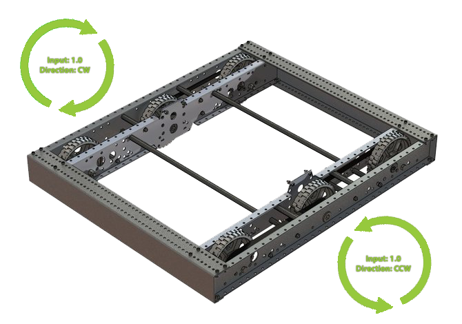

Open-Loop Quickstart
====================

The below example showcases controlling a four-motor drivetrain.

Declaring Motor Controllers
---------------------------

The ``TalonFX`` motor controller constructor (`Java <https://api.ctr-electronics.com/phoenix6/release/java/com/ctre/phoenix6/hardware/TalonFX.html>`__, `C++ <https://api.ctr-electronics.com/phoenix6/release/cpp/classctre_1_1phoenix6_1_1hardware_1_1_talon_f_x.html>`__) requires a **device ID** (int) and an optional **CAN bus** (string).

.. note:: The name of the native roboRIO CAN bus is ``rio``. This is also the default CAN bus on the roboRIO when none is specified.

.. tab-set::

   .. tab-item:: Java
      :sync: Java

      .. code-block:: java

         public class Robot extends TimedRobot {
            private static final String kCANBus = "canivore";

            private final TalonFX m_leftLeader = new TalonFX(0, kCANBus);
            private final TalonFX m_rightLeader = new TalonFX(1, kCANBus);
            private final TalonFX m_leftFollower = new TalonFX(2, kCANBus);
            private final TalonFX m_rightFollower = new TalonFX(3, kCANBus);
         }

   .. tab-item:: C++ (Header)
      :sync: C++

      .. code-block:: cpp

         class Robot : public frc::TimedRobot {
         private:
            static constexpr char const *kCANBus{"canivore"};

            ctre::phoenix6::hardware::TalonFX m_leftLeader{0, kCANBus};
            ctre::phoenix6::hardware::TalonFX m_rightLeader{1, kCANBus};
            ctre::phoenix6::hardware::TalonFX m_leftFollower{2, kCANBus};
            ctre::phoenix6::hardware::TalonFX m_rightFollower{3, kCANBus};
         }

Configure Followers & Inverts
-----------------------------

In a traditional robot drivetrain, there are two motors attached to each horizontal side of the drivetrain. This setup *typically* (unless mechanically inverted) causes the right side to rotate in an opposite direction when given the same voltage.

.. tab-set::

   .. tab-item:: Java
      :sync: Java

      .. code-block:: java

         @Override
         public void robotInit() {
            // start with factory-default configs
            var currentConfigs = new MotorOutputConfigs();

            // The left motor is CCW+
            currentConfigs.Inverted = InvertedValue.CounterClockwise_Positive;
            m_leftLeader.getConfigurator().apply(currentConfigs);

            // The right motor is CW+
            currentConfigs.Inverted = InvertedValue.Clockwise_Positive;
            m_rightLeader.getConfigurator().apply(currentConfigs);

            // Ensure our followers are following their respective leader
            m_leftFollower.setControl(new Follower(m_leftLeader.getDeviceID(), false));
            m_rightFollower.setControl(new Follower(m_rightLeader.getDeviceID(), false));
         }

   .. tab-item:: C++ (Source)
      :sync: C++

      .. code-block:: cpp

         #include "Robot.h"

         using namespace ctre::phoenix6;

         void Robot::RobotInit() {
            // start with factory-default configs
            configs::MotorOutputConfigs currentConfigs{};

            // The left motor is CCW+
            currentConfigs.Inverted = signals::InvertedValue::CounterClockwise_Positive;
            m_leftLeader.GetConfigurator().Apply(currentConfigs);

            // The right motor is CW+
            currentConfigs.Inverted = signals::InvertedValue::Clockwise_Positive;
            m_rightLeader.GetConfigurator().Apply(currentConfigs);

            // Ensure the followers are following their respective leader
            m_leftFollower.SetControl(controls::Follower{m_leftLeader.GetDeviceID(), false});
            m_rightFollower.SetControl(controls::Follower{m_rightLeader.GetDeviceID(), false});
         }

Full Example
------------

.. tab-set::

   .. tab-item:: Java
      :sync: Java

      .. code-block:: java

         public class Robot extends TimedRobot {
            private static final String kCANBus = "canivore";

            private final TalonFX m_leftLeader = new TalonFX(0, kCANBus);
            private final TalonFX m_rightLeader = new TalonFX(1, kCANBus);
            private final TalonFX m_leftFollower = new TalonFX(2, kCANBus);
            private final TalonFX m_rightFollower = new TalonFX(3, kCANBus);

            private final DutyCycleOut m_leftOut = new DutyCycleOut(0);
            private final DutyCycleOut m_rightOut = new DutyCycleOut(0);

            private final XboxController m_driverJoy = new XboxController(0);

            @Override
            public void robotInit() {
               // start with factory-default configs
               var currentConfigs = new MotorOutputConfigs();

               // The left motor is CCW+
               currentConfigs.Inverted = InvertedValue.CounterClockwise_Positive;
               m_leftLeader.getConfigurator().apply(currentConfigs);

               // The right motor is CW+
               currentConfigs.Inverted = InvertedValue.Clockwise_Positive;
               m_rightLeader.getConfigurator().apply(currentConfigs);

               // Ensure our followers are following their respective leader
               m_leftFollower.setControl(new Follower(m_leftLeader.getDeviceID(), false));
               m_rightFollower.setControl(new Follower(m_rightLeader.getDeviceID(), false));
            }

            @Override
            public void teleopPeriodic() {
               // retrieve joystick inputs
               var fwd = -m_driverJoy.getLeftY();
               var rot = m_driverJoy.getRightX();

               // modify control requests
               m_leftOut.Output = fwd + rot;
               m_rightOut.Output = fwd - rot;

               // send control requests
               m_leftLeader.setControl(m_leftOut);
               m_rightLeader.setControl(m_rightOut);
            }
         }

   .. tab-item:: C++ (Source)
      :sync: C++

      .. code-block:: cpp

         #include "Robot.h"

         using namespace ctre::phoenix6;

         void Robot::RobotInit() {
            // start with factory-default configs
            configs::MotorOutputConfigs currentConfigs{};

            // The left motor is CCW+
            currentConfigs.Inverted = signals::InvertedValue::CounterClockwise_Positive;
            m_leftLeader.GetConfigurator().Apply(currentConfigs);

            // The right motor is CW+
            currentConfigs.Inverted = signals::InvertedValue::Clockwise_Positive;
            m_rightLeader.GetConfigurator().Apply(currentConfigs);

            // Ensure the followers are following their respective leader
            m_leftFollower.SetControl(controls::Follower{m_leftLeader.GetDeviceID(), false});
            m_rightFollower.SetControl(controls::Follower{m_rightLeader.GetDeviceID(), false});
         }

         void Robot::TeleopPeriodic() {
            // retrieve joystick inputs
            auto fwd = -m_driverJoy.GetLeftY();
            auto rot = m_driverJoy.GetRightX();

            // modify control requests
            m_leftOut.Output = fwd + rot;
            m_rightOut.Output = fwd - rot;

            // send control requests
            m_leftLeader.SetControl(m_leftOut);
            m_rightLeader.SetControl(m_rightOut);
         }

   .. tab-item:: C++ (Header)
      :sync: C++

      .. code-block:: cpp

         private:
            static constexpr char const *kCANBus{"canivore"};

            ctre::phoenix6::hardware::TalonFX m_leftLeader{0, kCANBus};
            ctre::phoenix6::hardware::TalonFX m_rightLeader{1, kCANBus};
            ctre::phoenix6::hardware::TalonFX m_leftFollower{2, kCANBus};
            ctre::phoenix6::hardware::TalonFX m_rightFollower{3, kCANBus};

            ctre::phoenix6::controls::DutyCycleOut m_leftOut{0};
            ctre::phoenix6::controls::DutyCycleOut m_rightOut{0};

            frc::XboxController m_driverJoy{0};
