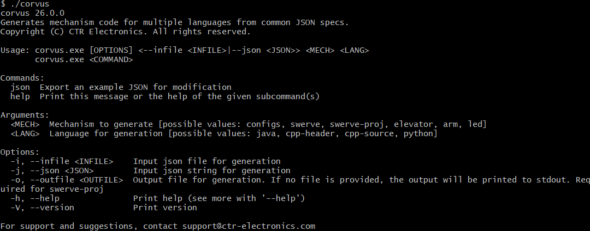

Mechanisms
==========

This section serves to provide API usage of mechanisms supported by Phoenix 6.

.. grid:: 1 2 2 2

   .. grid-item-card:: Swerve
      :link: swerve/swerve-overview
      :link-type: doc

      Documentation on the Phoenix 6 Swerve API

   .. grid-item-card:: Differential
      :link: differential/differential-overview
      :link-type: doc

      Documentation on the Phoenix 6 Differential Mechanism APIs

.. toctree::
   :maxdepth: 1
   :hidden:

   swerve/swerve-overview
   differential/differential-overview

Generating Mechanisms
---------------------

Mechanisms such as swerve or an elevator can be generated using :doc:`Tuner X </docs/tuner/index>`, greatly simplifying the setup process and eliminating many sources of error.

Additionally, the ``corvus`` CLI tool can be used from a terminal to generate a mechanism from a JSON specification, including a full swerve project. ``corvus`` can be downloaded from the `CLI Tools download page <https://docs.ctr-electronics.com/cli-tools>`__.

To view a list of available commands, run ``corvus`` either with no parameters or with ``--help``.

As an example, to generate an example ``Elevator`` subsystem for a Java robot program, run:

.. code-block:: bash

   ./corvus json elevator Elevator.json
   ./corvus elevator java -i Elevator.json -o src/main/java/frc/robot/subsystems/Elevator.java
