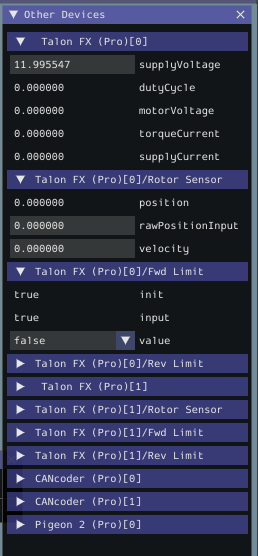

MotorController Integration
===========================

Phoenix 6 motor controller classes such as ``TalonFX`` (`Java <https://api.ctr-electronics.com/phoenix6/stable/java/com/ctre/phoenix6/hardware/TalonFX.html>`__, `C++ <https://api.ctr-electronics.com/phoenix6/stable/cpp/classctre_1_1phoenix6_1_1hardware_1_1_talon_f_x.html>`__, `Python <https://api.ctr-electronics.com/phoenix6/stable/python/autoapi/phoenix6/hardware/talon_fx/index.html>`__) implement many APIs from the ``MotorController`` (`Java <https://github.wpilib.org/allwpilib/docs/release/java/edu/wpi/first/wpilibj/motorcontrol/MotorController.html>`__, `C++ <https://github.wpilib.org/allwpilib/docs/release/cpp/classfrc_1_1_motor_controller.html>`__) interface. This allows Phoenix 6 motor controllers to more easily be used in WPILib drivetrain classes such as ``DifferentialDrive``.

.. tab-set::

   .. tab-item:: Java
      :sync: Java

      .. code-block:: java

         // instantiate motor controllers
         final TalonFX m_motorLeft = new TalonFX(0);
         final TalonFX m_motorRight = new TalonFX(1);

         // create DifferentialDrive object for robot control
         final DifferentialDrive m_diffDrive = new DifferentialDrive(
            m_motorLeft::set, m_motorRight::set
         );

         // instantiate joystick
         final XboxController m_driverJoy = new XboxController(0);

         public void teleopPeriodic() {
            var forward = -m_driverJoy.getLeftY();
            var rot = -m_driverJoy.getRightX();

            m_diffDrive.arcadeDrive(forward, rot);
         }

   .. tab-item:: C++ (Source)
      :sync: C++

      .. code-block:: cpp

         void Robot::TeleopPeriodic() {
            auto forward = -m_driverJoy.GetLeftY();
            auto rot = -m_driverJoy.GetRightX();

            m_diffDrive.ArcadeDrive(forward, rot);
         }

   .. tab-item:: C++ (Header)
      :sync: C++ Header

      .. code-block:: cpp

         // instantiate motor controllers
         hardware::TalonFX m_motorLeft{0};
         hardware::TalonFX m_motorRight{1};

         // create differentialdrive object for robot control
         frc::DifferentialDrive m_diffDrive{
            [this](double output) { m_motorLeft.Set(output); },
            [this](double output) { m_motorRight.Set(output); }
         };

         // instantiate joystick
         frc::XboxController m_driverJoy{0};

   .. tab-item:: Python
      :sync: python

      .. code-block:: python

         def __init__(self):
            # instantiate motor controllers
            self.motor_left = hardware.TalonFX(0)
            self.motor_right = hardware.TalonFX(1)

            # create DifferentialDrive object for robot control
            self.diff_drive = wpilib.drive.DifferentialDrive(
               self.motor_left.set, self.motor_right.set
            )

            # instantiate joystick
            self.driver_joy = wpilib.XboxController(0)

         def teleopPeriodic(self):
            forward = -self.driver_joy.getLeftY()
            rot = -self.driver_joy.getRightX()

            self.diff_drive.arcadeDrive(forward, rot)

Motor Safety
------------

CTR Electronics supported actuators implement WPILib `Motor Safety <https://docs.wpilib.org/en/stable/docs/software/hardware-apis/motors/wpi-drive-classes.html#motor-safety>`__. In additional to the normal :doc:`enable signal </docs/api-reference/api-usage/enabling-actuators>` of CTR Electronics actuators, Motor Safety will automatically disable the device according to the WPILib Motor Safety implementation.

Simulation
----------

It's recommended that users set supply voltage to ``RobotController.getBatteryVoltage()`` (`Java <https://github.wpilib.org/allwpilib/docs/release/java/edu/wpi/first/wpilibj/RobotController.html#getBatteryVoltage()>`__, `C++ <https://github.wpilib.org/allwpilib/docs/release/cpp/classfrc_1_1_robot_controller.html#a4b1e42e825583c82664a4ecc5d81b83f>`__) to take advantage of WPILib's ``BatterySim`` (`Java <https://github.wpilib.org/allwpilib/docs/release/java/edu/wpi/first/wpilibj/simulation/BatterySim.html>`__, `C++ <https://github.wpilib.org/allwpilib/docs/release/cpp/classfrc_1_1sim_1_1_battery_sim.html>`__) API. Additionally, the simulated device state is shown in the simulation :guilabel:`Other Devices` menu.

