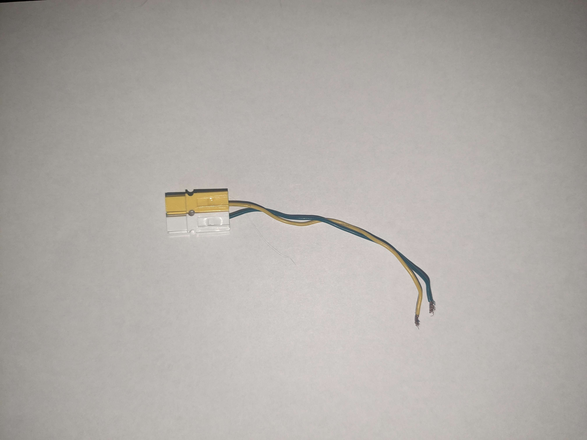
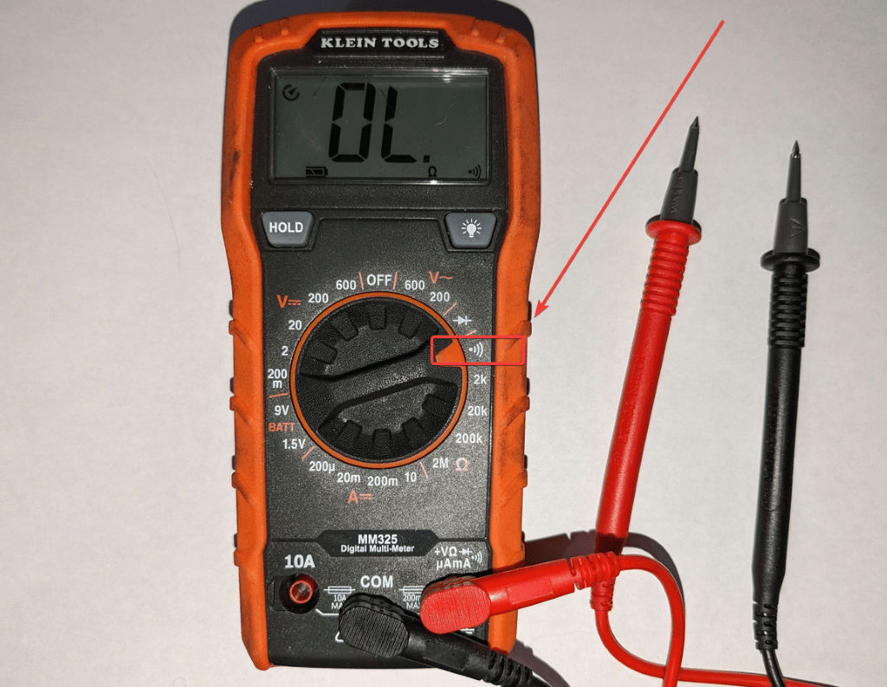
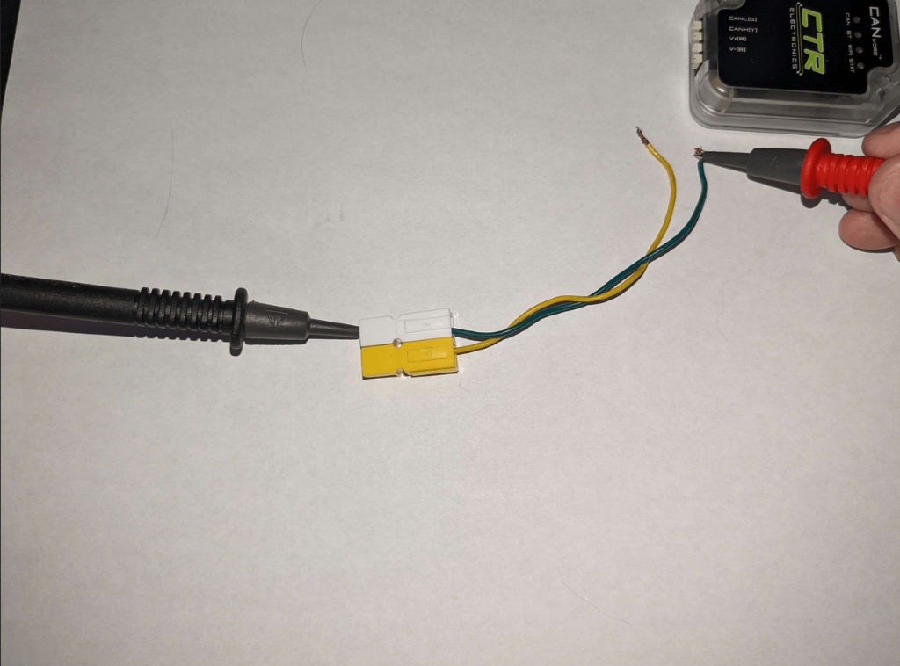

Troubleshooting your CAN bus
============================

*Authored by Dalton*

   *CAN with one side using an Anderson connector. Commonly dubbed "CANdersons".*

Recently, I had the pleasure of attending as a CSA for a local event. In that event, I noticed a few common problems among teams and how a bit of documentation on both

- Making your CAN bus more robust
- Troubleshooting your CAN bus

could greatly help teams. There are already numerous articles on `Chief Delphi <https://chiefdelphi.com/>`__ but Chief Delphi is often unheard of for rookie teams. In this article, I try to cover a few points on building a robust CAN bus but really focus on the diagnostic portion.

Identifying CAN Failures
------------------------

CAN failures often show up in the form of `Driver Station error messages <https://docs.wpilib.org/en/stable/docs/software/driverstation/driver-station-errors-warnings.html>`_. Some of the examples of these errors are shown below, but the one thing they all have in common is that they are CAN related.

.. code-block:: bash

   [CAN SPARK] IDs: 3, WPILib or External HAL Error: CAN: Message not found

.. code-block:: bash

   ERROR  -1001  Could not transmit CAN Frame.  talon fx 0 () Apply Config

.. code-block:: bash

   ERROR  -1003  CAN frame not received/too-stale. Check the CAN bus wiring, CAN bus utilization, and power to the device.  talon fx 0 () Status Signal MotorVoltage ERROR  -1003  CAN frame not received/too-stale. Check the CAN bus wiring, CAN bus utilization, and power to the device.  talon fx 0 () Status Signal Velocity ERROR  -1003  CAN frame

Before diving too deep into if it's a CAN problem, it's important to ask the following questions.

- Was your robot already working before you encountered problems AND you haven't made code changes between the last "working" robot and now?

  - Sometimes teams think it's their wiring, but a programmer accidentally changed a device ID somewhere.

- Did you recently replace a device?

  - Verify that device has the correct ID, CAN bus (does the code expect a CANivore or a roboRIO?), and firmware version.

- Are any of the devices on the bus blinking their "No CAN" leds. Consult the manufacturer's documentation on the LED blink codes.

  - This is likely a CAN bus issue.

Diagnosing the Problem
----------------------

Once you identified that it's an issue with your wiring, the next step is identifying where the problem is occurring. Is it (not a checklist, but these are often causes)?

- A bad crimp in a connector?
- Bad strip so copper wire is not touching the inside of the connector?
- A failure in a device causing the CAN chain to not continue?
- The CAN wire being physically disconnected (sliced or otherwise disconnected)?

The above list isn't all encompassing, but a good list to keep in mind when diagnosing. If the CAN bus is a CANivore, I would typically expect the entire bus to fail if connection to the terminating resistor is no longer valid. The roboRIO bus is more tolerant, so you'll typically see devices on the bus before any bad connections.

Diagnosing a CANivore bus can be a little tricky (TODO link to canivore step). For the roboRIO, you should be able to see where the CAN fails visually in the LEDs of the devices.

Follow the chain from the roboRIO, continuing until you encounter a device with bad CAN leds, then inspect wiring between the last good device and the first bad device.

Random Tangent
^^^^^^^^^^^^^^

Pretty much every time I have helped that have used these `splicing <https://www.amazon.com/Brightfour-Splice-Connector-T-Solderless-Connectors/dp/B07MDFMKVR/>`__ connectors have taken much more time to get up and running than others.

I really don't recommend these for your drivetrain. A common argument is that it let's you lose a motor/module and still have the rest of the devices in the chain (CAN allows ~1ft trunks). Realistically, if you lose one motor you can no longer drive your swerve robot without mechanically breaking it.

Then, when you get back and have to fix your wiring, it takes much more time to replace/repair then simple PWM-style connectors or my personal favorite, `WAGOs <https://www.andymark.com/products/wago-221-series-inline-splicing-connector-with-lever>`__ (there are many styles of connectors out there, choose what your team is most comfortable with while being robust).

Diagnosing a CANivore bus
-------------------------

When a CANivore bus fails, the typical symptom is the entire bus fails. This is because CAN FD only is tolerant about ~1ft without a 120 :math:`\Omega` terminating resister. What this means is that any failure in the connection (intermitten or otherwise) will bring the entire bus down.

From an LED perspective, the CAN status LED will likely alternate (inconsistently) between green and red, or be solid red. There are a couple of strategies to troubleshoot this, and a few of them you can (and should) perform in parallel.

Diagnosing with a Continuity Check
^^^^^^^^^^^^^^^^^^^^^^^^^^^^^^^^^^

I'll be going with the continuity check approach (at the same time, you can have your team members visually check all connectors for any breaks and any slices in the CAN wire).

Using your multimeter, switch the dial to the continuity option (kinda looks like a WiFi icon).

If you touch the red and black probes together, the multimeter should make an audible beep.

Disconnect the green and yellow CAN wires from the CANivore. Place one of the probes on the green wire. Then, at the first primary area of interest (in a swerve drive, I typically choose the first connection into one of the modules), disconnect the wires there. Place the other probe at the green wire that you just disconnected (the one leading back to the CANivore, not the rest of the chain).

If the connection beeps, you are all good. If it doesn't, you've identified the failure. Repeat this process with the yellow wire as well. Once you've finished verifying the point of interest (I.e. a swerve module), repeat for each swerve module.

What if they all are good?
~~~~~~~~~~~~~~~~~~~~~~~~~~

Check the terminating resistor. I've seen teams whose terminating resistor was just shoved into a pair of andersons or WAGOs. I would recommend soldering each end of the resistor onto a small strip of green/yellow CAN wire, then place the other end of the wires into the WAGOs.

Robustness Improvements
-----------------------

There are many ways a team can improve their wiring. I will always recommend teams to keep their electrical wiring a forethought in their mechanical design. Missing a match can be recoverable, missing two matches is basically disastrous.

1. Design your robot such that any wiring is protected from access outside of the robot, but still easy to replace if need be.
2. Use connectors that can be easily replaced. You will have to replace them during an event, no team is immune from disastrous events on the field. If using andersons or PWM-style connectors, zip-tie or use some sort of clip to prevent them from disconnecting.
3. Before each and every match, tug test your wires with the robot turned on. This will identify any issues.
4. Ensure wires have a good amount of slack. Slack allows wires to wiggle (you never know when a wire is going to come under tension) and allow room to strip and rewire if necessary.

Conclusion
----------

Hopefully this article shed a bit of light on how to troubleshoot your CAN bus, improve it, and maybe a bit on how it works.

If you have any suggestions to improve this article, feel free to `email us <mailto:support@ctr-electronics.com>`__.
