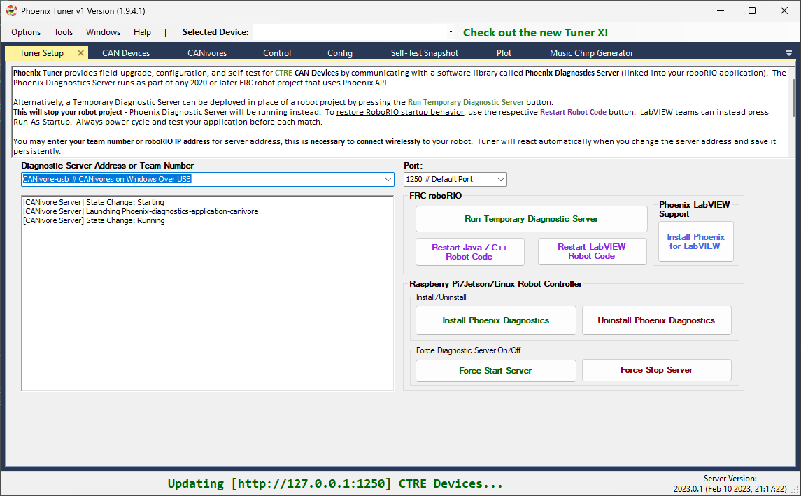
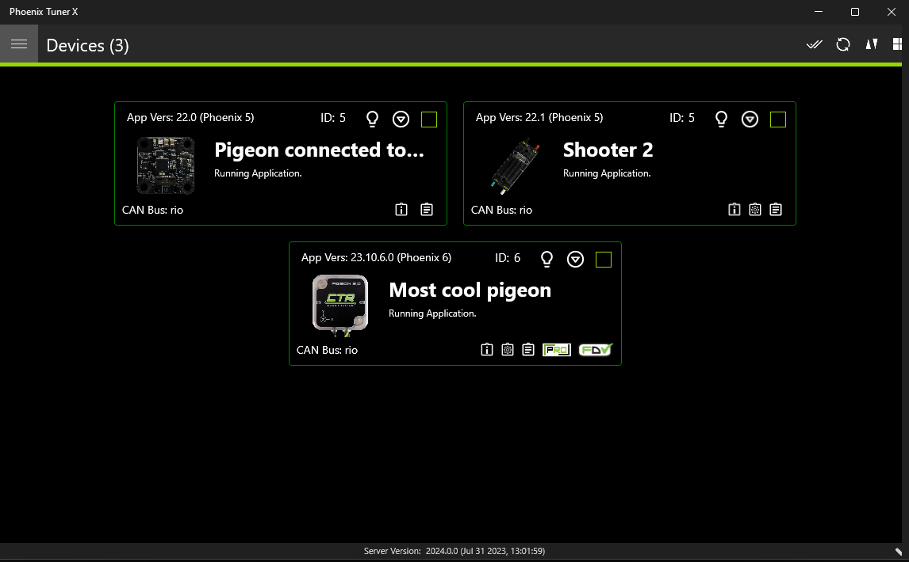
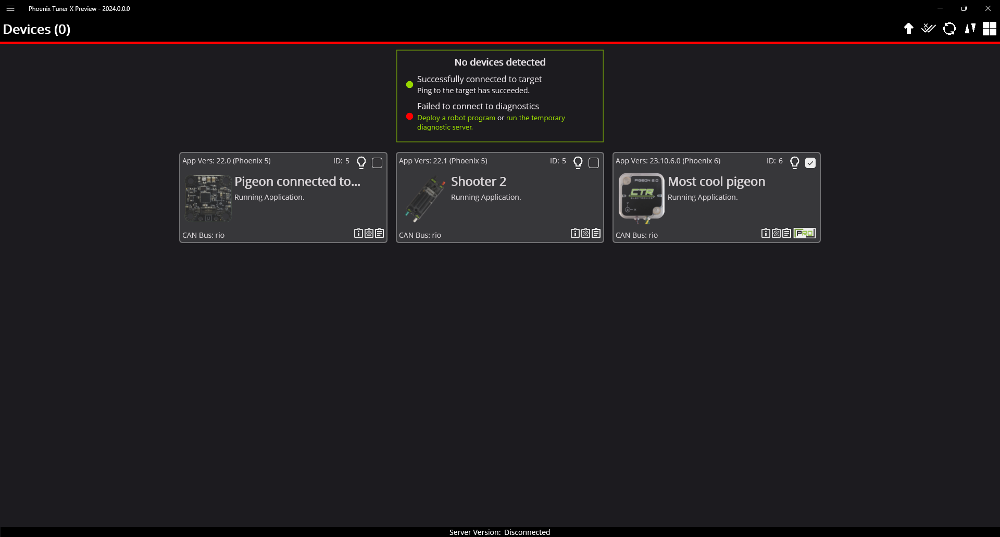
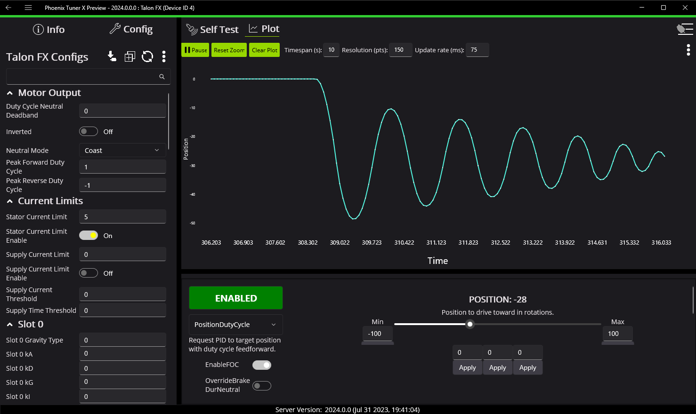

Tuner and an evolution in configuration
=======================================

*Authored by Dalton*

Since the introduction of the CTRE Toolsuite (pre-2018), we at CTR have strived to provide intuitive means of configuring and utilizing our products. In 2018, we launched Phoenix Tuner (now lovingly referred to as Tuner v1). Tuner v1 introduced features like: batch firmware upgrading like devices, diagnostic server deployment, self tests, plotting and control.

With Tuner, and by extension diagnostics, we have several primary objectives:

- Ease of debugging (exposed via self test).
- Seamless setup experience.
- Support and integrate our extension feature-set.

Tuner v1 was and is great, but we wanted to do more. In the 2023 season, we introduced Tuner X.

Introducing Tuner X
-------------------

The goal we had with Tuner X development was to refine and enhance the existing Tuner v1 feature set. We introduced `Android support <https://play.google.com/store/apps/details?id=com.ctre.phoenix_tuner>`__, improved batch upgrading, improved highlighting of duplicate devices, automatic firmware downloads (no more downloading CRFs!), improved self test and licensing support.

With Tuner X, users can:

* Configure their device's name & ID
* Blink a device, which is useful for identifying where the device is on the robot.
* Firmware update all devices to the latest version available (no more CRF downloads).
* Control individual motors with their Android phone, or on Windows.
* Plot various signals such as velocity, position and yaw.
* Self test their v6 device, which provides a marked up self test of the device.

.. important:: Tuner X does not require v6 and can be used with v5 flashed devices.

For a full list of features, check out the `v6 documentation <https://pro.docs.ctr-electronics.com/en/latest/docs/tuner/index.html>`__.

Introducing a new iteration of Tuner X
--------------------------------------

Some of you may have noticed that your version of Tuner X has changed recently. We've been working on several key improvements to the application that should dramatically improve the user experience.  While this blog will highlight some of those, it's best to just try out the new Tuner yourself.

.. note:: Feedback is welcome and can be provided by emailing `feedback@ctr-electronics.com <mailto:feedback@ctr-electronics.com>`__.

Improved connection diagnostics
^^^^^^^^^^^^^^^^^^^^^^^^^^^^^^^

Tuner requires a running `diagnostic server <https://pro.docs.ctr-electronics.com/en/latest/docs/installation/running-diagnostics.html>`__ to work. Typically, this is installed through a robot program utilizing one of our devices. Alternatively, this program is temporarily run using a button in `Settings <https://pro.docs.ctr-electronics.com/en/latest/docs/tuner/connecting.html?highlight=settings#temporary-diagnostics-frc>`__. We've improved the disconnection status card to contain information about the ping of the target and diagnostic state of the device.

This 3 step check looks for the following:

1. Ping of the target.
2. Is diagnostics (or a robot program with diagnostics) running?
3. Are there any devices reported?

To summarize, if a user is not seeing devices in Tuner but checks 1 and 2 are good, then the next recommendation is to check the LED status of the device. We have an extensive list of status LEDs that indicate if the device is detected on a CAN bus, or other problems. This list can be found on the corresponding device page in the docs. For example, look at the `CANcoder LED table <https://pro.docs.ctr-electronics.com/en/latest/docs/hardware-reference/cancoder/index.html#status-light-reference>`__.

Redesigned device overview
^^^^^^^^^^^^^^^^^^^^^^^^^^

The device overview page has been redesigned to improve usability of plot, control and configuration. It's never been easier to tune your closed-loop gains directly in Tuner!

Bug squashing and usability improvements
^^^^^^^^^^^^^^^^^^^^^^^^^^^^^^^^^^^^^^^^

This list is by no means exhaustive, but provides a good idea of the changes between 2023.X and 2024 versions of Tuner X.

* Firmware selection now has a dropdown for year, allowing you to flash older year firmware
* Dramatically improved startup and navigation performance
* Dramatically improved plotting performance
* Dramatically improved commands timing out on Android Tuner
* Enable/Disable button colors have been adjusted to be more clear
* Fixed “connection blipping” on Android Tuner
* Fixed control sometimes stuttering and causing the device to disable
* Fixed licensing sometimes fail to load on Android Tuner
* Fixed SSH credentials popup not appearing sometimes
* Fixed lag when entering into various entries
* Fixed memory leak when plotting for long periods of time
* Fixed situation where the application would shutdown uncleanly and lose settings
* Fixed various clipping of icons, text and labels
* Fixed issue where CANivore USB toggle would be unable to enable or disable
* Fixed firmware flashing on Raspberry Pi
* Fixed temporary diagnostic deployment on non-RIO platforms
* Slows down CANivore polling, which improves Rio CPU performance when Tuner is open

What's next?
------------

We have a couple of exciting improvements to Tuner on our radar, keep an eye out on our `changelog <https://api.ctr-electronics.com/changelog>`__. Tuner X can be downloaded via the `Microsoft Store <https://apps.microsoft.com/store/detail/phoenix-tuner-x/9NVV4PWDW27Z?hl=en-us&gl=us>`__ and the `Google Play Store <https://play.google.com/store/apps/details?id=com.ctre.phoenix_tuner>`__.
