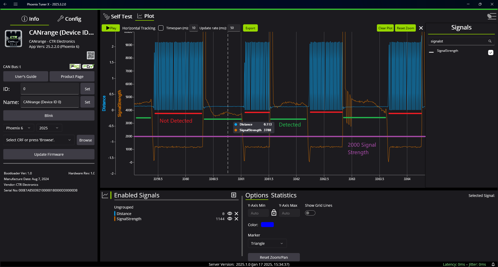
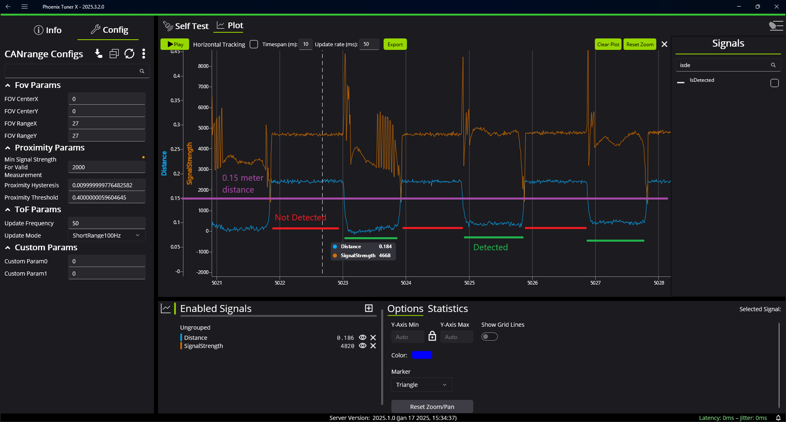
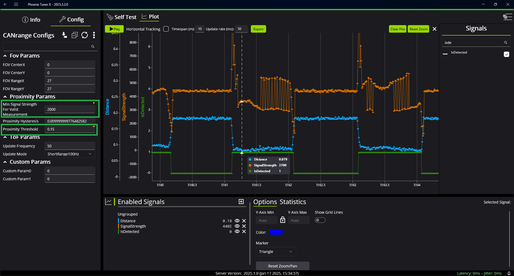
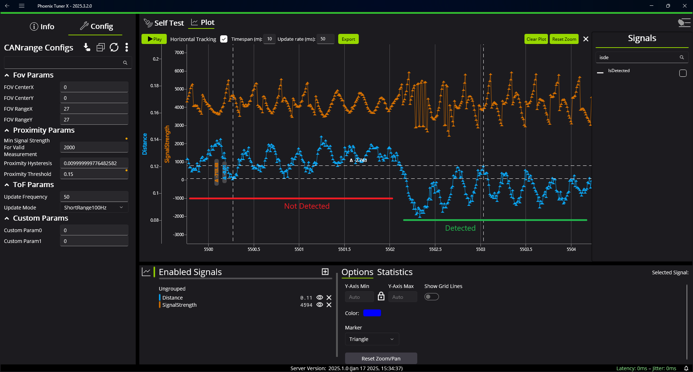

Tuning CANrange
===============
*Authored by Cory*

We've had a number of people asking about how to tune their CANrange to identify that a game piece or robot component is being detected.
This devblog covers the general strategy for tuning a CANrange.

Signal Strength Tuning
----------------------

The first step to detection tuning is to verify that your distance measurement is a valid measurement.
This is accomplished by looking at the signal strength, with higher values indicating more confident distance measurements.
By default, we specify a minimum signal strength of 2500 to classify a distance measurement as "valid" for the purpose of our "isDetected" signal.

Scenarios
+++++++++

There are two primary scenarios that affect the signal strength for the CANrange.

1. **CANrange looks into open air when nothing is in front of it** - This results in low signal strength under "not detected", and high signal strength with some distance when "detected"
2. **CANrange looks at something further away when nothing is in front of it** - This typically results in high signal strength regardless of if something is in front of it, but the distance shortens when something is in front of it.

The first scenario requires Signal Strength tuning to identify the difference between open air and objects in front of the sensor.

The process for tuning is to put an object in front of the CANrange, as if it would happen on the final mechanism, and measure the signal strength.
Then, remove that object and measure the signal strength.

Do this in as many configurations as is practical for the system and identify a signal strength threshold that will allow all detections when the object is present while disallowing as many of the detections when the object is not present as possible.
Typically, in an open-air system this alone is sufficient to classify an object as detected or not.

Distance Tuning
---------------

Distance tuning is essentially the same process as signal strength tuning.

Put an object in front of the CANrange, take a measurement, remove it, take a measurement, repeat.
Just like in signal strength tuning, you place the distance threshold so that it splits the two scenarios as best as possible.

In open air, the distance measurement may be unreliable when the object is not detected, in which case the signal strength should filter it out and reject it.
For these cases, just ensure the distance threshold is above the distance when an object is present.

Examples
--------

Example - Open Air
++++++++++++++++++

The following is an example of a CANrange being used to detect an object and is otherwise pointing to open air.

In the image, the distance measurement is unreliable at signal strengths below 2000, and very reliable when the strength is above 2000.

Given that the signal strength alone is sufficient to detect game piece detection, we can specify a large distance threshold without much concern.
In this case, I specified a distance threshold of 0.4 meters, despite the measured distance only being 0.11 meters.

This results in the following IsDetected result.

Which aligns nicely with when an object is placed in front of the CANrange and not.

Example - Always Valid measurements
+++++++++++++++++++++++++++++++++++

The following is an example of a CANrange being used to detect an object when it's also pointed at a backing material when the object is not present.

In this scenario, note that the signal strength is always high, typically larger than 2000.
However, the distance measurement is always valid, and we can instead rely on the distance thresholding for detection or not.

In this case, a signal strength of 2000 is appropriate, and a distance threshold of 0.15 meters would cleanly identify when an object is detected or not.
This results in the following plot.

And this, too, aligns nicely when an object is placed in front of the CANrange.

Example - Hysteresis
++++++++++++++++++++

In some cases, the object being detected results in a noisy distance measurement, and we want to avoid accidentally declaring an object as no longer detected when it is and vice versa.
An increased hysteresis may be appropriate in this circumstance, as it will require the distance measurement to move beyond the threshold to account for this noise.

Below is an example of such a case.

In this scenario, we want the threshold to be approximately 0.115, however the distance measurement sometimes dips below that threshold when it is not detected and sometimes dips above that threshold when it is detected.
In this case, we can place a hysteresis of approximately 0.01 to account for the dips above and below, resulting in the following.

And in this scenario, the hysteresis correctly disallows the IsDetected signal from blipping while the distance measured crosses the threshold.

