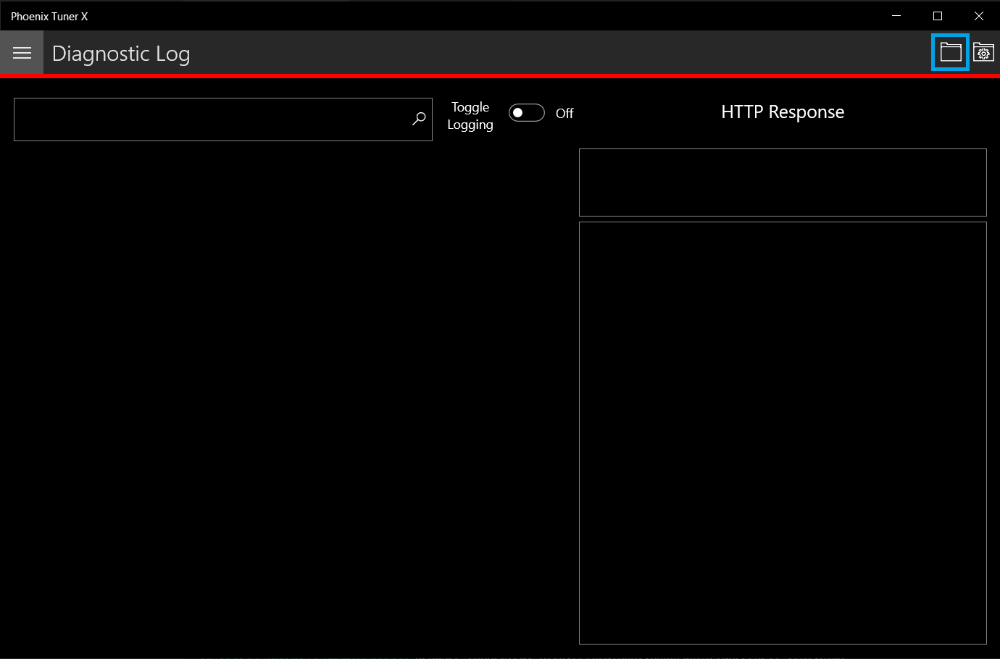

Advanced Configuration
======================

The CANivore provides additional configuration options for advanced users.

CAN Bus Termination
-------------------

The CANivore has a 120 :math:`\Omega` programmable resister for terminating the CAN bus. The resistor can be configured using the :guilabel:`CAN Bus Termination` toggle in the CANivore device card in Phoenix Tuner X.

.. warning:: A CAN bus requires two termination resistors, one at each extreme end. If only one is present, communication over CAN may fail.

.. image:: images/canivore-termination.png
   :width: 70%
   :alt: CAN bus termination is the second toggle in the CANivore device card

caniv - CANivore CLI
--------------------

``caniv`` is a Command-line Interface (CLI) to interact with CANivores outside of Phoenix Tuner X.

.. note:: Unlike the CANivores page in Phoenix Tuner X, ``caniv`` does **not** require a running Phoenix Diagnostic Server.

On Linux systems (including the roboRIO), ``caniv`` can be found at ``/usr/local/bin``. On Windows systems, the program is in the Phoenix Tuner X application cache directory, which can be opened by opening the :guilabel:`Diagnostic Log` page and clicking the left folder icon in the top right:

To view a list of available commands, run ``caniv`` either with no parameters or with ``--help``.

.. image:: images/caniv-cli.png
   :width: 70%
   :alt: Running the caniv CLI help message
