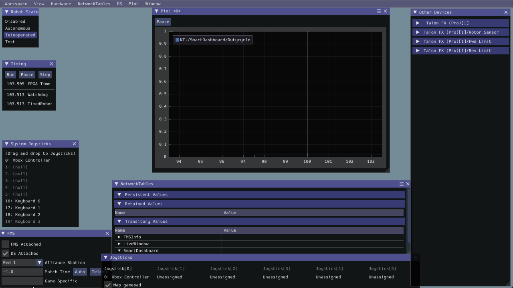
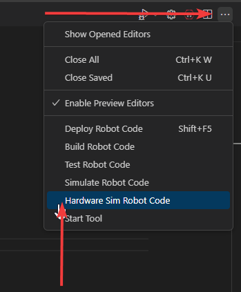

Hardware-attached Simulation
============================

CANivore supports hardware attached simulation when used in an `FRC robot program <https://docs.wpilib.org/en/stable/>`__; this allows a CANivore to be used with real devices on supported host operating systems. The below video showcases controlling a **real** `Falcon 500 <https://store.ctr-electronics.com/falcon-500-powered-by-talon-fx/>`__ in a robot program using hardware-attached simulation.

To utilize hardware-attached simulation, ensure the CANivore is connected directly via USB to the machine running the simulation. All devices on the CANivore CAN Bus should be independently powered, as the CANivore does not provide power. In the robot program, the CANivore name or ``*`` must be specified in the device constructor.

.. important:: Any motors/actuators that have been connected to a roboRIO CAN Bus at any time must be factory defaulted due to them being :ref:`FRC Locked <docs/api-reference/api-usage/enabling-actuators:frc lock>`. Factory defaulting can be done in :ref:`Tuner X <docs/tuner/configs:tuner configs>` and should be done when the CANivore is **not** connected to a roboRIO.

.. tab-set::

   .. tab-item:: Java
      :sync: Java

      .. code-block:: Java

         TalonFX m_motor = new TalonFX(0, "mycanivore");

   .. tab-item:: C++
      :sync: C++

      .. code-block:: cpp

         TalonFX m_motor{0, "mycanivore"};

In VS Code, select the 3 dots in the top-right, then select :guilabel:`Hardware Sim Robot Code`

A message in the console should appear that the CAN Bus is connected.

.. code-block:: text

   ********** Robot program startup complete **********
   [phoenix] CANbus Connected: uno (WinUSB, 2B189E633353385320202034383803FF)
   [phoenix] CANbus Network Up: uno (WinUSB, 2B189E633353385320202034383803FF)
   [phoenix] Library initialization is complete.
