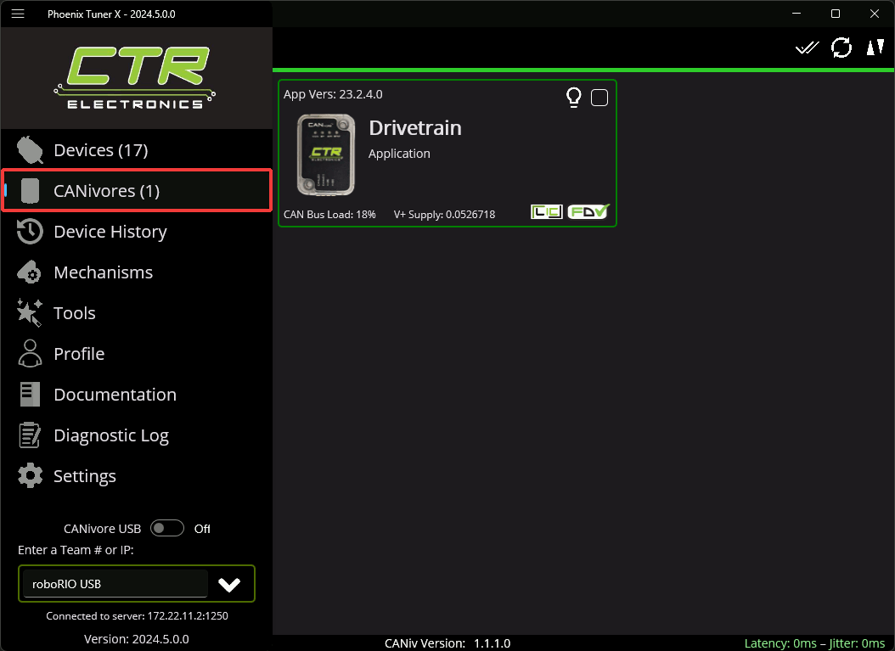
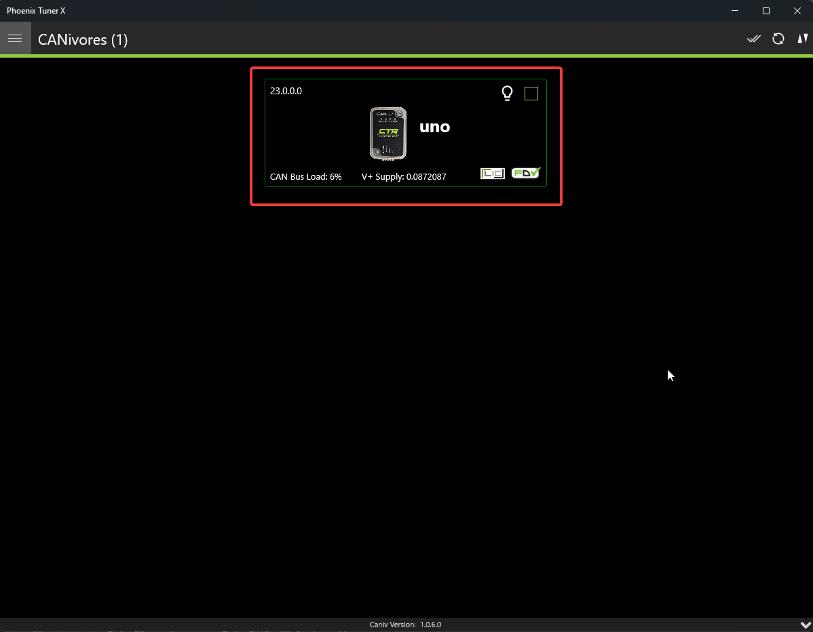
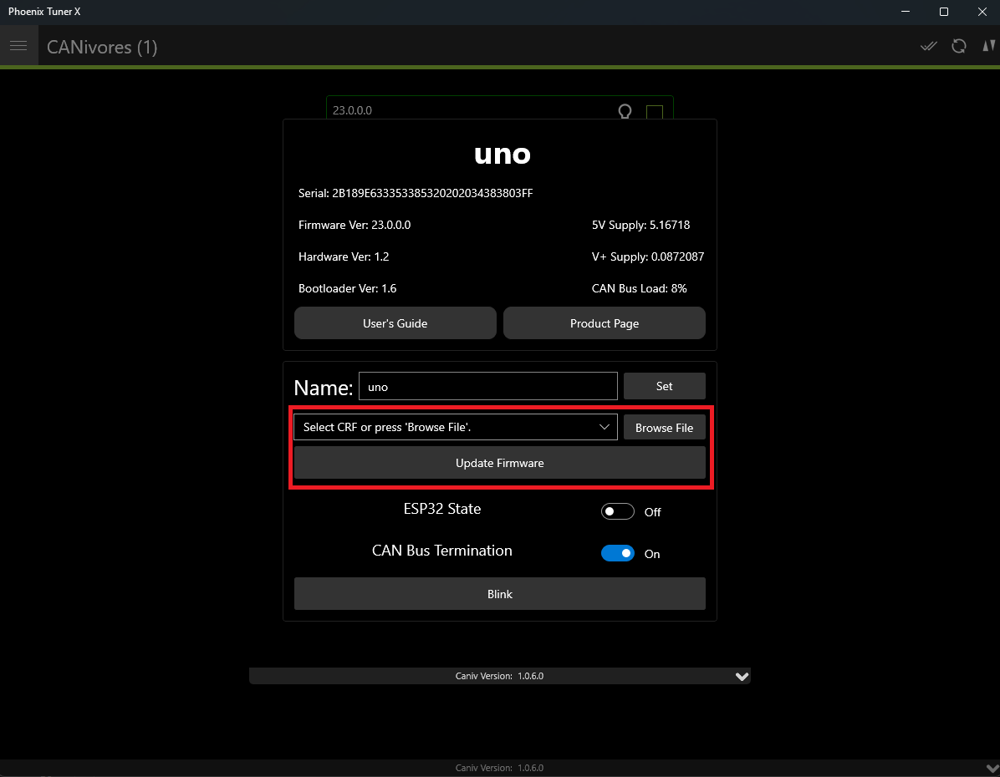
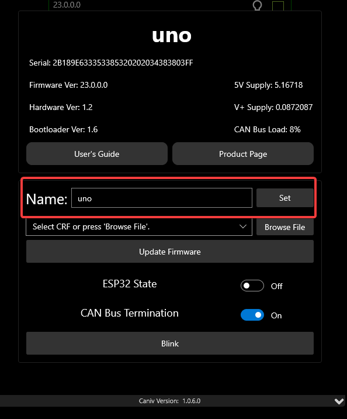

CANivore Setup
==============

Supported Systems
-----------------

Currently, the following systems are supported for CANivore development:

- NI roboRIO

- Windows 10/11 x86-64

- Linux x86-64 (desktop)

  - Ubuntu 22.04 or newer

  - Debian Bullseye or newer

- Linux ARM32 and ARM64 (Raspberry Pi, NVIDIA Jetson)

  - Ubuntu 20.04 or newer

  - Debian Bullseye or newer

.. note:: **Custom bit rates and CAN 2.0 are not supported at this time.** The parameters passed into SocketCAN are not applied by the firmware.

roboRIO
^^^^^^^

.. note:: Phoenix Tuner X requires a 2023 roboRIO image or newer to configure the CANivore.

No additional steps are required. The roboRIO comes with the ``canivore-usb`` kernel module pre-installed.

Linux (non-FRC)
^^^^^^^^^^^^^^^

On non-FRC Linux systems, the ``canivore-usb`` kernel module must be installed to add SocketCAN support for the CANivore. The kernel module is distributed through our APT repository. Begin with adding the repository to your APT sources.

.. code-block:: bash

   sudo curl -s --compressed -o /usr/share/keyrings/ctr-pubkey.gpg "https://deb.ctr-electronics.com/ctr-pubkey.gpg"
   sudo curl -s --compressed -o /etc/apt/sources.list.d/ctr<year>.list "https://deb.ctr-electronics.com/ctr<year>.list"

.. note:: ``<year>`` should be replaced with the year of Phoenix 6 software for which you have purchased licenses.

After adding the sources, the kernel module can be installed and updated using the following:

.. code-block:: bash

   sudo apt update
   sudo apt install canivore-usb

.. tip:: To get a robot application up and running quickly, check out our `non-FRC Linux example <https://github.com/CrossTheRoadElec/PhoenixPro-Linux-Example>`__.

Raspberry Pi 4 Errata
~~~~~~~~~~~~~~~~~~~~~

On a Raspberry Pi 4 or newer, the latest 32-bit Raspberry Pi OS image will default to using the 64-bit kernel while still using 32-bit apt packages. As a result, our canivore-usb kernel module will fail to install.

There are two options to work around this issue:

1. (Recommended) Use the 64-bit Raspberry Pi OS. This allows programs to use all available RAM and improves overall system performance and stability.
2. Add ``arm_64bit=0`` to /boot/config.txt and reboot. This forces the Raspberry Pi to use the 32-bit kernel. Note that programs will be limited to using 3 GB of RAM, and system performance may be impacted.

.. warning:: Do not add ``arm_64bit=0`` to /boot/config.txt when using the 64-bit Raspberry Pi OS. Attempting to do so may cause the Pi to be unable to boot.

Viewing Attached CANivores
--------------------------

Attached CANivores can be viewed in Phoenix Tuner X by selecting the :guilabel:`CANivores` page from the left-hand sidebar. You can specify the target system in the :guilabel:`Target IP or Team #` text box.

.. note:: The Phoenix Diagnostic Server must be running on the target system to use the CANivores page.

.. tip:: If you are connecting to CANivores on your local Windows machine, you can enable the CANivore USB toggle and set the target IP to ``localhost``. This runs a diagnostic server within Tuner X so you do not need to run a robot project to communicate with CANivores.

Field Upgrading CANivores
-------------------------

A CANivore can be field updated using :doc:`Phoenix Tuner X </docs/tuner/index>`.

Click or tap on the listed CANivore card:

The CANivore can then be field upgraded via the dropdown or by manually selected a file:

Phoenix Tuner X also allows the user to batch field upgrade CANivores from the list of CANivores in the same manner as :ref:`batch field upgrading devices <docs/tuner/device-list:batch field upgrade>`.

Renaming CANivores
------------------

CANivores can be given custom names for use within a robot program. This can be configured through Phoenix Tuner X on the specified device card.

