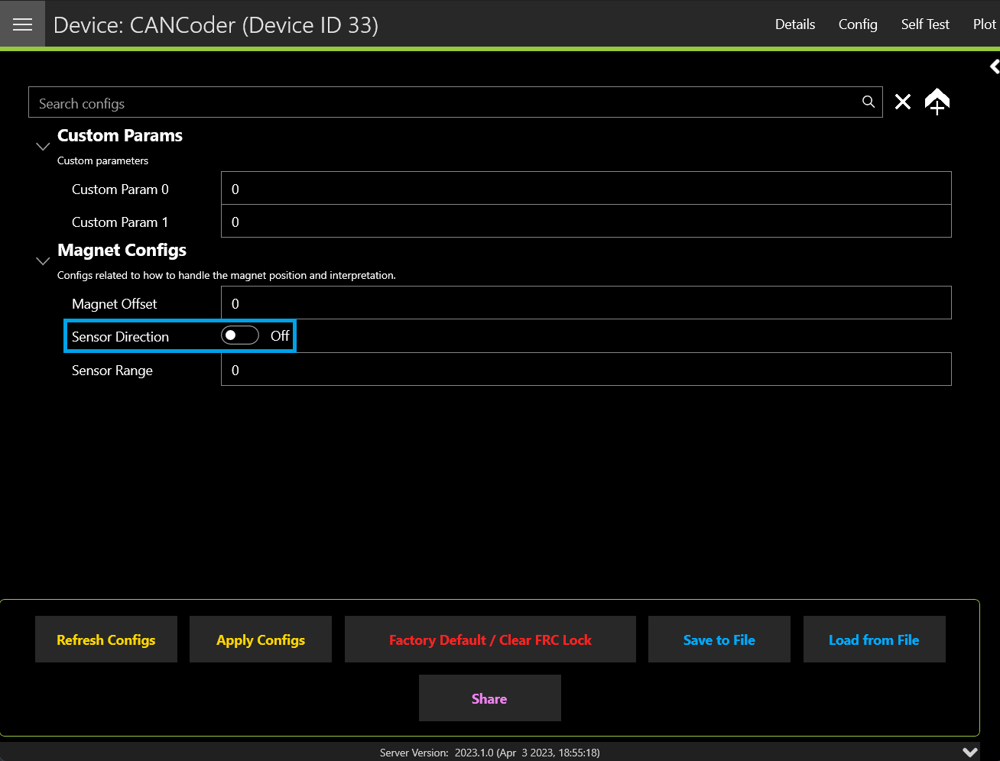

CANcoder
========

The CANcoder is the next evolution in the line of CTRE magnetic encoder products. As its name implies, this product is a rotary magnetic encoder that communicates over the CAN bus. Supporting CAN FD and CAN 2.0, this product provides the same position and velocity with the same resolutions you've come to expect from the SRX Magnetic Encoder.

.. grid:: 2

   .. grid-item-card:: Store Page
      :link: https://store.ctr-electronics.com/cancoder/
      :link-type: url

      CAD, Firmware and purchase instructions.

   .. grid-item-card:: Hardware User Manual
      :link: https://store.ctr-electronics.com/content/user-manual/CANCoder%20User's%20Guide.pdf
      :link-type: url

      Wiring and mount instructions in PDF format.

Status Light Reference
----------------------

.. important:: If the status lights do not exactly match any of the blink codes below, the device may be alternating between multiple blink codes (most commonly between good and bad CAN).

.. note:: Users wishing to test magnet placement must wait 8 seconds after boot for the LEDs to blink the magnet placement status.

.. raw:: html

    

    

        <table class="center">
            <tr>
                <th colspan="4">Blink Codes</th>
            </tr>
            <tr>
                <th>Animation (Click to play)</th>
                <th>LED State</th>
                <th>Cause</th>
                <th>Possible Fix</th>
            </tr>
            <tr>
                <td>

</td>
                <td>LED Off</td>
                <td>No Power</td>
                <td>Provide 12V to Red/Black leads.</td>
            </tr>
            <tr>
                <td>

</td>
                <td>Slow Bright Red</td>
                <td>CANcoder does not have valid CAN.</td>
                <td>Ensure good connections between CANH and CANL (Yellow and Green) & robot controller is on.</td>
            </tr>
            <tr>
                <td>

</td>
                <td>Rapid Dim Red</td>
                <td>CAN bus never detected since boot, CANcoder now reporting strength of magnet. Magnet is out of range (<25 mT or > 135 mT)</td>
                <td>Ensure good connections between CANH and CANL (Yellow and Green) & robot controller is on. Additionally, ensure the magnet's center axis is aligned with the defined center of the CANcoder housing and the magnet is in range of the CANcoder. See Section 2.1 of the Hardware User Manual.</td>
            </tr>
            <tr>
                <td>

</td>
                <td>Rapid Dim Orange</td>
                <td>CAN bus never detected since boot, CANcoder now reporting strength of magnet. Magnet is in range with slightly reduced accuracy (25-45 mT or 75-135 mT).</td>
                <td>Ensure good connections between CANH and CANL (Yellow and Green) & robot controller is on. Additionally, ensure the magnet's center axis is aligned with the defined center of the CANcoder housing and the CANcoder is not too close or too far from the magnet. See Section 2.1 of the Hardware User Manual.</td>
            </tr>
            <tr>
                <td>

</td>
                <td>Rapid Dim Green</td>
                <td>CAN bus never detected since boot, CANcoder now reporting strength of magnet. Magnet is in range.</td>
                <td>Ensure good connections between CANH and CANL (Yellow and Green) & robot controller is on.</td>
            </tr>
            <tr>
                <td>

</td>
                <td>Rapid Bright Red</td>
                <td>CAN bus healthy. Magnet is out of range (<25 mT or > 135 mT)</td>
                <td>Ensure the magnet's center axis is aligned with the defined center of the CANcoder housing and the magnet is in range of the CANcoder. See Section 2.1 of the Hardware User Manual.</td>
            </tr>
            <tr>
                <td>

</td>
                <td>Rapid Bright Orange</td>
                <td>CAN bus healthy. Magnet is in range with slightly reduced accuracy (25-45 mT or 75-135 mT).</td>
                <td>Ensure the magnet's center axis is aligned with the defined center of the CANcoder housing and the CANcoder is not too close or too far from the magnet. See Section 2.1 of the Hardware User Manual.</td>
            </tr>
            <tr>
                <td>

</td>
                <td>Rapid Bright Green</td>
                <td colspan="2">CAN bus healthy. Magnet is in range.</td>
            </tr>
            <tr>
                <td>

</td>
                <td>Alternate Red/Orange</td>
                <td>Damaged Hardware.</td>
                <td>Use Tuner X Self Test to confirm the LEDs and that the hardware fault is set, then contact CTRE</td>
            </tr>
            <tr>
                <td>

</td>
                <td>Alternate Orange/Green</td>
                <td>CANcoder in bootloader.</td>
                <td>Field-upgrade device in Tuner X.</td>
            </tr>
        </table>
    

    

Magnet Placement
----------------

Using the `CANcoder User's Guide <https://store.ctr-electronics.com/content/user-manual/CANCoder%20User's%20Guide.pdf>`__, verify that magnet placement is correct for the CANcoder.

Verifying Sensor Direction
--------------------------

CANcoder sensor direction can be configured via the :guilabel:`Config` page in Phoenix Tuner X.

Zeroing the CANcoder
--------------------

The zero offset for the CANcoder absolute position can be configured using the Magnet Offset config.

Additionally, CANcoders can be zeroed in Tuner X by pressing on the button shown below. This sets the Magnet Offset config and reports the applied offset to the user.

.. important:: The Tuner X CANcoder zeroing button requires 2024 diagnostics or newer.

.. image:: images/tunerx-zero-cancoder.png
   :alt: Picture with an arrow pointing at the zero cancoder icon
   :width: 50%
