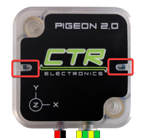
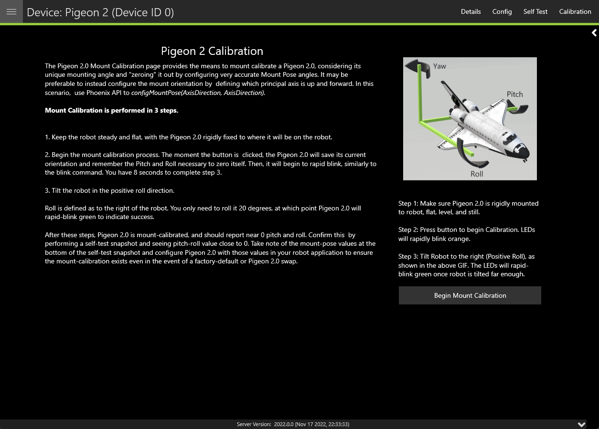

Pigeon 2.0
==========

Pigeon 2.0 is the next evolution in the family of Pigeon IMUs.

With no on-boot calibration or temperature calibration required and dramatic improvement to drift, the Pigeon is the easiest IMU to use yet.

.. grid:: 2

   .. grid-item-card:: Store Page
      :link: https://store.ctr-electronics.com/pigeon-2/
      :link-type: url

      CAD, Firmware and purchase instructions.

   .. grid-item-card:: Hardware User Manual
      :link: https://store.ctr-electronics.com/content/user-manual/Pigeon2%20User's%20Guide.pdf
      :link-type: url

      Wiring and mount instructions in PDF format.

Status Light Reference
----------------------

+---------------+------------------------------------------------------------------------+-----------------------------------------------------------------------------------------------------------------------------------------------------------------------------------------------------------------------------+
| LED Color     | Blink Pattern                                                          | Description                                                                                                                                                                                                                 |
+===============+========================================================================+=============================================================================================================================================================================================================================+
| Off           |                                                                        | Pigeon 2.0 is not powered.                                                                                                                                                                                                  |
+---------------+------------------------------------------------------------------------+-----------------------------------------------------------------------------------------------------------------------------------------------------------------------------------------------------------------------------+
| Yellow/Green  | Only a single LED will blink with this pattern.                        | Device is in boot-loader, most likely because firmware upgrading has failed. Inspect CAN bus wiring and retry firmware upgrading. If device has valid firmware, turn device off, wait 10 seconds, and turn device back on.  |
+---------------+------------------------------------------------------------------------+-----------------------------------------------------------------------------------------------------------------------------------------------------------------------------------------------------------------------------+
| Red/Green     | Alternating Red/Green                                                  | Device is not licensed. License device in Phoenix Tuner.                                                                                                                                                                    |
+---------------+------------------------------------------------------------------------+-----------------------------------------------------------------------------------------------------------------------------------------------------------------------------------------------------------------------------+
| Red/Yellow    | LEDs are never off - one of the two colors are **always illuminated**  | Hardware is damaged                                                                                                                                                                                                         |
+---------------+------------------------------------------------------------------------+-----------------------------------------------------------------------------------------------------------------------------------------------------------------------------------------------------------------------------+
| Red Blink     |                                                                        | Check CAN bus health and connection to the Pigeon 2.0                                                                                                                                                                       |
+---------------+------------------------------------------------------------------------+-----------------------------------------------------------------------------------------------------------------------------------------------------------------------------------------------------------------------------+
| Yellow        | Alternate Blinking                                                     | CAN bus detected but robot controller is not detected (or Pigeon 2.0 is not referenced in code)                                                                                                                             |
+---------------+------------------------------------------------------------------------+-----------------------------------------------------------------------------------------------------------------------------------------------------------------------------------------------------------------------------+
| Yellow        | Simultaneous Blinking                                                  | CAN bus detected, robot is disabled.                                                                                                                                                                                        |
+---------------+------------------------------------------------------------------------+-----------------------------------------------------------------------------------------------------------------------------------------------------------------------------------------------------------------------------+
| Green Blink   |                                                                        | CAN bus detected. Robot is enabled                                                                                                                                                                                          |
+---------------+------------------------------------------------------------------------+-----------------------------------------------------------------------------------------------------------------------------------------------------------------------------------------------------------------------------+

Mount Calibration
-----------------

It's recommended to perform a mount calibration when placement of the Pigeon 2.0 has been finalized. This can be done via the :doc:`Calibration page </docs/tuner/pigeon-cal>` in Tuner X.

