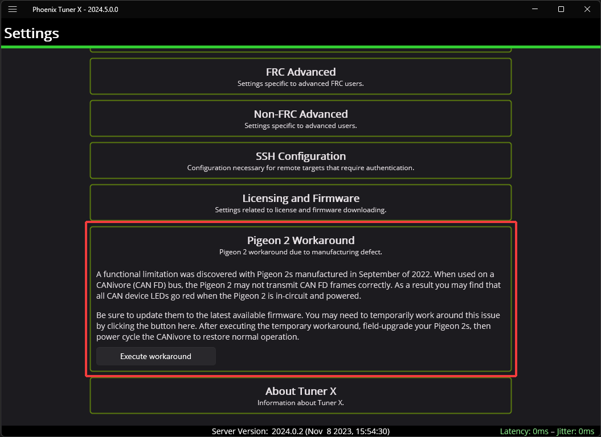

Pigeon 2 Troubleshooting
========================

A functional limitation was discovered in Pigeon 2s manufactured in September of 2022. When used on a CANivore (CAN FD) Bus, the Pigeon 2 may not transmit CAN FD frames correctly. As a result, you may find that all CAN device LEDs go red when the Pigeon 2 is in-circuit and powered.

A firmware fix has been published, to update the firmware of an affected Pigeon 2, one of the below options can be used.

Option 1: Workaround with Tuner X
---------------------------------

.. note:: If you do not see the below option, then Tuner X is likely older than version **2023.1.5.0**.

A new section in Tuner X :guilabel:`Settings` labeled **Pigeon 2 Workaround** has been added. When the :guilabel:`Execute Pigeon 2 workaround` button is pressed, all CANivores will enter a special mode that allows them to see the offending Pigeon 2s. This mode is reverted when the CANivore is power cycled.

Once the workaround has been applied, the device will show up in the :guilabel:`Devices` menu and the LED should be alternating green/orange. :ref:`Field-upgrade <docs/tuner/device-details-page:field-upgrade firmware version>` the firmware version and power cycle the CANivore.

Option 2: Connect to the roboRIO Bus
------------------------------------

Connect the Pigeon 2 to the roboRIO CAN Bus and :ref:`field-upgrade <docs/tuner/device-details-page:field-upgrade firmware version>` the firmware version.

.. note:: We recommend power cycling Pigeon after moving CAN bus leads from CANivore to roboRIO CAN bus to ensure a clean transition.
