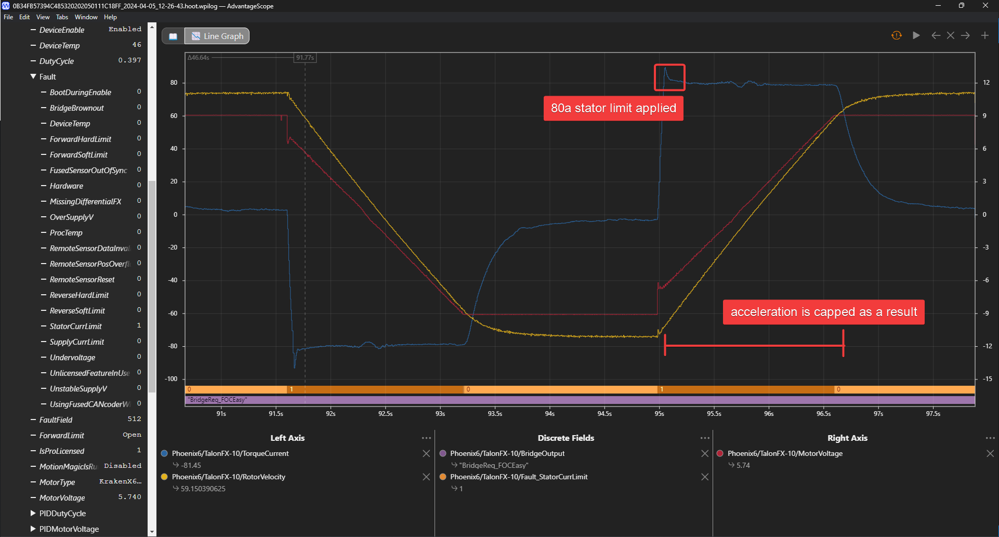
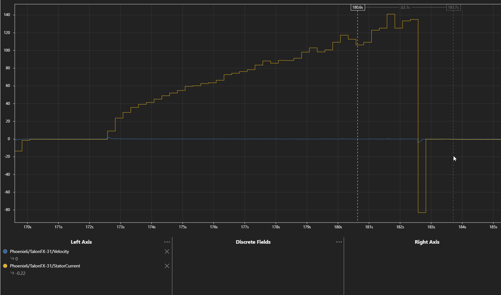

Improving Performance with Current Limits
=========================================

Current limiting is the process of restricting motor output when a given current has surpassed a limit. There are two types of current limits available: stator and supply. Each of these limits accomplishes different goals. This article goes over **why** current limiting is important, **when** to configure these limits, and **how** to configure them.

.. note:: By default, devices are not configured with any current limits. This is because the optimal limits depend on how the motor is integrated into the system. There are additional safety measures in place to prevent damage to the motor or motor controller under excessive load.

Stator and Supply Current Limits
--------------------------------

It's important to understand the need for current limits and how they work. When a motor is under a load, it takes an increasing amount of current to continue rotating the shaft of the motor (and by extension the mechanism). The cumulative sum of all the currents in a multi-motor system, such as a robot, may excessively drain batteries, trigger brownout protection, or in the worst case trip breakers.

There are two forms of current limiting: stator and supply. The relevant :ref:`configs <docs/tuner/configs:tuner configs>` are located in the ``CurrentLimits`` config group (`Java <https://api.ctr-electronics.com/phoenix6/release/java/com/ctre/phoenix6/configs/CurrentLimitsConfigs.html>`__, `C++ <https://api.ctr-electronics.com/phoenix6/release/cpp/classctre_1_1phoenix6_1_1configs_1_1_current_limits_configs.html>`__, `Python <https://api.ctr-electronics.com/phoenix6/release/python/autoapi/phoenix6/configs/config_groups/index.html#phoenix6.configs.config_groups.CurrentLimitsConfigs>`__). All current limits must be **separately enabled** using the appropriate enable config.

.. warning:: Current limits are not applied in torque based control modes, such as ``TorqueCurrentFOC``. Limits for torque based control modes should be applied with ``PeakForwardTorqueCurrent`` and ``PeakReverseTorqueCurrent`` instead. Torque current is equivalent to stator current in magnitude.

Stator Limits
^^^^^^^^^^^^^

.. important:: Stator current limits are only applicable in non-torque control modes. Users utilizing torque based control modes should use the ``PeakForwardTorqueCurrent`` and ``PeakReverseTorqueCurrent`` configs instead, where the following documentation is still applicable.

Stator current is the output current of the motor and is directly proportional to torque.

   *80 A stator current limit taking effect*

Stator current limits are used to restrict the torque output of the motor. This can be used to prevent wheel slip or avoid damaging a mechanism when running into a hard stop. Stator current limits also reduce heat buildup in the motor.

Since stator current limits also limit supply current, they are also effective at preventing brownouts when accelerating.

.. dropdown:: Relationship between Supply and Stator Current
   :open:

   .. note:: This explanation ignores energy loss from heat or other inefficiencies.

   By conservation of energy, power going into the motor must equal power out. Since power is equivalent to voltage times current, :math:`V_{supply} * I_{supply} = V_{stator} * I_{stator}`, where :math:`V_{stator}` is the output voltage of the motor. The duty cycle output of a motor is equivalent to :math:`V_{stator} / V_{supply}`, so the relationship between supply and stator current can be described as :math:`I_{supply} = I_{stator} * duty cycle`.

   As an example, if a motor is applied 100% output (~12 V) and has 80 A of measured stator current, then the supply current will also be 80 A. However, if the motor is applied 50% output (~6 V) and has 80 A of measured stator current, then supply current will only be 40 A.

   This means that stator current limits also effectively limit supply current. Supply current will not exceed a stator current limit and is often significantly lower than stator current.

Another impact that stator current limits have is that they restrict acceleration. Stator current limits cap the torque output of the motor, which directly increases the amount of time it takes to accelerate to max velocity. As a result, it is important not to set stator current limits too low, otherwise performance may be negatively impacted.

.. grid:: 1 2 2 2
   :gutter: 3

   .. grid-item-card:: Without stator limit (~170 rotations/second²)

      .. image:: images/no-stator-limit-accel.png
         :alt: Graph with no stator limit applied and a peak accel around 170 rotations/second²

   .. grid-item-card:: With 80 A stator limit (~75 rotations/second²)

      .. image:: images/with-stator-limit-accel.png
         :alt: Graph with stator limit applied and a peak accel around 75 rotations/second²

Supply Limits
^^^^^^^^^^^^^

.. important:: Supply limits are not functional in torque based control modes. Use the ``PeakForwardTorqueCurrent`` and ``PeakReverseTorqueCurrent`` configs instead.

Supply current is the current drawn from the battery. As a result, limiting supply current can be useful to prevent breakers from tripping, as well as to improve the longevity of the battery.

.. tip:: Since stator current limits also limit supply current, it is often not necessary to enable both limits.

When the ``SupplyCurrentThreshold`` has elapsed for ``SupplyTimeThreshold`` amount of time, the supply current limiter will activate and reduce motor output until supply current is within range of the limit.

In the rare case where the robot experiences brownouts despite configuring stator current limits, a supply current limit can also further help avoid brownouts. However, such brownouts are most commonly caused by a bad battery or poor power wiring, so those should be examined first.

Determining Current Limits
--------------------------

While supply current limits can be theoretically estimated by calculating max supply draw for every mechanism, stator limits are not easy to estimate. Determine your stator current limits first, then supply only if necessary. In many cases, stator current limits are sufficient to prevent battery brownouts, as stator current limits also limit supply current.

Preventing Wheel Slip
^^^^^^^^^^^^^^^^^^^^^

Stator current limits are excellent at preventing wheel slip, which is necessary to maximize power output of the system. To determine wheel slip, perform the following instructions:

1. Place the robot on carpet against a wall.
2. Begin plotting velocity and stator current in :doc:`Tuner X </docs/tuner/plotting>`.
3. Slowly increase voltage output until the velocity becomes non-zero and the stator current drops.

Set your stator current limit to a value below the observed stator current in Tuner. In the example below, the wheels began slipping at around 130 A.

Preventing Brownouts
^^^^^^^^^^^^^^^^^^^^

Brownouts occur when the robot voltage dips below a threshold. For the `FRC roboRIO <https://docs.wpilib.org/en/stable/docs/software/roborio-info/roborio-brownouts.html>`__, this threshold is 6.3 V on the roboRIO 1 and 6.75 V (by default) on the roboRIO 2. When the roboRIO dips below the threshold, it will disable all actuators to prevent a total robot reboot.

Brownouts most commonly occur when the motor accelerates or is otherwise under high load (such as in a pushing match). Since stator current limits are highly effective at limiting supply current, especially at the start of acceleration, they are also highly effective at preventing brownouts in both of these scenarios.

For a few high-inertia mechanisms, such as some flywheels, supply current limits can also be used to further prevent brownouts during long periods of acceleration or high load. However, if a robot is still experiencing brownouts after configuring reasonable stator current limits, the robot should be checked for some common electrical issues before considering more restrictive current limits:

- Check the health of the battery, which can be done using a `Battery Beak <https://store.ctr-electronics.com/battery-beak/>`__ or by performing a full discharge test with a `battery analyzer <https://www.andymark.com/products/computerized-battery-analyzer>`__.
- Make sure your battery leads are properly tightened to the battery, and the battery connector is properly crimped.
- If using the CTRE PDP, make sure the leads going into the PDP are properly crimped and secured.
- Check all device power connections at the PDP/PDH. The PDP/PDH should be clearly connected to copper and not wire insulation.

As motor supply currents increase, the battery voltage will decrease in a similar fashion. A simplified equation for modeling voltage sag is shown below along with a calculator. However, it is easier and more accurate to empirically determine supply current limits. The process of empirically finding these limits is the same as in :ref:`docs/hardware-reference/talonfx/improving-performance-with-current-limits:improving battery longevity`.

.. math::

   V_{loaded} = V_{unloaded} - (I_{totalsupply} * R_{battery})

.. raw:: html

   <h4>Loaded Battery Voltage Calculator</h4>
   

      <form onkeypress="return event.keyCode != 13" style="float:left;">
         
Unloaded voltage (V)

         <input onchange="updateOutput()" id="uV" value="12.5" style="width:90%;" type="numeric" placeholder="12.5"/>
      </form>
      <form onkeypress="return event.keyCode != 13" style="float:left;">
         
Total current draw (A)

         <input onchange="updateOutput()" id="current" value="240" style="width:90%;" type="numeric" placeholder="240"/>
      </form>
      <form onkeypress="return event.keyCode != 13" style="float:left;">
         
Battery resistance (mOhms)

         <input onchange="updateOutput()" id="resistance" value="20" style="width:90%;" type="numeric" placeholder="20"/>
      </form>
      
= 0 V

   

    

   

Be aware that battery health (in the form of battery resistance above) significantly impacts how large current draw affects the output voltage of the battery. Health of the battery can be roughly determined via a `Battery Beak <https://store.ctr-electronics.com/battery-beak/>`__ or by performing a battery discharge test with a `battery analyzer <https://www.andymark.com/products/computerized-battery-analyzer>`__.

Improving Battery Longevity
^^^^^^^^^^^^^^^^^^^^^^^^^^^

While supply limits can be estimated using battery datasheets and average mechanism current draw, the easiest and most reliable method is to test, analyze, and reduce. By applying a conservative supply limit to mechanisms that can operate with minimal current draw, you can improve the performance of other mechanisms (e.g. reducing your intake current limits to increase the amount of current available for a swerve drivetrain).

1. Plot a mechanism's supply currents throughout the match.
2. Reduce the supply current limits until your performance begins to suffer (unable to intake items, etc.). Increase this value slightly for some comfort room.
3. Repeat this for all mechanisms on a fresh battery each time. Time how long it takes before brownouts are regular and battery capacity has dropped.

For example, a user may have the following mechanisms and current limits:

- x4 Kraken(s) on swerve drive - 120 A stator, 70 A supply
- x4 Kraken(s) on swerve azimuth - 40 A stator, no supply limit (<40 A)
- x1 Kraken(s) on elevator - 80 A stator, 30 A supply
- x1 Kraken(s) on intake - 20 A stator, no supply limit (<20 A)

This would yield a peak supply current of <490 A in the worst case scenario. However, this current draw is **extremely unlikely**. Stator current limits ensure all motors and mechanisms will not be under peak load at the same time. Peak current draw occurs towards the end of acceleration when stator current limits are enabled. Additionally, peak supply current is often extremely brief (>60 A on all 4 swerve drive motors lasts <0.5 seconds). A more common scenario is 4 swerve drive motors accelerating at the same time for a peak supply current of 280 A.

When determining supply current limits for a mechanism, ensure that its peak supply current and the duration of that peak does not cause any breakers to trip. FRC breakers typically trip from temperature and can sustain well beyond their rated amperage for a given amount of time. Consult the manufacturer datasheet for the breakers you use to see their trip times.

Reduce your current limits until your battery life is in an acceptable range.

How to Apply Current Limits
---------------------------

Current limits must be **enabled** and **configured**. This can be done in :doc:`Tuner X configs </docs/tuner/configs>` or using the Phoenix 6 :ref:`configuration API <docs/api-reference/api-usage/configuration:applying configs>`.

.. tab-set::

   .. tab-item:: Java
      :sync: Java

      .. code-block:: java

         var talonFXConfigurator = m_talonFX.getConfigurator();
         var limitConfigs = new CurrentLimitConfigs();

         // enable stator current limit
         limitConfigs.StatorCurrentLimit = 120;
         limitConfigs.StatorCurrentLimitEnable = true;

         talonFXConfigurator.apply(limitConfigs);

   .. tab-item:: C++
      :sync: C++

      .. code-block:: c++

         auto& talonFXConfigurator = m_talonFX.GetConfigurator();
         configs::CurrentLimitConfigs limitConfigs{};

         // enable stator current limit
         limitConfigs.StatorCurrentLimit = 120;
         limitConfigs.StatorCurrentLimitEnable = true;

         talonFXConfigurator.Apply(limitConfigs);

   .. tab-item:: Python
      :sync: python

      .. code-block:: python

         talonfx_configurator = self.talonfx.configurator
         limit_configs = configs.CurrentLimitConfigs()

         # enable stator current limit
         limit_configs.stator_current_limit = 120
         limit_configs.stator_current_limit_enable = true

         talonfx_configurator.apply(limit_configs)
