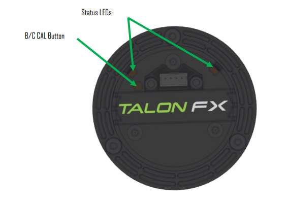

TalonFX
=======

.. tab-set::

   .. tab-item:: Kraken X60

      The Kraken X60 powered by Talon FX is a brushless motor developed by `WestCoast Products <https://wcproducts.com/products/kraken>`__ that uses the latest BLDC motor control technology from CTR Electronics. The integrated Talon FX unlocks the full performance of the Kraken X60 BLDC motor while providing best-in-class motion control.

      .. grid:: 2

         .. grid-item-card:: Store Page
            :link: https://store.ctr-electronics.com/kraken-x60/
            :link-type: url

            CAD, Firmware and purchase instructions.

         .. grid-item-card:: Hardware User Manual
            :link: https://docs.wcproducts.com/kraken-x60/kraken-x60-motor/overview-and-features
            :link-type: url

            Wiring and mount instructions available on the WestCoast Products documentation site.

   .. tab-item:: Falcon 500

      The Falcon 500 powered by Talon FX is a brushless motor with an integrated motor controller and high-resolution encoder, custom designed specifically for the FIRST Robotics Competition, through a collaboration between Cross the Road Electronics and `VEX Robotics <https://www.vexrobotics.com/217-6515.html>`__.

      .. grid:: 2

         .. grid-item-card:: Store Page
            :link: https://store.ctr-electronics.com/falcon-500-powered-by-talon-fx/
            :link-type: url

            CAD, Firmware and purchase instructions.

         .. grid-item-card:: Hardware User Manual
            :link: https://store.ctr-electronics.com/content/user-manual/Falcon%20500%20User%20Guide.pdf
            :link-type: url

            Wiring and mount instructions in PDF format.

Actuator Limits
---------------

CTR Electronics actuators, such as the TalonFX, support various kinds of hardware and software limits.

.. note:: The TalonFX + Kraken X60 does not support hardware limit switches. Instead, :ref:`control request limit <docs/api-reference/api-usage/actuator-limits:control request limits>` overrides can be used, or a CANcoder can be used a :ref:`remote limit switch <docs/api-reference/api-usage/actuator-limits:remote limit switches>`.

Documentation on retrieving and configuring limits can be found :doc:`here </docs/api-reference/api-usage/actuator-limits>`.

Limit Switches
^^^^^^^^^^^^^^

CTR Electronics supported actuators have limit features that will automatically neutral the actuator output (set voltage to 0) if a limit switch is activated. By default, limits are set to "normally open". This means that the switch needs to be explicitly closed (or grounded) for the actuator output to be set to neutral.

When the limit switch is closed (connected to ground), the actuator will disable and the pattern will move toward the forward/reverse limit pin (red blink pattern will move toward the forward limit pin when the forward limit is closed, and vice-versa).

.. tip:: For more information on limit switch wiring in the Falcon 500, consult the `Falcon 500 User's Guide <https://store.ctr-electronics.com/content/user-manual/Falcon%20500%20User%20Guide.pdf>`__.

Status Light Reference
----------------------

.. raw:: html

    

    

        <table class="center">
            <tr>
                <th colspan="4">Blink Codes</th>
            </tr>
            <tr>
                <th colspan="4">Disabled Codes</th>
            </tr>
            <tr>
                <th>Animation (Click to animate)</th>
                <th>LED State</th>
                <th>Cause</th>
                <th>Possible Fix</th>
            </tr>
            <tr>
                <td>

                                          

</td>
                <td>LEDs Off</td>
                <td>No Power</td>
                <td>Provide 12V to Red/Black leads.</td>
            </tr>
            <tr>
                <td>

                                          

</td>
                <td>Blinking Alternating Red</td>
                <td>Talon FX does not have a valid CAN/PWM signal.</td>
                <td>Ensure good connections between CANH and CANL (Yellow and Green) & robot controller is on.</td>
            </tr>
            <tr>
                <td>

                                          

</td>
                <td>Blinking Alternating Orange</td>
                <td>TalonFX detects CAN but does not see Phoenix running on the robot controller.</td>
                <td>If Phoenix is running on the robot controller, ensure good connection between the controller and this device. Otherwise, deploy a robot program that uses Phoenix.</td>
            </tr>
            <tr>
                <td>

                                          

</td>
                <td>Blinking Simultaneous Orange</td>
                <td colspan="2">Talon FX has valid CAN/PWM signal. If on CAN, Phoenix is running in robot controller <b>and</b> Talon FX has good CAN connection to robot controller.</td>
            </tr>
            <tr>
                <th colspan="4">Enabled Codes</th>
            </tr>
            <tr>
                <td>

                                          

</td>
                <td>Both Solid Orange</td>
                <td colspan="2">Talon FX Enabled with Neutral Output.</td>
            </tr>
            <tr>
                <td>

                                          

</td>
                <td>Blinking Simultaneous Red</td>
                <td colspan="2">Talon FX driving in reverse. Rate of blink corresponds to duty cycle applied.</td>
            </tr>
            <tr>
                <td>

                                          

</td>
                <td>Blinking Simultaneous Green</td>
                <td colspan="2">Talon FX driving forward. Rate of blink corresponds to duty cycle applied.</td>
            </tr>
            <tr>
                <td>

                                          

</td>
                <td>Offset Alternating Red/Off</td>
                <td colspan="2">Talon FX limited (hard or soft limit). Direction of offset determines forward/reverse limit.</td>
            </tr>
            <tr>
                <th colspan="4">Special Codes</th>
            </tr>
            <tr>
                <td>

                                          

</td>
                <td>Offset Orange/Off</td>
                <td>Talon FX in thermal cutoff.</td>
                <td>Allow Talon FX to cool. Consider configuring Stator Current Limits to reduce heat generation.</td>
            </tr>
            <tr>
                <td>

                                          

</td>
                <td>Alternate Red/Green</td>
                <td>Talon FX driven with Pro-only command while unlicensed.</td>
                <td>Use non-Pro-only command, or license device for Pro.</td>
            </tr>
            <tr>
                <td>

                                          

</td>
                <td>Alternate Red/Orange</td>
                <td>Damaged Hardware.</td>
                <td>Contact CTRE.</td>
            </tr>
            <tr>
                <td>

                                          

</td>
                <td>Single LED alternates Green/Orange</td>
                <td>Talon FX in bootloader.</td>
                <td>Field-upgrade device in Tuner X.</td>
            </tr>
        </table>
    

    

