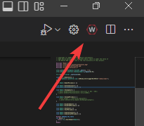

Installing Phoenix 6
====================

Installation of Phoenix 6 is comprised of a few steps

* :ref:`Installing API <docs/installation/installation:API Installation>`
* :ref:`Installing Tuner <docs/installation/installation:Tuner X Installation>`
* :doc:`Updating Device Firmware </docs/installation/configuring-your-device>`
* :doc:`Device Licensing </docs/licensing/licensing>`

API Installation
----------------

Phoenix 6 currently supports Java and C++ for development.

System Requirements
^^^^^^^^^^^^^^^^^^^

The following targets are supported:

* NI roboRIO

* Windows 10/11 x86-64

* Linux x86-64 (desktop)

  * Ubuntu 22.04 or newer

  * Debian Bullseye or newer

* Linux ARM32 and ARM64 (Raspberry Pi, NVIDIA Jetson)

  * Ubuntu 20.04 or newer

  * Debian Bullseye or newer

* macOS (regular simulation **only**)

Offline
^^^^^^^

.. important:: Users on non-Windows devices should skip to the :ref:`Online <docs/installation/installation:online>` installation instructions.

1. Download the `Phoenix Framework Installer <https://github.com/CrossTheRoadElec/Phoenix-Releases/releases>`__
2. Navigate through the installer, ensuring applicable options are selected

.. image:: images/framework-installer.png
   :width: 70%
   :alt: Showing the installation screen root

3. Apply the vendordep via WPILib VSCode `Adding Offline Libraries <https://docs.wpilib.org/en/stable/docs/software/vscode-overview/3rd-party-libraries.html#adding-offline-libraries>`__

Online
^^^^^^

Users in FRC can install Phoenix without an installer using WPILib's `Install New Libraries <https://docs.wpilib.org/en/stable/docs/software/vscode-overview/3rd-party-libraries.html#libraries>`__ functionality. This requires the user to have an installation of WPILib on their machine.

To begin, open WPILib VS Code and click on the WPILib icon in the top right. 

Then type :guilabel:`Manage vendor libraries` and click on the menu option that appears. Click :guilabel:`Install new libraries (online)` and a textbox should appear. Follow the remaining instructions below on pasting the correct link into the textbox.

.. tab-set::

   .. tab-item:: FRC (v6 Only)

      .. important:: This vendordep is for robot projects that are **only** using devices with Phoenix 6 firmware.

      Paste the following URL in `WPILib VS Code <https://docs.wpilib.org/en/stable/docs/software/vscode-overview/3rd-party-libraries.html#libraries>`__ :guilabel:`Install New Libraries (Online)`

      - ``https://maven.ctr-electronics.com/release/com/ctre/phoenix6/latest/Phoenix6-frc2023-latest.json``

   .. tab-item:: FRC (v6 & Phoenix 5)

      .. important:: This vendordep is for robot projects that are using **both** Phoenix 6 devices & Phoenix 5 devices.

      Paste the following URL in `WPILib VS Code <https://docs.wpilib.org/en/stable/docs/software/vscode-overview/3rd-party-libraries.html#libraries>`__ :guilabel:`Install New Libraries (Online)`

      - ``https://maven.ctr-electronics.com/release/com/ctre/phoenix6/latest/Phoenix6And5-frc2023-latest.json``

      .. important:: Devices on Phoenix 6 firmware **must** use the Phoenix 6 API. Device on Phoenix 5 firmware **must** use the Phoenix 5 API.

   .. tab-item:: non-FRC (Linux)

      Phoenix 6 is distributed through our APT repository. Begin with adding the repository to your APT sources.

      .. code-block:: bash

         sudo curl -s --compressed -o /usr/share/keyrings/ctr-pubkey.gpg "https://deb.ctr-electronics.com/ctr-pubkey.gpg"
         sudo curl -s --compressed -o /etc/apt/sources.list.d/ctr<year>.list "https://deb.ctr-electronics.com/ctr<year>.list"

      .. note:: ``<year>`` should be replaced with the year of Phoenix 6 software for which you have purchased licenses.

      After adding the sources, Phoenix 6 can be installed and updated using the following:

      .. code-block:: bash

         sudo apt update
         sudo apt install phoenix-pro

      .. tip:: To get a robot application up and running quickly, check out our `non-FRC Linux example <https://github.com/CrossTheRoadElec/PhoenixPro-Linux-Example>`__.

Tuner X Installation
--------------------

Phoenix Tuner X is a modern version of the legacy Phoenix Tuner v1 application that is used to configure CTRE Phoenix CAN devices.

Phoenix Tuner X is supported on Android, Windows 10 (build 1903+), and Windows 11. Installation is available from the respective OS stores.

- Windows: https://apps.microsoft.com/store/detail/phoenix-tuner/9NVV4PWDW27Z
- Android: https://play.google.com/store/apps/details?id=com.ctre.phoenix_tuner
