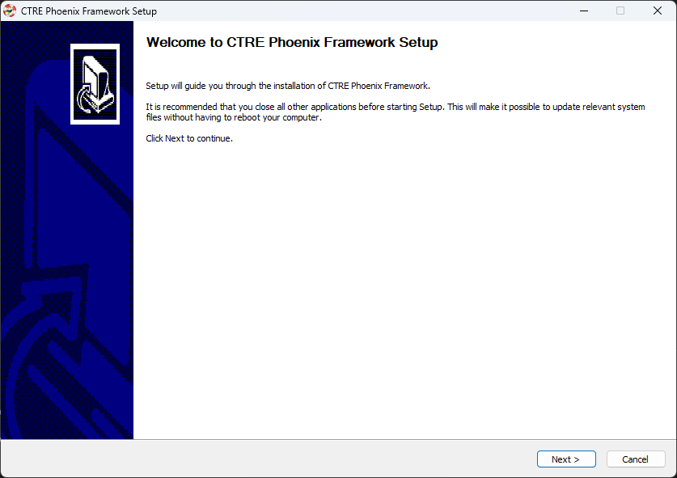

Installing Phoenix Pro
======================

Installation of Phoenix Pro is comprised of a few steps

* :ref:`Installing API <docs/installation/pro-installation:API Installation>`
* :ref:`Installing Tuner <docs/installation/pro-installation:Tuner X Installation>`
* :doc:`Updating Device Firmware </docs/installation/configuring-your-device>`
* :doc:`Device Licensing </docs/licensing/licensing>`

API Installation
----------------

Phoenix Pro currently supports Java and C++ for development.

System Requirements
^^^^^^^^^^^^^^^^^^^

The following targets are supported:

* Windows 10/11 x86-64
* Linux x86-64 (Ubuntu 20.04 or higher)
* Linux ARM 32-bit & 64-bit (Pi 3B+, Pi 4B, Jetson Nano)
* macOS (regular simulation **only**)
* NI roboRIO

Offline
^^^^^^^

.. important:: Users on non-Windows devices should skip to the :ref:`Online <docs/installation/pro-installation:online>` installation instructions.

1. Download the `Phoenix Framework Installer <https://github.com/CrossTheRoadElec/Phoenix-Releases/releases>`__
2. Navigate through the installer, ensuring applicable options are selected

3. Apply the vendordep via WPILib VSCode `Adding Offline Libraries <https://docs.wpilib.org/en/stable/docs/software/vscode-overview/3rd-party-libraries.html#adding-offline-libraries>`__

Online
^^^^^^

.. tab-set::

   .. tab-item:: FRC (Pro Only)

      .. important:: This vendordep is for robot projects that are **only** using Phoenix Pro licensed devices.

      Paste the following URL in `WPILib VS Code <https://docs.wpilib.org/en/stable/docs/software/vscode-overview/3rd-party-libraries.html#libraries>`__ :guilabel:`Install New Libraries (Online)`

      - ``https://maven.ctr-electronics.com/release/com/ctre/phoenixpro/PhoenixPro-frc2023-latest.json``

   .. tab-item:: FRC (Pro & Phoenix 5)

      .. important:: This vendordep is for robot projects that are using **both** Phoenix Pro licensed devices & Phoenix 5 devices.

      Paste the following URL in `WPILib VS Code <https://docs.wpilib.org/en/stable/docs/software/vscode-overview/3rd-party-libraries.html#libraries>`__ :guilabel:`Install New Libraries (Online)`

      - ``https://maven.ctr-electronics.com/release/com/ctre/phoenixpro/PhoenixProAnd5-frc2023-latest.json``

      .. important:: Devices on Phoenix Pro firmware **must** use the Phoenix Pro API. Device on Phoenix 5 firmware **must** use the Phoenix 5 API.

   .. tab-item:: non-FRC (Linux)

      Phoenix Pro is distributed through our APT repository. Begin with adding the repository to your APT sources.

      .. code-block:: bash

         sudo curl -s --compressed -o /usr/share/keyrings/ctr-pubkey.gpg "https://deb.ctr-electronics.com/ctr-pubkey.gpg"
         sudo curl -s --compressed -o /etc/apt/sources.list.d/ctr<year>.list "https://deb.ctr-electronics.com/ctr<year>.list"

      .. note:: ``<year>`` should be replaced with the year of Phoenix Pro software for which you have purchased licenses.

      After adding the sources, Phoenix Pro can be installed and updated using the following:

      .. code-block:: bash

         sudo apt update
         sudo apt install phoenix-pro

Tuner X Installation
--------------------

Phoenix Tuner X is a modern version of the legacy Phoenix Tuner v1 application that is used to configure CTRE Phoenix CAN devices.

Phoenix Tuner X is supported on Android, Windows 10 (build 1903+), and Windows 11. Installation is available from the respective OS stores.

- Windows: https://apps.microsoft.com/store/detail/phoenix-tuner/9NVV4PWDW27Z
- Android: https://play.google.com/store/apps/details?id=com.ctre.phoenix_tuner
