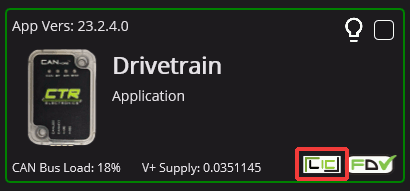
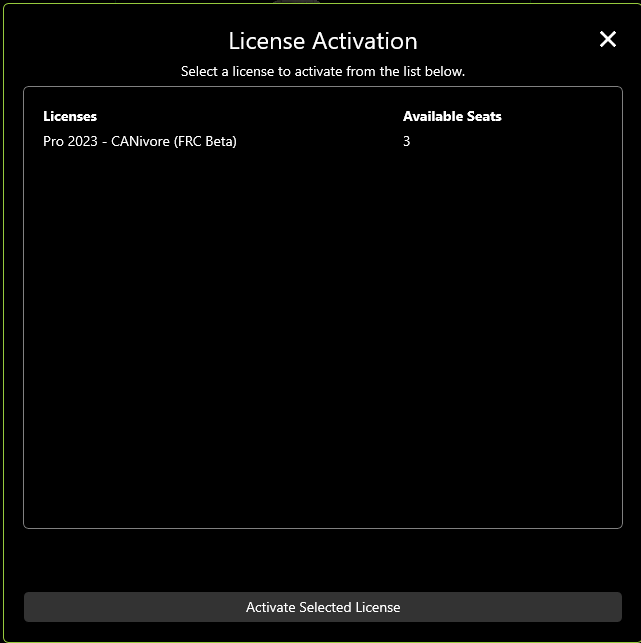
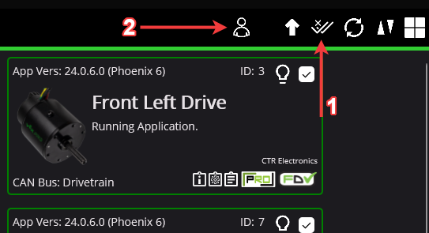
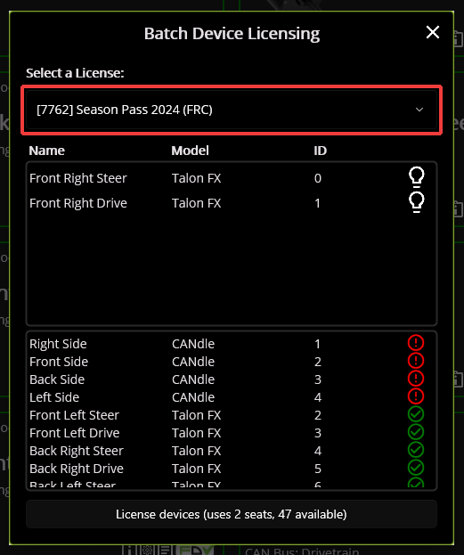
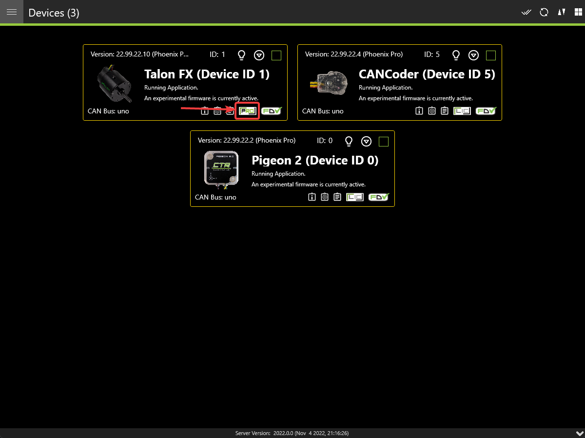

Device Licensing
================

.. note:: Users utilizing season pass must attach a team number before continuing. See :ref:`docs/licensing/team-licensing:attaching a team number to season pass` for more information.

The following devices are eligible for single-device licensing:

- TalonFX (Falcon 500)
- Pigeon 2
- CANcoder

Additionally, CANivore is supported for licensing. When a CANivore is licensed, all devices on that bus are **Pro** enabled without additional activation.

.. important:: All license activation and verification features are only available in **Phoenix Tuner X**. Phoenix Tuner v1 does not support licensing actions.

Purchasing a License
--------------------

Licenses can be purchased in the licensing section on the CTR Electronics store. Click `here <https://store.ctr-electronics.com/licenses>`__ to purchase a license.

Once a license has been purchased, you will receive an email confirmation confirming your purchase. Once this email is received, the license should be visible in the list of licenses in Tuner X.

Activating a License
--------------------

Licenses are activated by first clicking on the **LIC** icon in the bottom right corner of the device card.

This will open up a screen which displays a list of currently attached licenses for that device. Click on the :guilabel:`Activate a new license` button on the bottom of the popup.

A list of purchased (but unattached) license seats are shown here. Click on the license you would like to redeem and press the :guilabel:`Activate Selected License` button to confirm redemption of that seat.

.. warning:: Users should be aware that license activation is permanent and irreversible

Once the activation is complete, the license will be downloaded to the device. In the event that Tuner X disconnects from the internet or from the robot before this completes, the license is still activated and available for download the next time Tuner X is connected to the internet/robot.

Batch Activating Licenses
^^^^^^^^^^^^^^^^^^^^^^^^^

Tuner X also supports batch activate licenses from the **Devices** page. The user can either select devices by their checkbox (in the top right corner of their respective card) or by selecting the checkmark icon in the top right.

.. tip:: Selecting a device using their checkbox and clicking the checkmark in the top right will select all devices of the same models

Step 1 in the above image selects all devices of the same models selected (or all devices if no device is currently check-boxed).

Step 2 in the above image opens the batch licensing dialog.

Once the dialog is opened, select a license from the dropdown at the top of the popup.

The first list contains devices that will be batch licensed, while the second list contains devices that are ineligible due to one of the following:

- Device is not running Phoenix 6 firmware that supports licensing
- Device does not support the selected license
- Device is already licensed with the selected license

The :guilabel:`License devices` button at the bottom of the popup shows the number of device licenses that will be applied and the number of seats currently available. After confirming that everything looks correct, press the :guilabel:`License devices` button to apply the licenses.

Activating a License without a Robot
^^^^^^^^^^^^^^^^^^^^^^^^^^^^^^^^^^^^

Devices that have been seen by Tuner X at least once will be available in :ref:`Device History <docs/tuner/device-history:licensing from device history>`. This can be useful for licensing a device when disconnected from the robot.

Verifying Activation State
--------------------------

An icon displaying the license state of your device is located in the bottom right of the device card.

The below table can be used to determine your device license state for troubleshooting.

+----------------------+---------------------------------------------------------------------+-----------------------------------------------------------------------------+
| State                | Image                                                               | Description                                                                 |
+======================+=====================================================================+=============================================================================+
| Licensed             | .. image:: images/license_states/pro_licensed_logo_small.png        | Device is licensed for the current version of the Phoenix 6 API.            |
|                      |    :width: 40%                                                      |                                                                             |
+----------------------+---------------------------------------------------------------------+-----------------------------------------------------------------------------+
| CANivore contains    | .. image:: images/license_states/license_logo_small_black.png       | CANivore contains at least one bus license, which it will use to            |
| Licenses             |    :width: 40%                                                      | remote-license all compliant CAN devices.                                   |
+----------------------+---------------------------------------------------------------------+-----------------------------------------------------------------------------+
| Pro Licensing Error  | .. image:: images/license_states/pro_licensed_logo_small_error.png  | Device is licensed and there was an error communicating license state.      |
|                      |    :width: 40%                                                      |                                                                             |
+----------------------+---------------------------------------------------------------------+-----------------------------------------------------------------------------+
| Licensing Error      | .. image:: images/license_states/license_logo_small_error.png       | Device is not licensed and there was an error communicating license state.  |
|                      |    :width: 40%                                                      |                                                                             |
+----------------------+---------------------------------------------------------------------+-----------------------------------------------------------------------------+
| Not Licensed         | .. image:: images/license_states/license_logo_small.png             | Device is not licensed for this version of the Phoenix 6 API.               |
|                      |    :width: 40%                                                      |                                                                             |
+----------------------+---------------------------------------------------------------------+-----------------------------------------------------------------------------+
| Licensing Not        |  Icon not present                                                   | Device does not support licensing or is using an incompatible firmware for  |
| Supported            |                                                                     | device licensing.                                                           |
+----------------------+---------------------------------------------------------------------+-----------------------------------------------------------------------------+

Additionally, users can perform a :ref:`Self Test <docs/tuner/self-test:self test snapshot>` to verify that the device has a valid license.

Troubleshooting
---------------

- Did you activate a license for this device?

  - Clicking on the icon will show licenses that are attached to this device

- Is the latest diagnostic server running?

  - Check the version at the bottom of Tuner X's devices page.

    - Latest version details can be found in the `changelog <https://api.ctr-electronics.com/changelog>`__ under the latest Phoenix-6/Libs version.

  - Confirm the **vendordep** in your robot project is the latest version.
  - Alternatively, you can deploy the **temporary diagnostic server**.

- Is the latest **Pro** firmware flashed onto the device?
