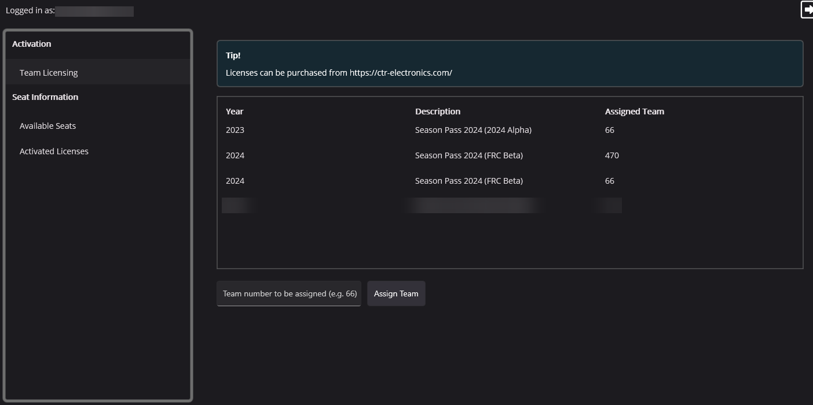

Season Pass Licensing
=====================

.. tip:: Season Pass can be purchased at `https://store.ctr-electronics.com/ <https://store.ctr-electronics.com/phoenix-pro/>`__.

Season Pass is a single, cost-effective purchase that allows **FRC teams** to license :ref:`compatible devices <docs/licensing/licensing:device licensing>` with Phoenix Pro for the entire season. The steps for licensing devices with season pass are as follows.

1. Purchase a season pass at `https://store.ctr-electronics.com/ <https://store.ctr-electronics.com/phoenix-pro/>`__.
2. Wait for the email that says your license is ready (typically 1-2 minutes).
3. Follow the below steps for attaching a team number to your license.
4. Once a team number has been attached, licensing process is the same as :doc:`/docs/licensing/licensing`.

Attaching a Team Number to Season Pass
--------------------------------------

.. warning:: Attaching a team number to a season pass is permanent.

1. On the "Profile" page of Tuner X, click on the license to attach a team for.

2. Enter the team number in the box below the list of licenses.
3. Click :guilabel:`Assign Team`. A prompt will appear asking the user to confirm the entered team number.

.. note:: Note that the robot must be configured for the assigned team number. An invalid team number on the robot will result in the device not appearing as Pro licensed.

How many devices can I activate?
--------------------------------

A season pass contains 60 individual device licenses. In the event that a team needs more licenses, contact us at `support@ctr-electronics.com <mailto:support@ctr-electronics.com>`__.
