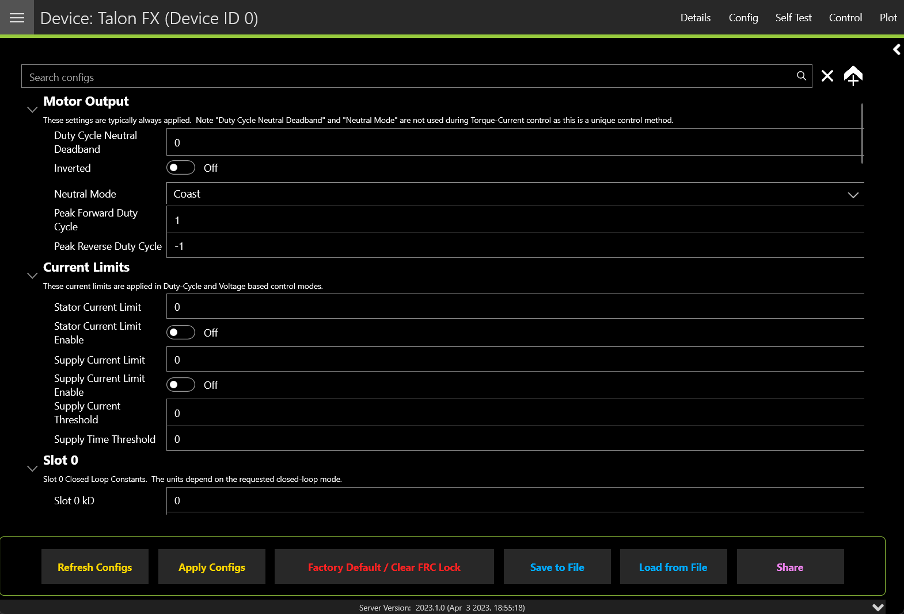
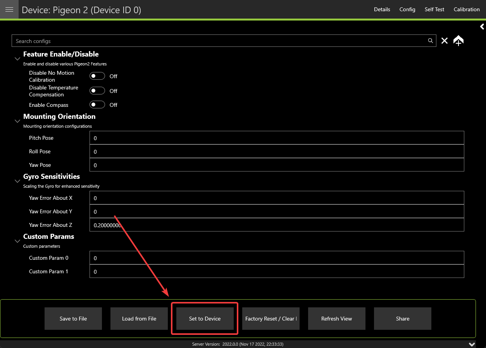

Tuner Configs
=============

.. tip:: Devices can also be :ref:`configured in code <docs/api-reference/api-usage/configuration:configuration>`.

Configs can be viewed, modified, backed-up, restored, and factory-reset via the :guilabel:`Configs` tab in Phoenix Tuner X.

To apply a modified config, press the :guilabel:`Apply Configs` button on the bottom button bar.

