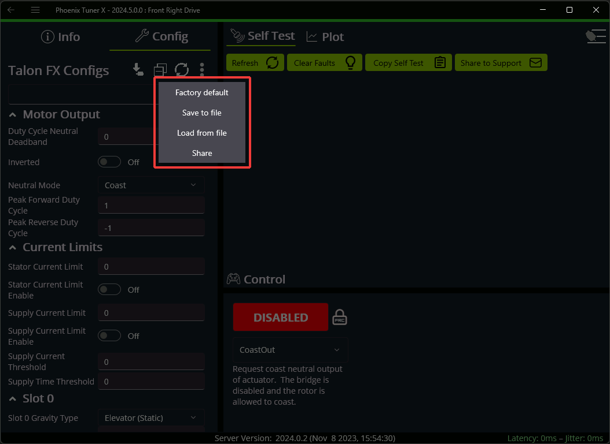

Tuner Configs
=============

.. tip:: Devices can also be :ref:`configured in code <docs/api-reference/api-usage/configuration:configuration>`.

Configs can be viewed, modified, backed-up, restored, and factory-defaulted via the :guilabel:`Configs` tab in Phoenix Tuner X.

.. image:: images/tunerx-configs.png
   :width: 70%
   :alt: Tuner X configs page

To apply a modified config, press the apply button (download icon) on the top button bar.

.. image:: images/setting-configs.png
   :width: 70%
   :alt: Applying configs to the device

Additional options are available by clicking on the 3-dots icon on the top button bar.

