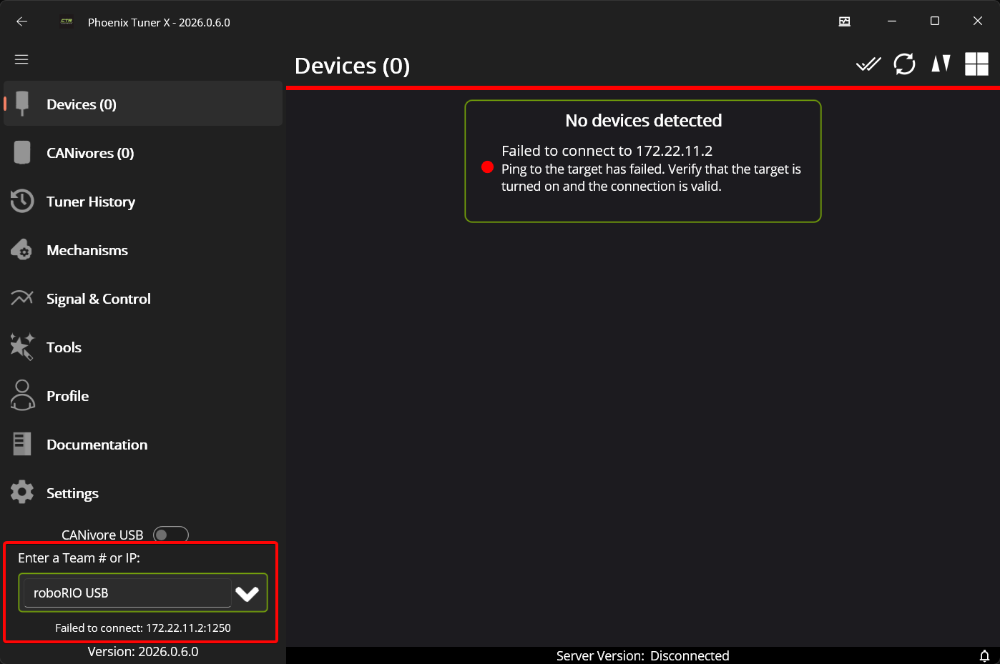
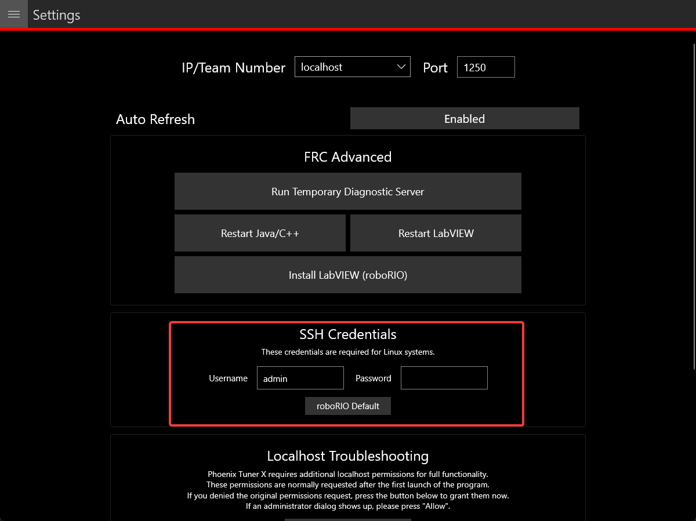
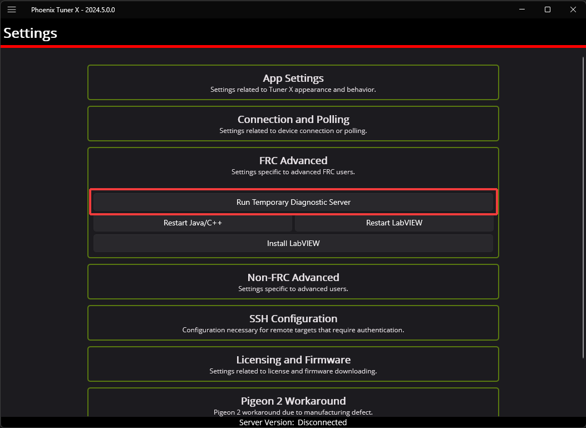
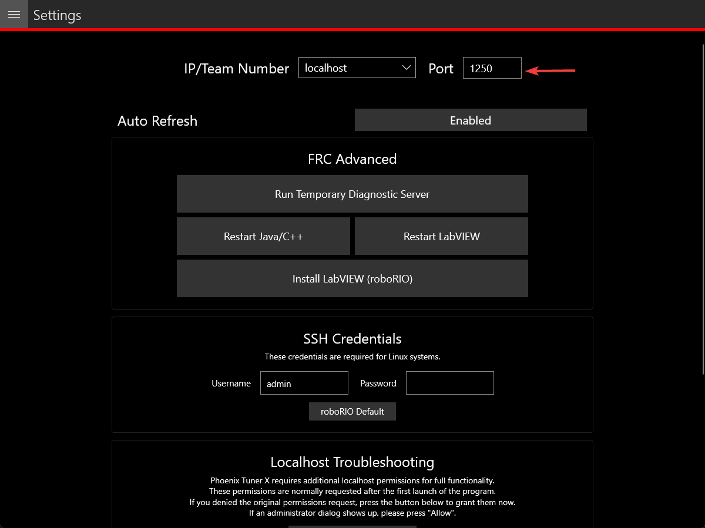
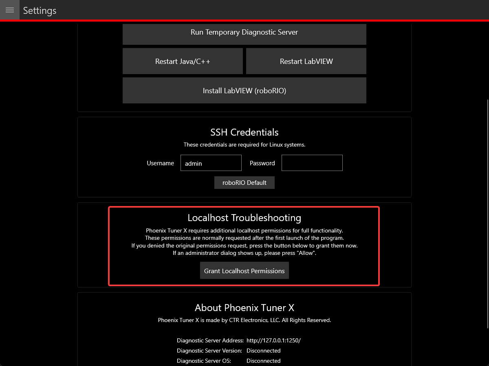

Connecting Tuner
================

Installed onto the robot controller (either manually or via a robot program) is the Phoenix Diagnostics Server. This program enables communication between Tuner X and the robot controller for managing and setting up devices.

Connecting to the Server
------------------------

A dropdown/textbox is available in the upper-left flyout menu.

By clicking the arrow, you can change between presets such as:

- :guilabel:`Driver Station` -- Retrieves the robot IP from the FRC Driver Station if launched
- :guilabel:`roboRIO USB` -- Defaults to ``172.22.11.2`` which is the roboRIO IP when connected via USB
- :guilabel:`localhost` -- Use for simulation or hardware-attached CANivore.

Alternatively, the user can manually enter the robot IP into the textbox.

Configuring SSH Credentials (non-FRC)
^^^^^^^^^^^^^^^^^^^^^^^^^^^^^^^^^^^^^

When using a non-FRC robot controller (non-roboRIO), users must have their SSH credentials configured in :guilabel:`Settings` for general use.

Temporary Diagnostics (FRC)
---------------------------

Devices can be configured without a diagnostic server present. This can be useful if the roboRIO has been freshly imaged. Ensure that you are pointed at the roboRIO IP address (usually ``10.TE.AM.2`` where ``TE.AM`` is the team number) and then click the :guilabel:`Run Temporary Diagnostic Server` in :guilabel:`Settings`.

Changing Diagnostics Server Port (non-FRC)
------------------------------------------

The target server port can be changed in the Tuner X :guilabel:`Settings` page, which is accessed from the flyout menu.

.. important:: The default port for diagnostic server is 1250. FRC users must not change this under any circumstance.

Localhost Troubleshooting
-------------------------

When Tuner X is first started after installation, it may request admin privileges to access the localhost network. If the user disallows admin access, diagnostic servers hosted on the local machine (simulation and hardware-attached CANivore) may not be visible in Tuner X. Users can manually grant this permission afterward by clicking the :guilabel:`Grant Localhost Permissions` in :guilabel:`Settings`.

