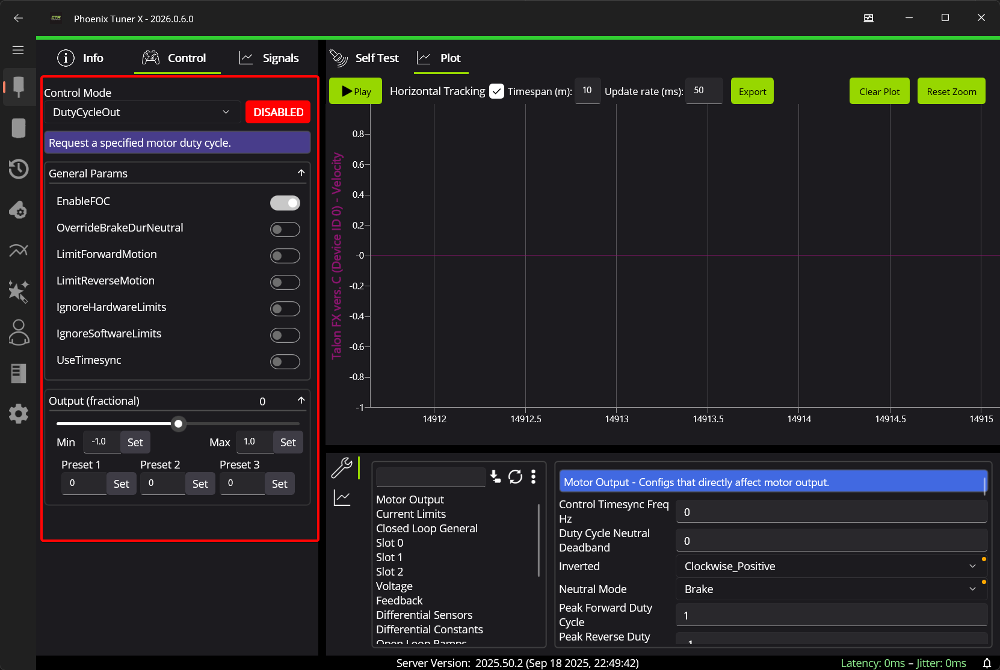
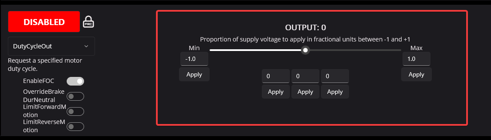
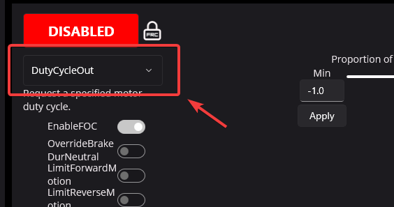

Controlling Devices
===================

Tuner X can be used to directly control devices outside a robot program. When combined with :ref:`docs/tuner/plotting:plotting`, it can be an excellent tool for calculating closed loop gains or isolating mechanical issues.

Devices can be controlled by clicking on the red "DISABLED" button, switching it to "ENABLED".

During this time, the output can be adjusted using the sliders or the text entries below it.

Control modes can be changed utilizing the dropdown below the disable/enable button.

FRC Locked
----------

The "lock" icon next to the "DISABLED" button indicates that this device is FRC locked. This means the FRC Driver Station **must** also be enabled for the device to actuate. For more information, see :ref:`docs/api-reference/api-usage/enabling-actuators:frc lock`.

.. image:: images/highlighting-frc-lock.png
   :alt: Highlighting the FRC lock icon next to DISABLED
   :width: 400
