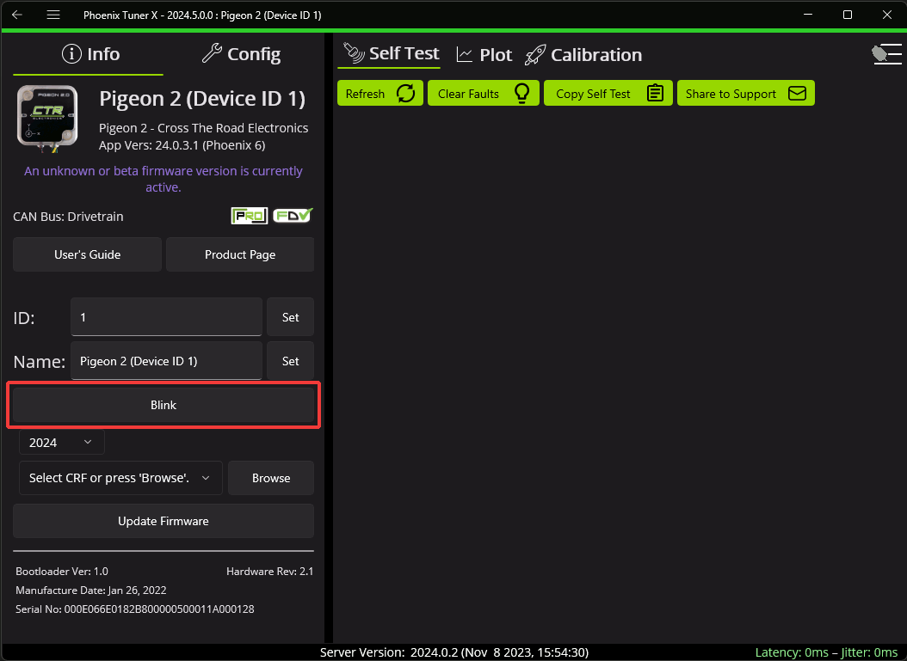
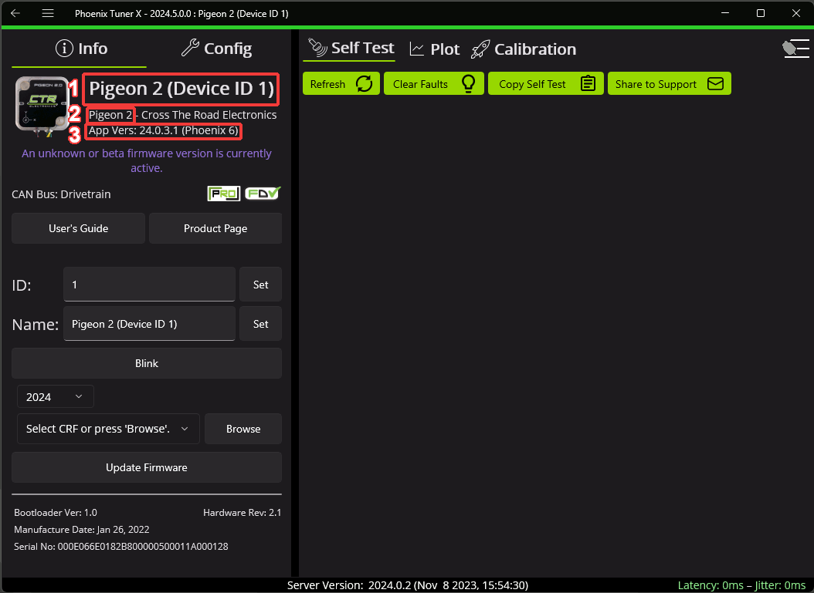
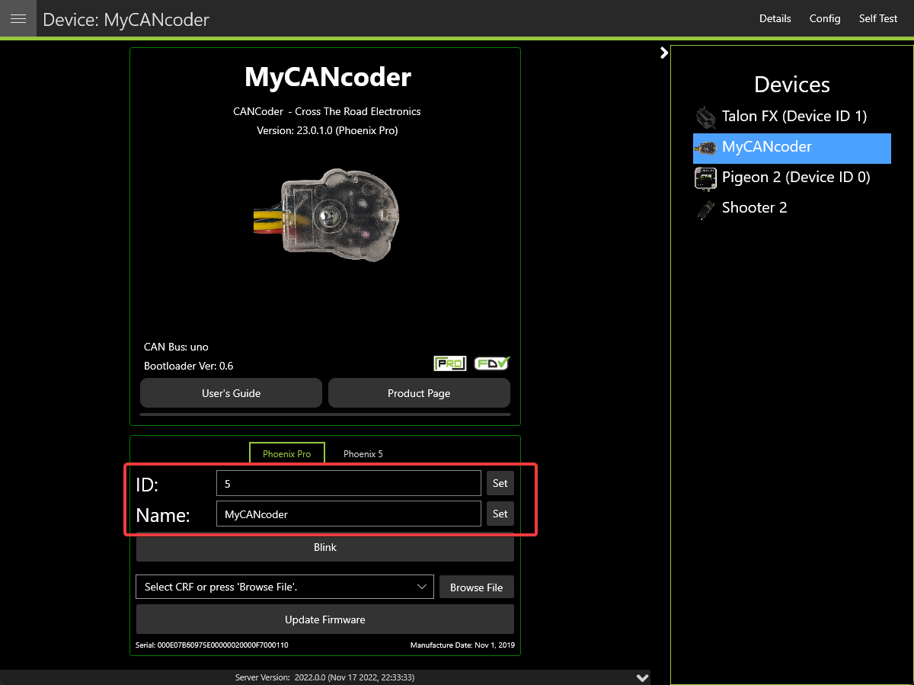
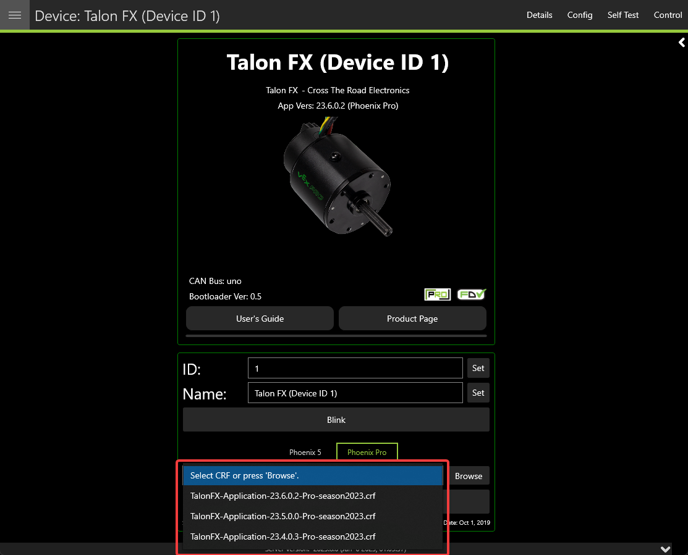
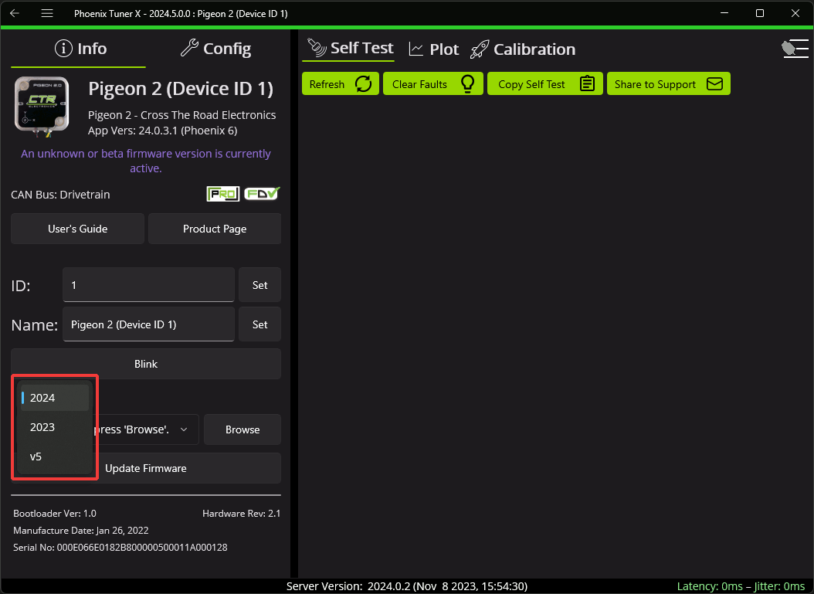

Device Details
==============

The **Device Details** page can be accessed by clicking on the device card (or double clicking on the device row when in grid view). This view allows you to access detailed device actions such as:

- Device Details (Name, ID, Firmware Version, Model, Serial No, etc.)
- Blinking LEDs
- Field Upgrading
- Licensing Details (by clicking on the LIC/PRO icon)
- Configs
- Control
- Self Tests
- Plotting
- Pigeon 2 Mount Calibration

.. note:: Plotting currently only works with Phoenix 5 devices.

Blinking
--------

All CTR Electronics devices can be blinked (rapidly flash the LEDs). This can be useful for handling whenever you have duplicate devices using the same ID on the CAN bus.

Verifying Device Details
------------------------

This screen highlights information such as (1) Device Name, (2) Device Model, (3) Firmware Version.

.. tip:: Clicking in the blank space outside the detail frames will bring the user back to the devices page.

Configuring Name & IDs
----------------------

All devices can have their Name (1) and ID (2) configured via their respective textbox. IDs are limited to the range of 0 to 62 (inclusive). After inputting the ID or name, press the :guilabel:`Set` button to save the changes to the device.

Field-Upgrade Firmware Version
------------------------------

Tuner X has improved firmware upgrading functionality by **automatically downloading and caching** firmware. Upon initial Tuner X launch, the latest firmware for all devices will automatically be downloaded in the background (takes <10s on most internet connections). The individual device page allows you to select specific firmware versions for your device via the firmware dropdown. Batch firmware can also be completed via the :ref:`batch field upgrade pop-up<docs/tuner/device-list:batch field upgrade>`.

.. important:: Users should ensure they select Phoenix Pro firmware when using Phoenix Pro API, and Phoenix v5 firmware when using Phoenix v5 API. A single robot project may use both APIs simultaneously.

Users can switch between "Phoenix Pro" and "Phoenix 5" by clicking on the toggle above the firmware dropdown.

.. note:: The toggle between Phoenix Pro and Phoenix 5 firmware only affects online field-upgrades.

