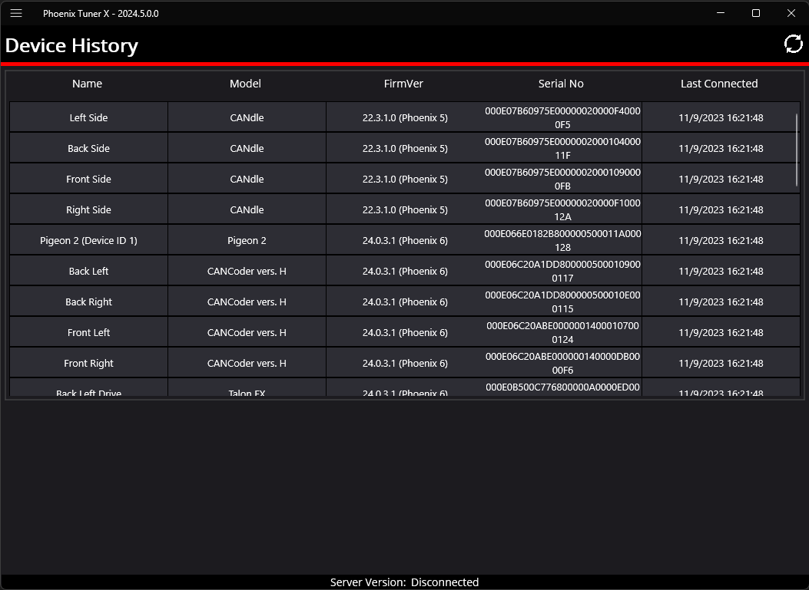
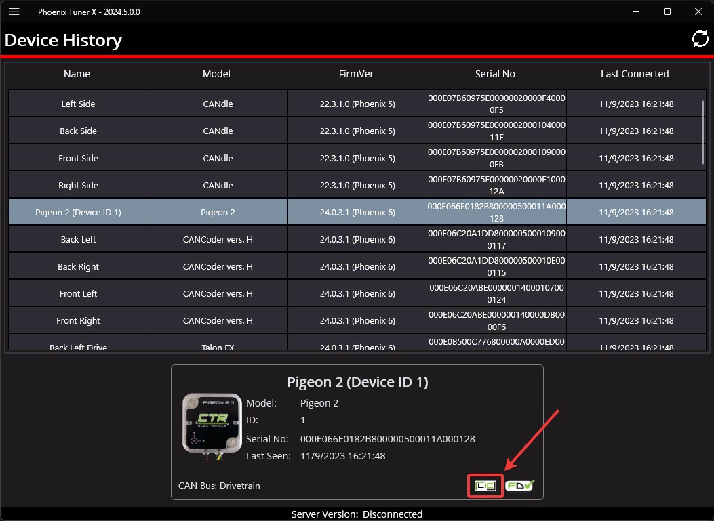

Device History
==============

Users can access a list of past devices connected to Tuner X and license them via the :guilabel:`Device History` page. This is accessible from the left-hand sidebar. This list is not automatically refreshed, but users can refresh it by pressing the refresh icon in the top-right of the page.

Licensing from Device History
-----------------------------

Users can activate a license for a disconnected device by clicking on the device in the Grid. Then, select the "PRO" icon at the bottom right of the device card.

From there, the user can activate a license for the device like normal. Once the device license has been activated, the user still needs to connect Tuner X to the robot to transfer the activated license to the device.

The "PRO" icon may be replaced with a greyed "LIC" icon in the following situations:

- The device is on Phoenix 5 firmware AND actively connected to Tuner X
- The device is not a Pro compatible device

Users who license an eligible Pro device running Phoenix 5 firmware must :ref:`update the device firmware <docs/tuner/device-details-page:field-upgrade firmware version>` to Pro compatible firmware to utilize Pro features.
