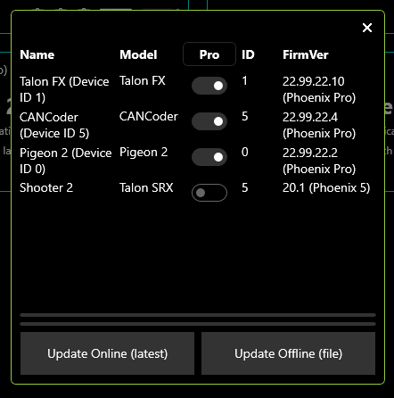
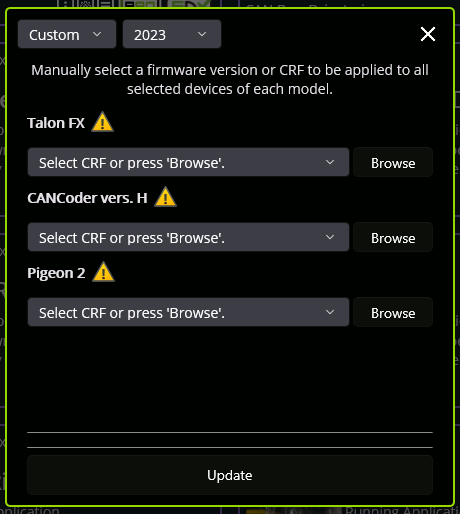

Device List
===========

.. tab-set::

   .. tab-item:: Card Layout

      .. image:: images/tunerx-devices-page.png
         :width: 70%
         :alt: Devices root page in Phoenix Tuner

   .. tab-item:: Grid Layout

      .. image:: images/tunerx-devices-page-grid.png
         :width: 70%
         :alt: Devices root page in Phoenix Tuner as a grid

The **Devices** page is the first page that is shown to the user upon launching the application. The **Devices** page by default shows a grid of cards, but can be changed to a flat grid view (similar to Phoenix Tuner v1) by clicking on the 4 grid square icon located in the top right corner (not available in Android Tuner X).

Card Colors
-----------

The color of the device cards is helpful as a visual indicator of device state. The meaning of the card color is also shown as text underneath the device title.

+--------+--------------------------------------------------+
| Color  | Description                                      |
+========+==================================================+
| Green  | Device has latest firmware.                      |
+--------+--------------------------------------------------+
| Purple | Device has an unexpected/beta firmware version.  |
+--------+--------------------------------------------------+
| Yellow | A new firmware version is available. Check the   |
|        | changelog to determine if the new version        |
|        | matters to your application                      |
+--------+--------------------------------------------------+
| Red    | Device has a duplicate ID.                       |
+--------+--------------------------------------------------+
| Blue   | Failed to retrieve list of available firmware.   |
+--------+--------------------------------------------------+

Clipboard Options & Licensing
-----------------------------

Phoenix Tuner X provides icons at the bottom right of each card that will allow the user to copy to the clipboard the device details, configs and Self Test. This can be useful for support requests and additional debugging.

.. image:: images/tunerx-device-card.png
   :width: 70%
   :alt: Tuner X clipboard options

Devices that support `CAN FD <https://store.ctr-electronics.com/can-fd/>`__ are shown via a :guilabel:`CAN FD` icon in the bottom right of the card.

.. note:: The :guilabel:`CAN FD` icon does **not** indicate that the device is currently on a CAN FD bus, merely that it supports CAN FD.

The other major icon in the bottom right of the device card is the licensing indicator. This showcases the :doc:`licensing states </docs/licensing/licensing>` and when clicked, will open the licensing dialog.

Batch Field Upgrade
-------------------

Phoenix Tuner X allows the user to batch field upgrade from the **Devices** page. The user can either select devices by their checkbox (in the top right corner of their respective card) or by selecting the checkmark icon in the top right.

.. tip:: Selecting a device using their checkbox and clicking the checkmark in the top right will select all devices of the same models

.. image:: images/tunerx-batch-selection.png
   :width: 70%
   :alt: Showing batch selection option in the top right

Step 1 in the above image selects all devices of the same models selected (or all devices if no device is currently check-boxed).

Step 2 in the above image opens the field-upgrade dialog.

Once the dialog is opened, information detailing the device name, model, ID, and firmware version is presented. There is a year selector in the top-left corner to select the firmware version year.

Once the correct firmware year is selected user can begin the upgrade progress by selecting :guilabel:`Update to latest`. If the user does not want to use the latest firmware version, the :guilabel:`Custom` year selection allows for the selection of a specific firmware version for each device model.

.. tip:: Generally, users should update their devices to the latest available firmware version. If manually selecting a CRF is important, the firmware files are available for download on our `GitHub Repo <https://github.com/CrossTheRoadElec/Phoenix-Releases>`__.

.. important:: While the user can cancel firmware upgrading using the "X" button in the top-right, this will **not** cancel the current device in progress. It will finish upgrading the current device and will not upgrade subsequent devices. Typical Tuner X behavior will resume once the current device finishes flashing.

Batch Licensing
---------------

See :ref:`docs/licensing/licensing:batch activating licenses`
