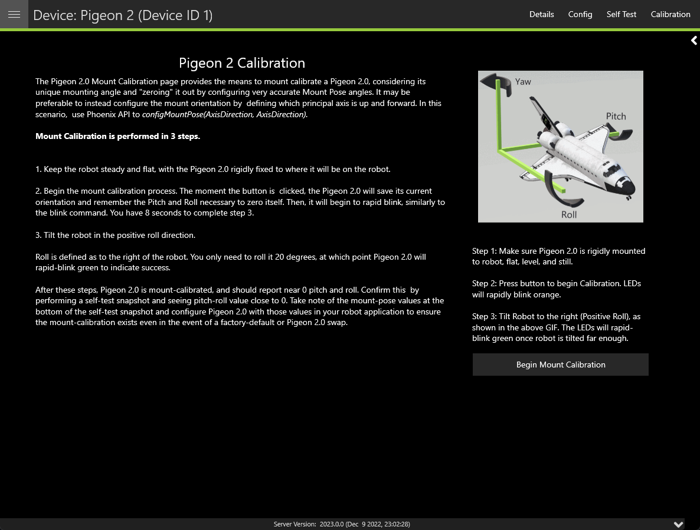

Pigeon 2.0 Calibration
======================

It is recommended that calibration is performed once the Pigeon 2.0 has been mounted to the robot. Calibration will calculate the optimal offsets to apply to ensure that Pose, Pitch and Yaw is 0 when the robot is considered "flat". Users can access the calibration menu by clicking on the Pigeon 2.0 in :guilabel:`Devices` and clicking :guilabel:`Calibration` in the top right.

Read through the on-screen instructions and click :guilabel:`Begin Mount Calibration`.

