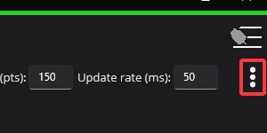

Plotting
========

Supported devices can have certain signals/sensor data plotted in real-time without any additional configuration.

.. tip:: Plotting is supported in both Phoenix 5 and Phoenix 6.

.. image:: images/plot-page-button-location.png
   :width: 70%
   :alt: Plot page button is located in the top right navigation bar.

If the list of signals is not visible, the 3-dots button at the top right of the page can be used to open them.

From the list on the right of the page, select the signals that you wish to plot. Then click the :guilabel:`Play` button at the top left.

.. image:: images/valid-plotting-signals.png
   :width: 70%
   :alt: Valid plotting signals

Adjusting Plotting Settings
---------------------------

Plotting time period (the time frame that points are recorded) can be adjusted using the :guilabel:`Timespan` textbox. Additionally, the resolution (number of points shown) can be adjusted using the :guilabel:`Resolution` textbox. The rate at which the plot fetches updates from the robot program can be adjusted using the :guilabel:`Update rate` textbox.

.. image:: images/time-period-box.png
   :width: 70%
   :alt: Plot settings textboxes

Exporting Data
--------------

Plots can be exported into the ``csv`` format for viewing in an external analysis tool. Click on the :guilabel:`Export as CSV` button.

Plot Appearance & Behavior
--------------------------

.. important:: Scatter points may dramatically affect Tuner X performance.

Plotting supports zoom and panning via the mouse and scroll wheel (or via gestures on Android). The point appearance can also be adjusted between "Spline" and "Scatter".

.. image:: images/scatter-plot-view.png
   :width: 70%
   :alt: Points as shown when scatter is selected.
