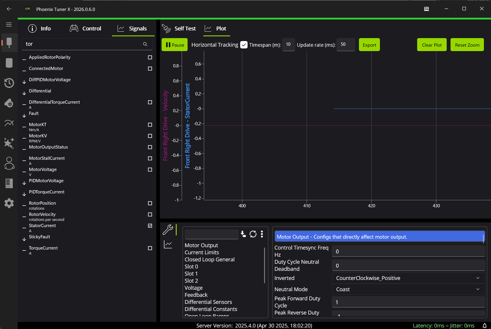
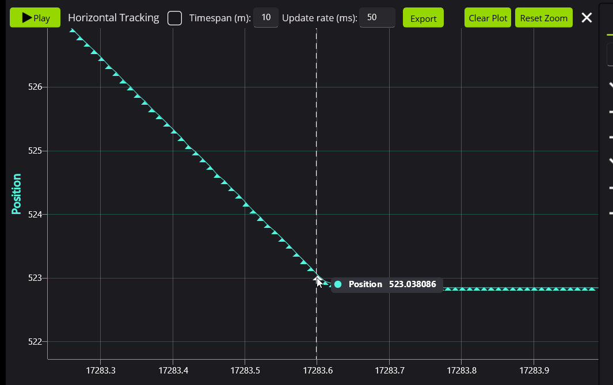
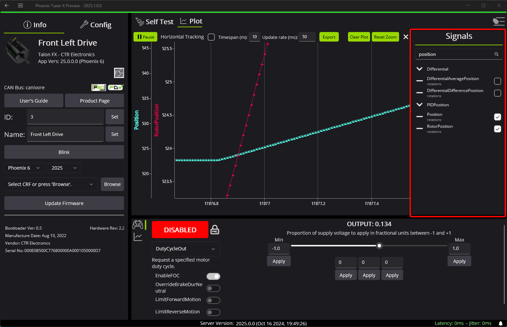
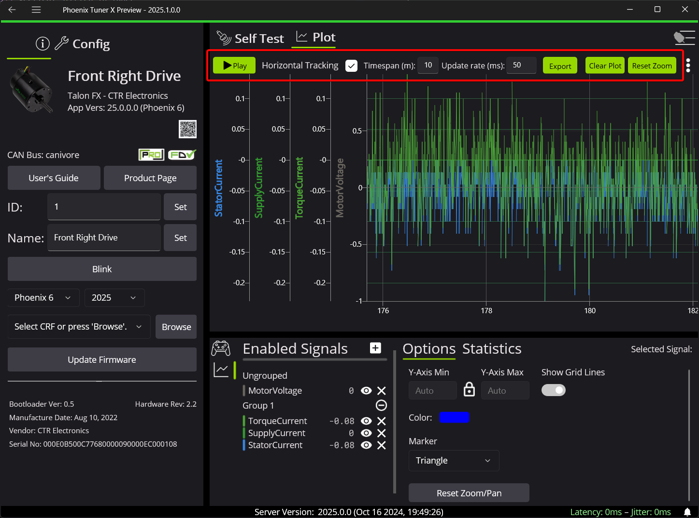
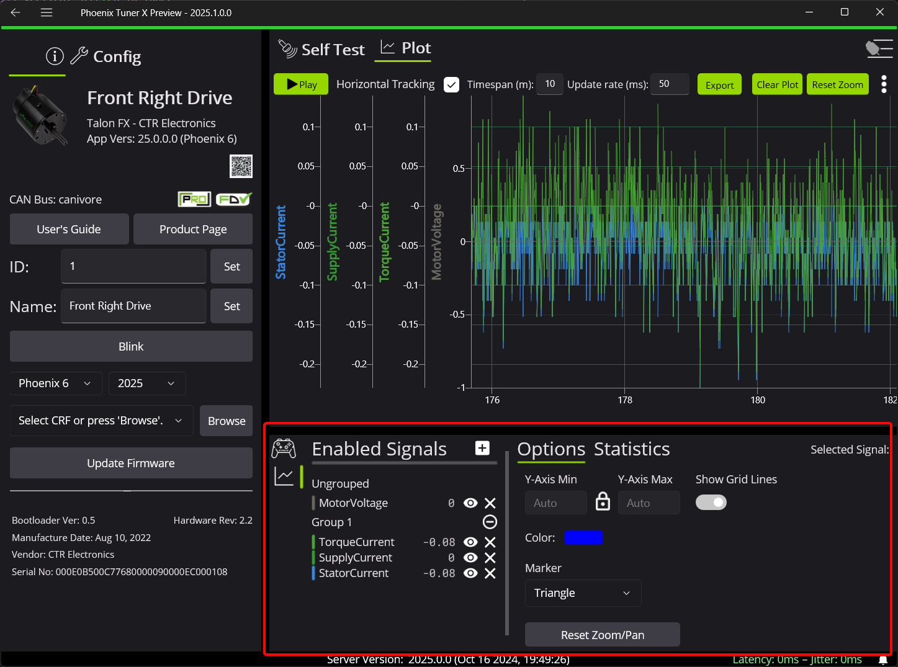
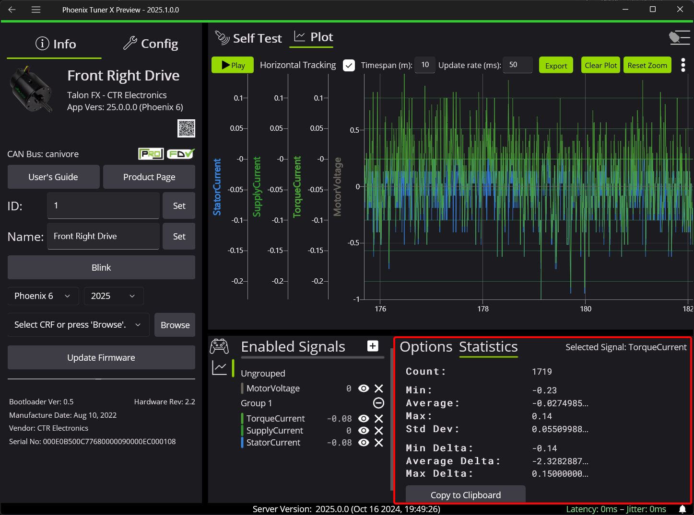

Plotting
========

Phoenix Tuner X supports an accurate and highly performant real-time plotter. Users can plot and manipulate multiple signals simultaneously. Plotter has undergone strenuous stress testing to ensure hours of plotting operation. This can be used in conjunction with :doc:`configs </docs/tuner/configs>` and :doc:`control </docs/tuner/controlling-devices>` for tasks like tuning PID loops.

Tuner supports plotting signals as they arrive, ensuring that every visible point is a signal update that has been sent by a device. Users can zoom in and hover over points for a tooltip highlighting the exact value of the datapoint.

Adding a Signal
---------------

Signals can be added from the right-side menu.

Manipulating the Plot
---------------------

.. card-carousel:: 3

   .. card:: Horizontal Stretch

      .. image:: images/tuner-plot-horizontal-stretch.gif
         :alt: Horizontal stretch in Tuner

   .. card:: Vertical Stretch

      .. image:: images/tuner-plot-vertical-stretch.gif
         :alt: Vertical stretch in Tuner

   .. card:: Panning

      .. image:: images/tuner-plot-pan.gif
         :alt: Panning in Phoenix Tuner

   .. card:: Box Selection

      .. image:: images/tuner-box-selection.gif
         :alt: Box selection in Tuner

The plot can be manipulated in a variety of ways:

- :kbd:`Click` + :kbd:`Drag` to pan around the plot
- :kbd:`Scroll` over the X-axis or the plot to horizontally stretch the timescale
- :kbd:`Shift` + :kbd:`Scroll` over a signal's Y-axis to vertically stretch that signal
- :kbd:`Shift` + :kbd:`Scroll` over the plot to vertically stretch all visible signals' Y-axis
- :kbd:`Ctrl` + :kbd:`Drag` to pan across all signals' Y-axis

Additional Customizations
-------------------------

The topbar of plotter contains a variety of options used for controlling data collection.

- **Play**: Play/Pauses the plotter. Points are **not** collected when the plotter is paused.
- **Horizontal Tracking**: Whether the horizontal axis should be locked to the most recent point. This automatically turns off when pan operations occur. Users can click this checkbox to keep their current Y-axis min/max but resume seeking at the beginning.
- **Timespan**: How long points should be kept before being discarded. Increasing this value will result in increased memory usage.
- **Update Rate**: How often to fetch points from the diagnostic server. Update rates larger than 100ms may result in lost points and lower update rates will result in increased CPU utilization.
- **Export**: Export currently visible signals to CSV.
- **Clear Point**: Remove all points and reset the plot back to its default state.
- **Reset Zoom**: Keep current points but reset horizontal and vertical zoom to its defaults

A plot customization tab is available at the bottom of the device view. This tab allows users to group signals together (create a group with the :kbd:`Plus` icon, and then drag signals over the group name), customize the color of the signal, explicitly set min/max, etc.

Additionally, statistics for a signal can be viewed under :guilabel:`Statistics`.

