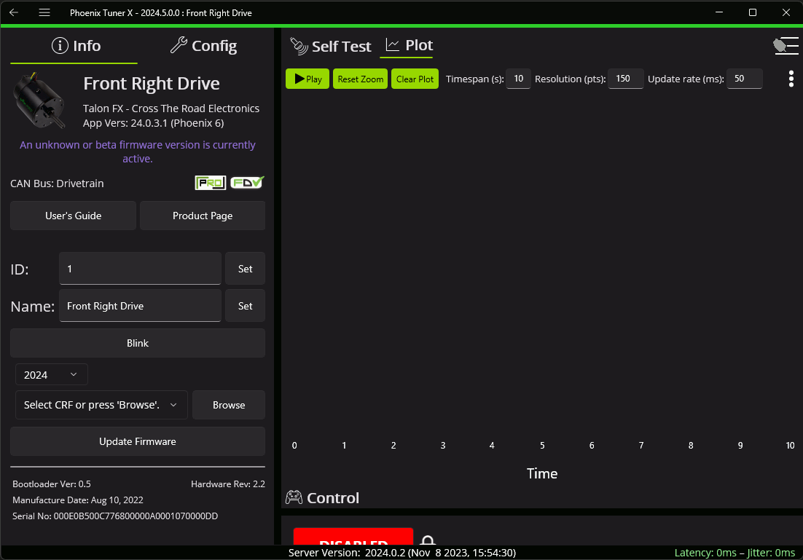
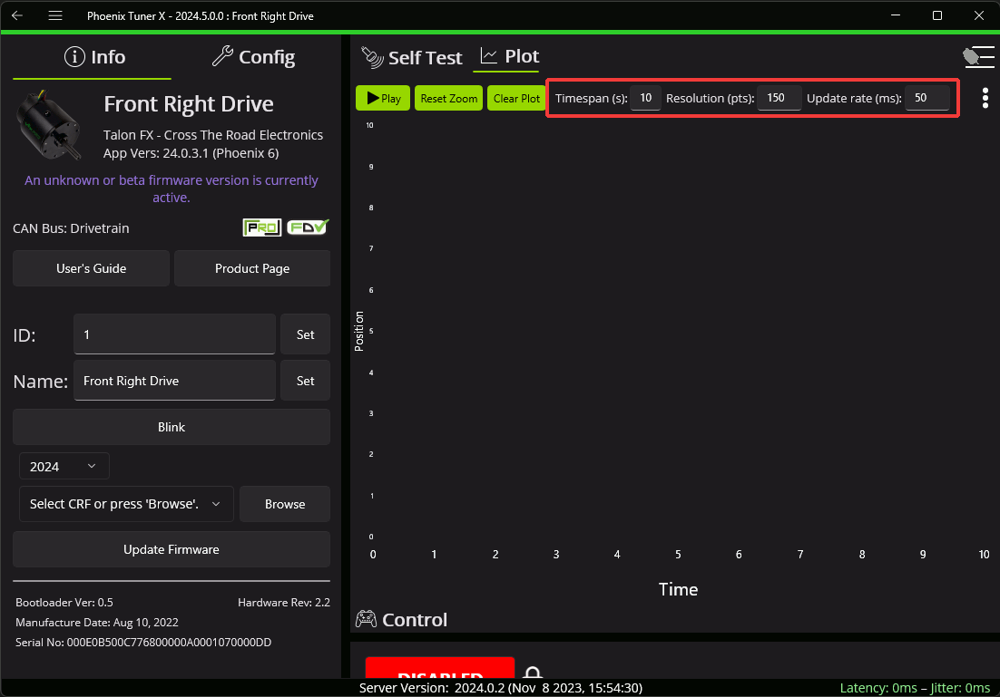
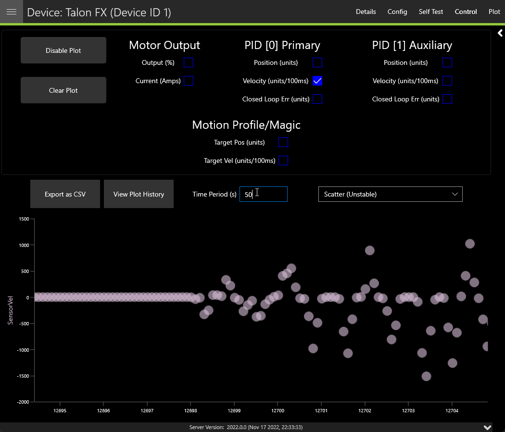

Plotting
========

Supported devices can have certain signals/sensor data plotted in real-time without any additional configuration. To get started, click on the :guilabel:`Plot` button in the top right navigation bar.

.. note:: Plotting currently only works with Phoenix 5 devices.

At the top of this page is a list of supported values that can then be plotted. Click on the signal that you wish to plot. Then click :guilabel:`Enable Plot` on the left.

.. image:: images/valid-plotting-signals.png
   :width: 70%
   :alt: Valid plotting signals

Adjusting Plotting Time Period
------------------------------

Plotting time period (the time frame that points are recorded) can be adjusted using the :guilabel:`Time Period` textbox.

Exporting Data
--------------

Plots can be exported into `csv` format for viewing in an external analysis tool. Click on the :guilabel:`Export as CSV` button.

Plot Appearance & Behavior
--------------------------

.. important:: Scatter points may dramatically affect Tuner X performance.

Plotting supports zoom and panning via the mouse and scroll wheel (or via gestures on Android). The point appearance can also be adjusted between "Spline" and "Scatter".

