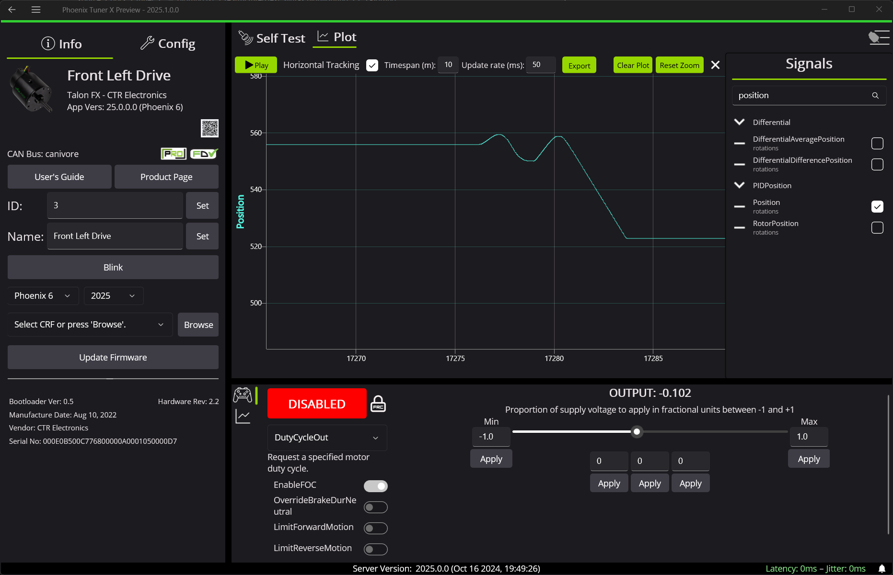

Plotting
========

Phoenix Tuner supports an accurate and highly performant real-time plotter. Users can plot and manipulate multiple signals simultaneously. Plotter has undergone strenous stress testing to ensure hours of plotting operation. This can be used in conjuction with :doc:`configs </docs/tuner/configs>` and :doc:`control </docs/tuner/controlling-devices>` for tasks like tuning PID loops.

Tuner supports plotting signals as they arrive; ensuring that every visible point is a signal update that has been sent by a device. Users can zoom in and hover over points for a tooltip highlighting the exact value of the datapoint.

.. image:: images/tuner-plot-tooltip.png
   :alt: Tuner supports tooltips by hovering on the plot
   :width: 650

Adding a Signal
---------------

Signals can be added from the right-side menu.

Manipulating the Plot
---------------------

.. card-carousel:: 3

   .. card:: Horizontal Stretch

      .. image:: images/tuner-plot-horizontal-stretch.gif
         :alt: Horizontal stretch in Tuner
      
   .. card:: Vertical Stretch

      .. image:: images/tuner-plot-vertical-stretch.gif
         :alt: Vertical stretch in Tuner

   .. card:: Panning

      .. image:: images/tuner-plot-pan.gif
         :alt: Panning in Phoenix Tuner

   .. card:: Box Selection

      .. image:: images/tuner-box-selection.gif
         :alt: Box selection in Tuner
   
The plot can be manipulated in a variety of ways:

- :kbd:`Click` + :kbd:`Drag` to pan around the plot
- Scroll over a signals Y-axis to vertically stretch a signal
- Scroll over the X-axis or the plot to horizontally stretch the timescale
- :kbd:`Shift` + :kbd:`Scroll` to vertically stretch all visible signals' Y-axis
- :kbd:`Ctrl` + :kbd:`Drag` to pan across all signals' Y-axis
