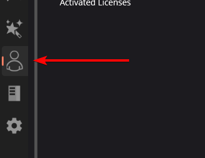

Profile Page
============

The profile page gets the user access to account management and is where :ref:`team numbers are assigned to a season pass <docs/licensing/team-licensing:Attaching a Team Number to Season Pass>`. This can be accessed by clicking the profile icon in the left-side menu.

Users can use this page to see how many seats they've redeemed for their season pass, how many licenses are available, how many licenses have been redeemed, and much more. This is also where the user can manually log out of their account, by clicking :guilabel:`LOGOUT` in the top-right corner.
