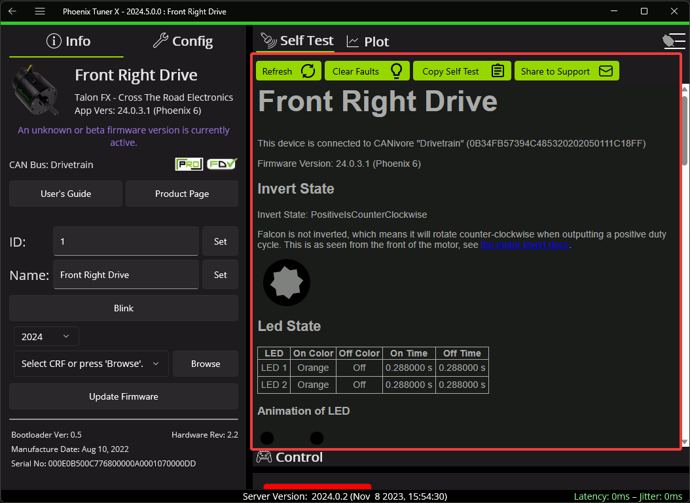
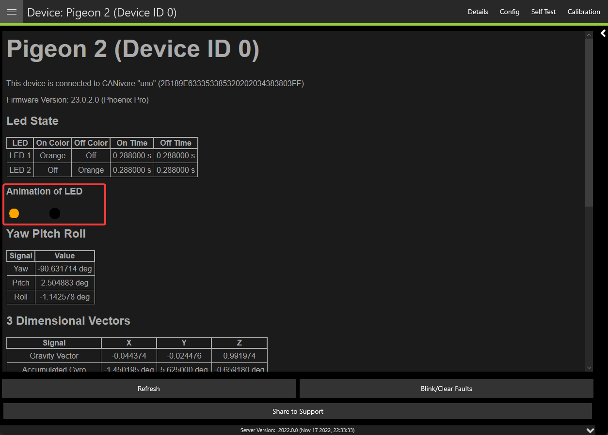

Self Test Snapshot
==================

Self Test Snapshot is a diagnostic feature of all supported devices that will show the immediate state of the device. This is extremely useful for troubleshooting and ensuring the device is working properly. Phoenix 6 with Phoenix Tuner X improves upon Self Test by showing the information in clean tables, animations and detailed units.

Self Test also includes four buttons: :guilabel:`Refresh`, :guilabel:`Clear Faults`, :guilabel:`Copy Self Test`, and :guilabel:`Share to Support`. :guilabel:`Refresh` will refresh the Self Test information, :guilabel:`Clear faults`` will blink the device and clear any faults on the device. :guilabel:`Copy Self Test` will copy the Self Test information to your clipboard. :guilabel:`Share to Support` will open the default email client with an email to CTR Electronics support.

Viewing Status LEDs
-------------------

Phoenix 6 devices report status LEDs as an animated GIF in Phoenix Tuner X. This can be useful for diagnosing a device when it's buried in a robot.

