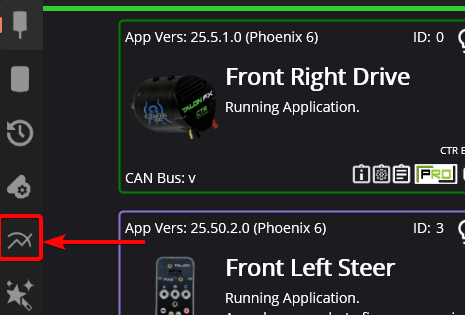
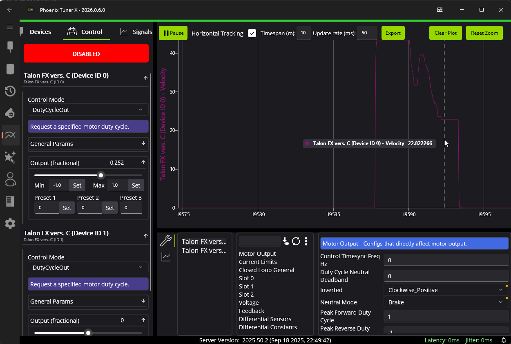
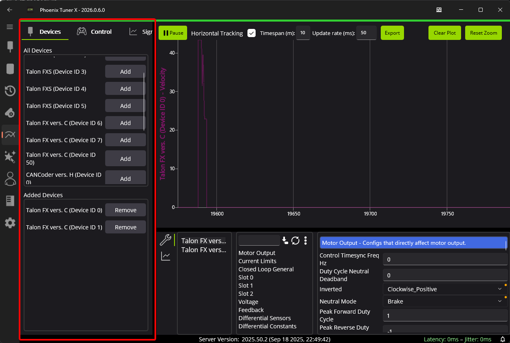

Multi-device Plot & Control
===========================

Multiple devices can be controlled and plotted simultaneously using the :guilabel:`Signal & Control` tab in Phoenix Tuner X. The interface mirrors the existing device details page, with dropdowns or comboboxes for choosing devices in a specific context.

The :guilabel:`Signal & Control` interface can be incredibly useful when tuning subsystems with multiple motors.

Adding Devices
--------------

Devices can be added or removed to the instance using the :guilabel:`Devices` tab on the left-hand side.

