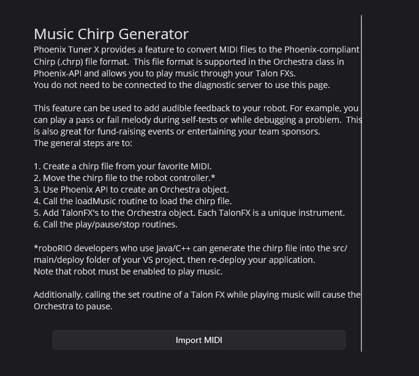

CHRP Converter
==============

:doc:`Orchestra </docs/api-reference/api-usage/orchestra>` uses CHRP files to play music using compatible Talon FX motors. Tuner offers the ability to convert `MIDI <https://en.wikipedia.org/wiki/MIDI>`__ soundtracks to compatible CHRPs. Simply follow the on-screen instructions and press :guilabel:`Import MIDI`.

