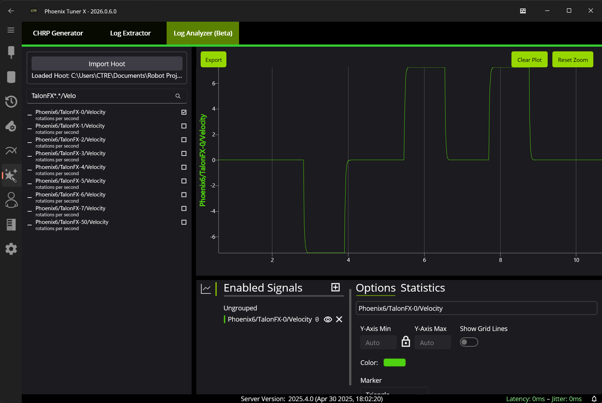
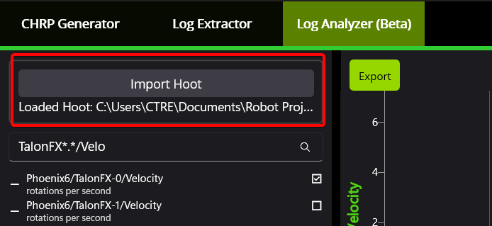

Log Analysis (Beta)
===================

Hoot logs can be directly viewed and analyzed in Tuner using the built-in Log Analysis tool. This tool can be found by navigating to :guilabel:`Tools` -> :guilabel:`Log Analysis (Beta)` tab. Users can take advantage of our high-performance :doc:`plotter </docs/tuner/plotting>` to analyze their logs for trends.

Loading Logs
------------

A hoot log can be loaded by clicking on the :guilabel:`Import Hoot` button. Depending on the size of the log, it may take a long time for the log to be loaded.

