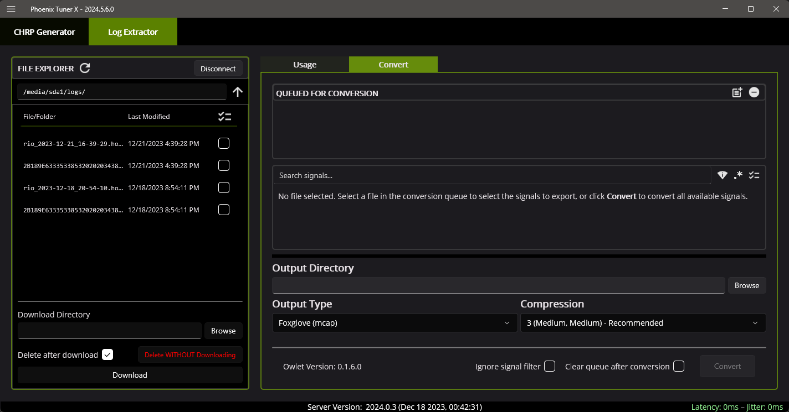
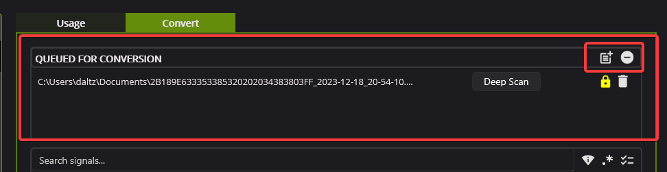
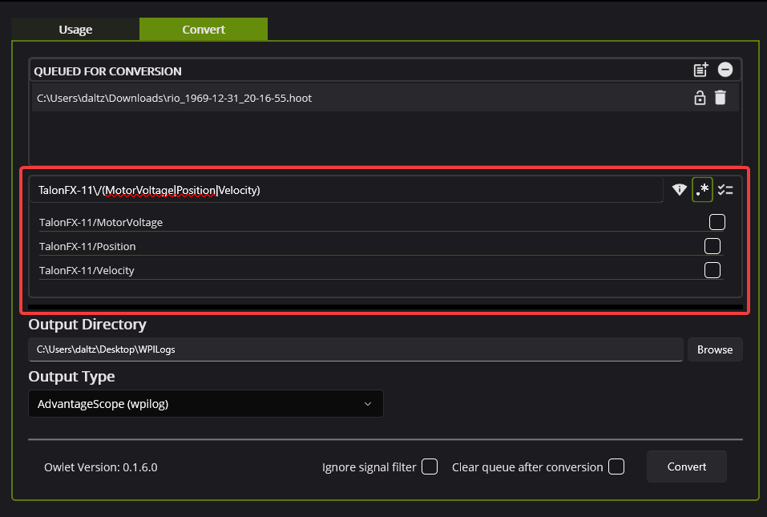

Extracting Signal Logs
======================

.. tip:: Information on how to use the signal logger API can be found in the :ref:`corresponding API article <docs/api-reference/api-usage/signal-logging:signal logging>`.

Tuner X offers in-app functionality to retrieve, manage, and convert ``hoot`` logs to compatible formats.

CTRE ``hoot`` logs can be retrieved utilizing the file explorer on the left of the application. The file explorer offers the functionality to download and delete logs on a remote target.

On the right side, the :guilabel:`Convert` tab can be used to import and convert ``hoot`` logs to available formats.

Once a ``hoot`` log has been downloaded, it is automatically placed in the conversion queue to the right. Logs can also be manually imported or removed using the two buttons at the top-right of the conversion queue.

If a log file is reported as unlicensed, users can perform a :guilabel:`Deep Scan` of the log if they believe it should contain pro-licensed devices. By default, Tuner will only scan the first few megabytes of the log for pro-licensed devices to save time during scan and export.

Filtering for Signals
---------------------

Since ``hoot`` logs can contain a massive amount of data, users may want to trim the exported log file. Tuner supports simple search and regex filtering of signals in a ``hoot``. Filters are optional and configured on a per-log basis.

.. note:: If no signals are selected, all signals will be exported during conversion.

In the below picture, regex is used to select only the ``MotorVoltage``, ``Position``, and ``Velocity`` signals for ``TalonFX-11``.

.. important:: If the ``hoot`` log does not contain any Pro-licensed devices, a :ref:`limited set of signals <docs/api-reference/api-usage/signal-logging:free signals>` may be exported for free using the :guilabel:`AdvantageScope (wpilog)` option.

Converting
----------

After adding ``hoot`` logs to the queue, select the output directory and one of the output types. Then, click the :guilabel:`Convert` button to begin the conversion process. This may take some time depending on the output format, the size of the ``hoot`` file, and the number of selected signals.

.. image:: images/log-extractor-convert-button.png
   :width: 70%
   :alt: Picture of bottom bar of convert tab in Tuner

Common Issues
-------------

Problem: When converting, I get ``hoot log API version too old, cannot export its signals``
^^^^^^^^^^^^^^^^^^^^^^^^^^^^^^^^^^^^^^^^^^^^^^^^^^^^^^^^^^^^^^^^^^^^^^^^^^^^^^^^^^^^^^^^^^^

**Solution:** This may happen if your hoot file was generated using an old version of Phoenix. Update your Phoenix installation (by updating your vendordep in :doc:`/docs/installation/installation`) and recreate your log file. If the log file recorded is critical, reach out to `support@ctr-electronics.com <mailto:support@ctr-electronics>`__.

Problem: When converting, I get ``Could not read to end of input file``
^^^^^^^^^^^^^^^^^^^^^^^^^^^^^^^^^^^^^^^^^^^^^^^^^^^^^^^^^^^^^^^^^^^^^^^

**Solution:** This occurs when the converter encounters bad data. This typically occurs when the robot is turned off in the middle of writing to the log. Users can often ignore this error message, although the last few seconds of data may be lost. To avoid this issue, run ``SignalLogger.stop()`` before shutting down the robot program.
