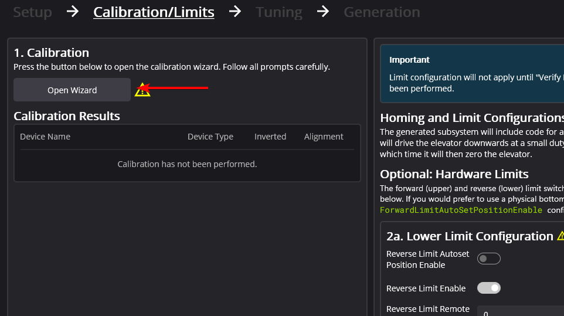
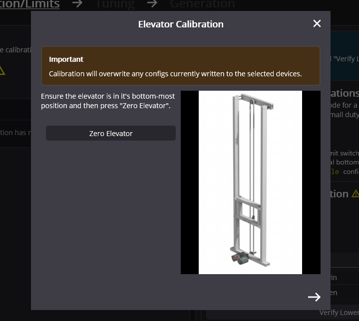
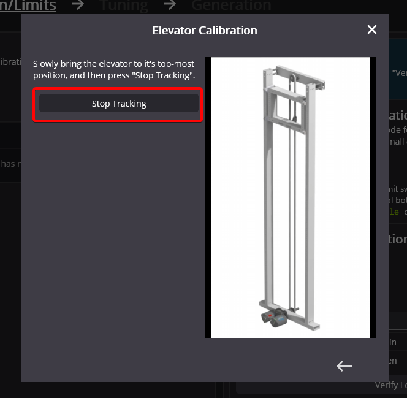
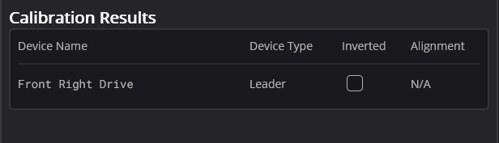
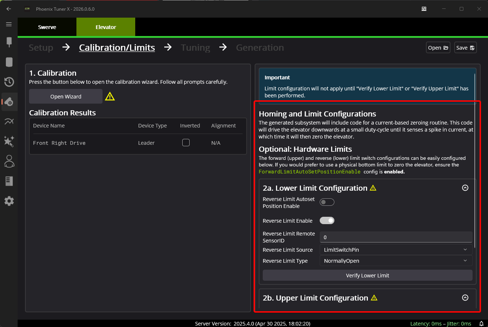

Calibration and Limits
======================

Tuner will have the user perform a calibration routine, during which the user will bring the elevator to it's lowest position, and then manually raise the elevator to it's top-most position. This routine will automatically determine the bounds of the elevator and motor inverts.

To begin, select :guilabel:`Open Wizard`.

This will open the Elevator Calibation popup. Manually bring the elevator to it's bottom-most position. This will act as it's zero. Once this is done, press :guilabel:`Zero Elevator`.

Press the arrow on the bottom-right of the popup to navigate to the next step in the wizard. Bring the elevator to it's top-most position. Once this is done, press :guilabel:`Stop Tracking`.

Go ahead and exit the popup. The :guilabel:`Calibration Results` will be populated with it's results.

Homing Limits
-------------

The generated Elevator subsystem includes a function for performing a **current-based** homing routine to zero the elevator. However, the calibration and limits interface provides the ability to configure hardware or remote limits.

