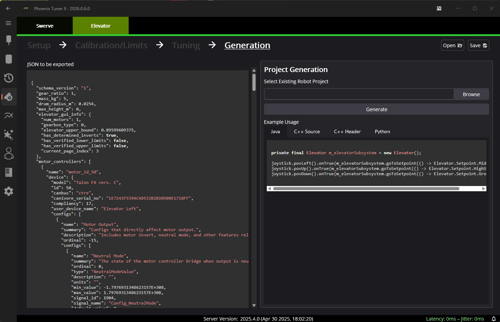

Generation
==========

The subsystem is generated directly into an **existing robot project**. Select :guilabel:`Browser` and navigate to the **root** of a robot project. Then, press :guilabel:`Generate`.

Open the robot project in WPILib VS Code.

