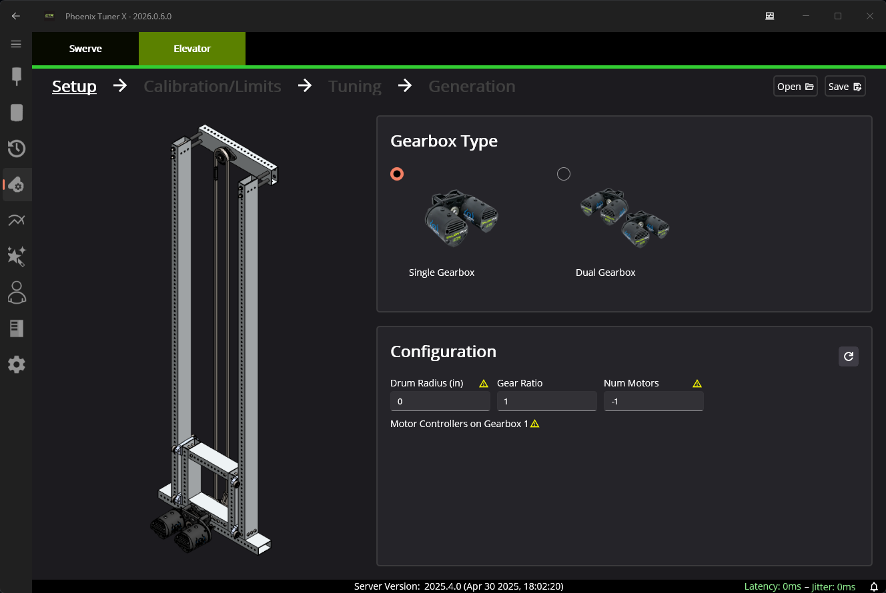
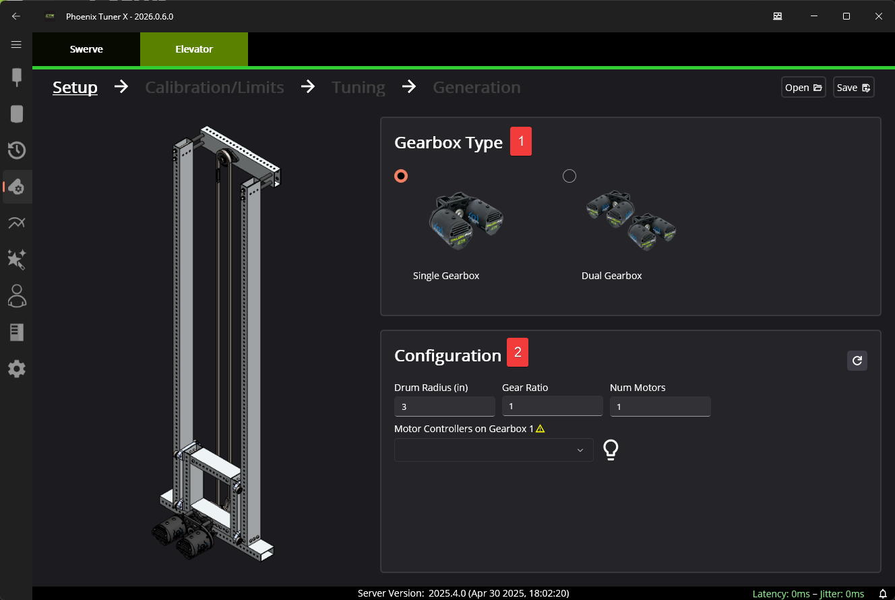

Setup
=====

Prerequisites
-------------

The elevator generator and generated project make a few assumption. To determine if the elevator generator is the best fit for your mechanism, consult the following checklist.

- The elevator is a single or two gearbox mechanism.
- All gearboxes on the elevator consist of the same gearing.
- All gearboxes on the elevator have the same number of motors.
- If using two gearboxes, ensure that the orientation of the gearbox's are identical.
- All motors on the elevator are identical.

Initial Configuration
---------------------

Setup is done with two steps.

1. Choosing your Gearbox
^^^^^^^^^^^^^^^^^^^^^^^^

The supported gearbox types are ``Single`` and ``Dual``.

2. Configuration
^^^^^^^^^^^^^^^^

A typical elevator is composed of a number of motors, driving a gearbox which spins a spool that drives the elevator up or down. The generated Elevator subsystem will automatically handle conversion between raw mechanism rotations to linear units (inches, meters, feet, etc).

To handle this scenario, certain constants cannot be automatically determined. Users will need to input the :guilabel:`Drum Radius (in)`, :guilabel:`Gear Ratio`, and :guilabel:`Num Motors`.

Once this has been done, a list of motor controllers will be populated per gearbox.

