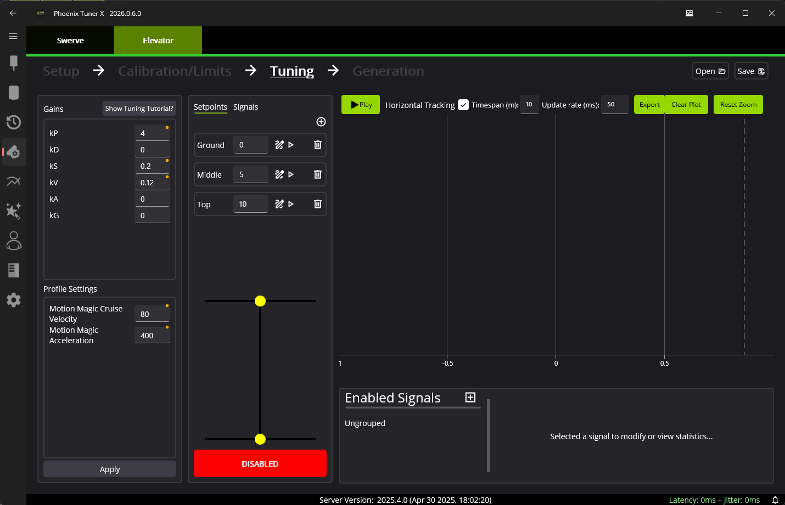
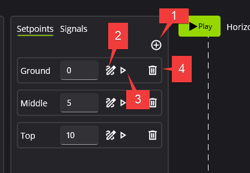
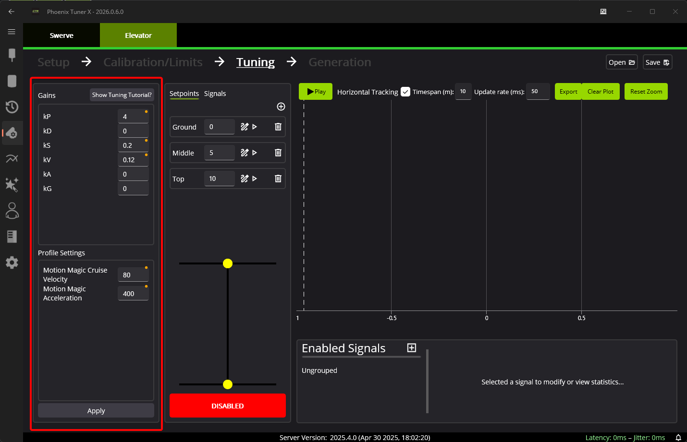

Tuning your Elevator
====================

In the third step of the elevator wizard, the user is guided through **creating setpoints** and **calculating closed-loop** gains.

.. tip:: Check out :doc:`/docs/api-reference/device-specific/talonfx/basic-pid-control` for information on how to tune a closed-loop position system.

Elevator Setpoints
------------------

Setpoints are configured in the :guilabel:`Setpoints` tab in the second column.

1. Add a new setpoint
2. Rename a setpoint

   - Ensure setpoint names are unique, or there will be compile errors when you generate your Elevator.

3. Run setpoint

   - The robot must be **ENABLED**, or nothing will happen.

4. Delete setpoint

Closed-loop Gains
-----------------

Gains can be configured in the first column. While default gains have been calculated, it is **highly recommended** to just use this as a starting point. The elevator should be tuned in it's final configuration, with any load that it may need to bear (holding a game piece).

The control request used to command the elevator is ``MotionMagicVoltage`` (`Java <https://api.ctr-electronics.com/phoenix6/stable/java/com/ctre/phoenix6/controls/MotionMagicVoltage.html>`__, `C++ <https://api.ctr-electronics.com/phoenix6/stable/cpp/classctre_1_1phoenix6_1_1controls_1_1_motion_magic_voltage.html>`__, `Python <https://api.ctr-electronics.com/phoenix6/stable/python/>`__), which allows the user to directly control velocity and acceleration for smooth travel.
