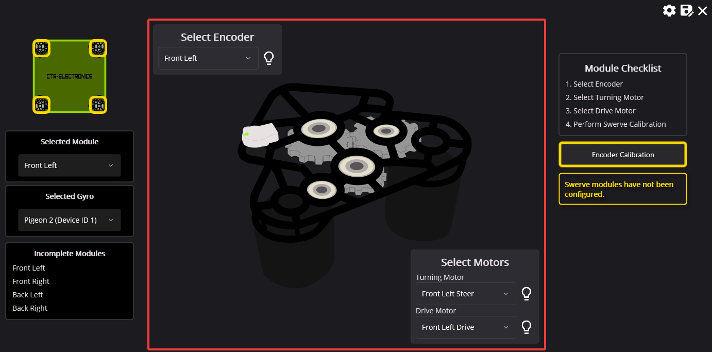
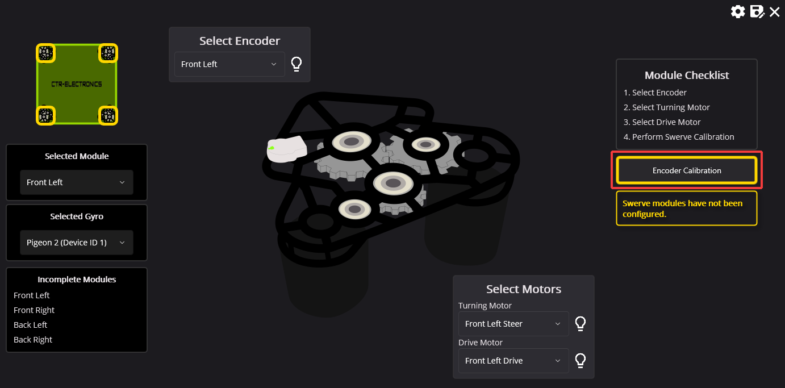
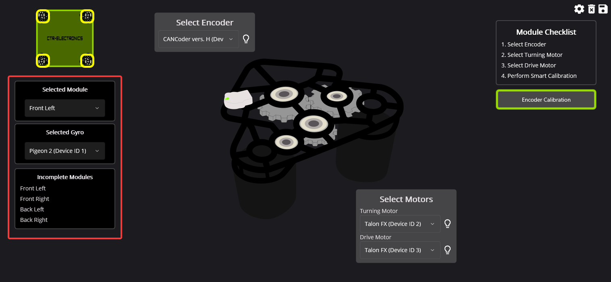

Configuring Modules
===================

Module configuration is comprised of 4 steps.

#. Selecting encoder
#. Selecting steer/turning motor
#. Selecting drive motor
#. Performing encoder calibration

Selecting Module Devices
------------------------

The first step is to select the encoder and motor controllers for the selected swerve module. In the screenshot below, **Talon FX (Device ID 0)** and **Talon FX (Device ID 1)** are selected as the steer and drive motor controllers.

.. tip:: If a warning icon shows where the :guilabel:`Blink` icon is, this typically means this device has already been assigned to module.

Encoder Calibration
-------------------

Once a module's devices have been selected, an :guilabel:`Encoder Calibration` button will appear on the right-side of the screen. This will open a popup that guides the user through aligning their module and calibrating their CANcoder offsets.

.. important:: It's extremely important for the modules to be aligned such that the bevel gear faces the **vertical center** of the robot. Failure to perform this step may lead the drive verification tests to fail.

Once calibration has been completed, the module will be removed from the **Incomplete Modules** lift on the left.

Switching between Modules
-------------------------

Modules can be swapped by selecting the module in the dropdown located on the left-hand side of the wizard.

Alternatively, a module can be selected by clicking on one of the yellow squares on the swerve bot in the top-left corner.

.. warning:: If an encoder has been reassigned to a new module, users should perform encoder calibration. Failure to perform encoder calibration will lead to unexpected module behavior.

Once all modules have been configured, click on the :guilabel:`Configuration Completed!` button that appears.

.. danger:: To ensure the drive and steer tests are accurate, the devices are factory defaulted. It's recommended that the user makes a :ref:`backup <docs/tuner/configs:tuner configs>` of their configs if they are not applied in their robot program.
