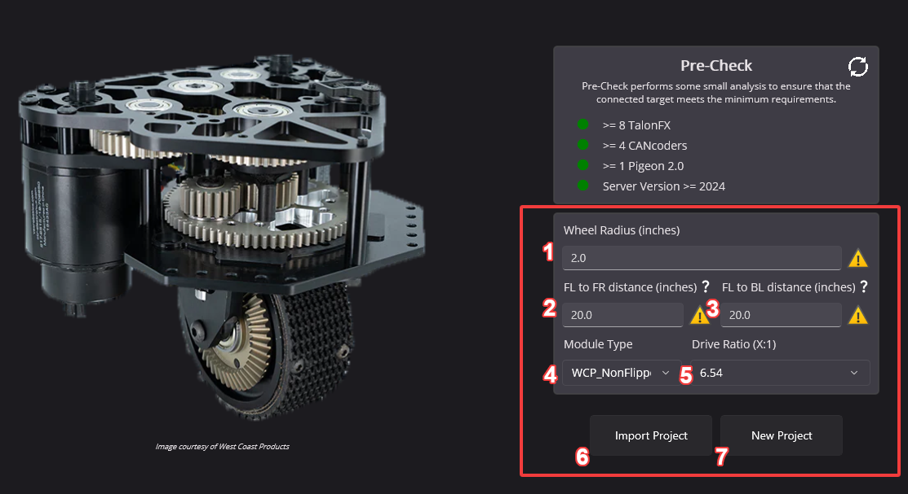

Creating your Project
=====================

#. Wheel Radius (inches)

   * The radius can be found by measuring the width of the module wheel, then dividing that by 2.

#. FL to FR distance (inches)

   * This is the distance between the center of the front-left module, and the center of the front-right module.

#. FL to BL distance (inches)

   * This is the distance between the center of the front-left module, and the center of the back-right module.

#. Module Type

   * The type of swerve module, such as WCP Swerve X standard, flipped gear, or flipped belt. Users not using any of the supported modules should select :guilabel:`Custom` instead.

#. Drive Ratio

   * This is the gearing ratio between the output shaft of the motor and the module wheel. Swerve X users can find that information `here <https://docs.wcproducts.com/frc-build-system/gearboxes/swerve#drive-ratios>`__.

* Steer Ratio (Custom)

  * This is the gearing ratio between the output shaft of the steering motor and the azimuth gear. For the :guilabel:`Custom` module type, users must calculate this based on their gearing themselves, or consult their manufacturer.

6. Import Project

   * Import an existing Tuner X swerve project save file.

7. New Project

   * Create a new project based on the settings configured.

Users should configure the settings applicable for their robot and click :guilabel:`New Project` once they are done.

.. tip:: Throughout the application is various tooltips, that when you hover on them, provide instructions. If you are unsure on what something means, try hovering on it!

Wizard Options
--------------

Once a project is open, a couple of options are exposed at the top-right.

In order from left to right:

* Factory default all devices
* Open the swerve settings menu
* Export project
* Exit project
