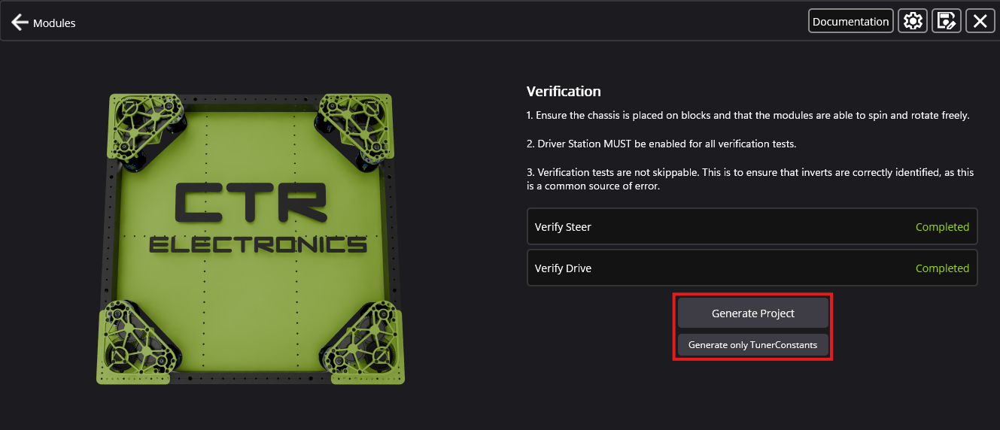

Generating the Project
======================

The robot program can be generated by clicking the :guilabel:`Generate Project` button. This will open a prompt asking what team number to generate a project for.

.. tip:: It's highly recommended to export the project settings using the Save As icon in the top-right. This will save time if the robot program needs to be regenerated for any reason.
